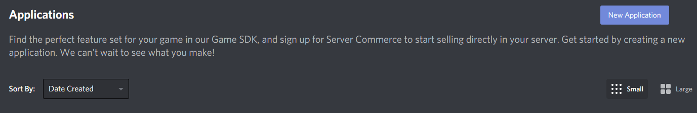
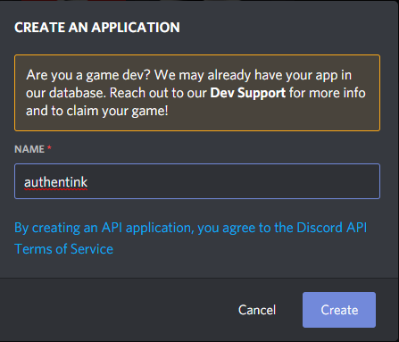
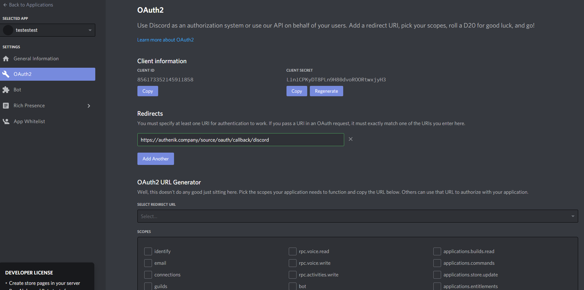
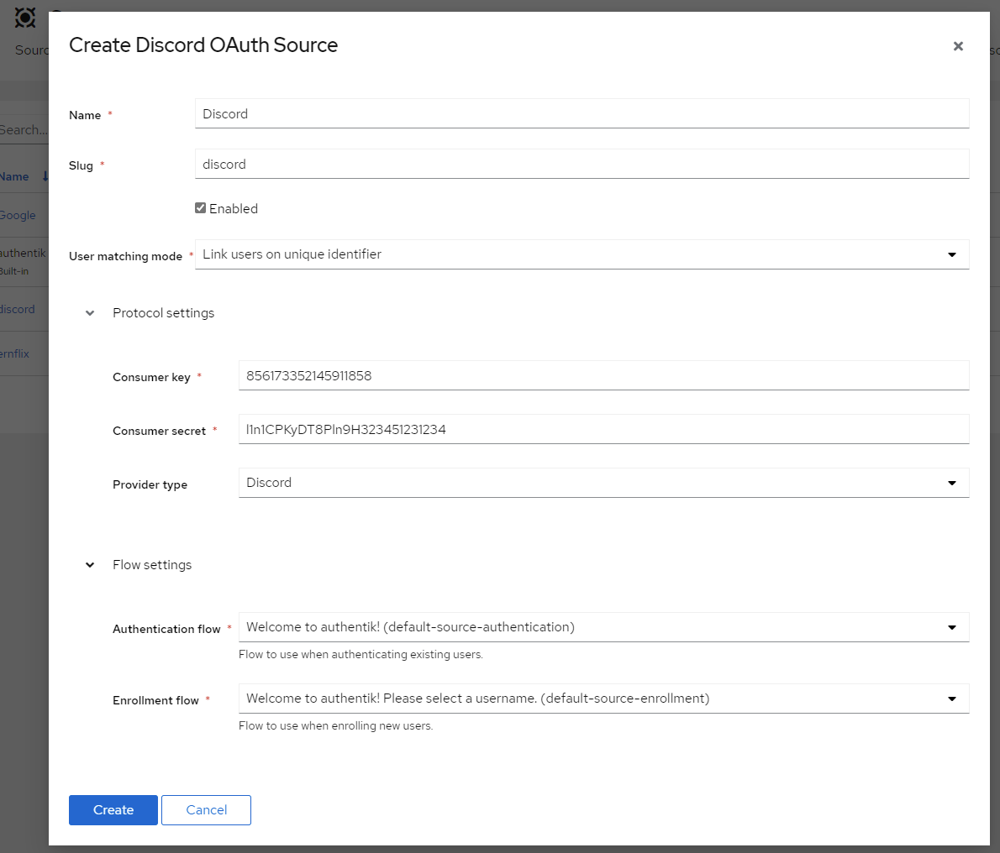

Allows users to authenticate using their Discord credentials

## Preparation

The following placeholders will be used:

- `authentik.company` is the FQDN of the authentik install.

## Discord

1. Create an application in the Discord Developer Portal (This is Free) https://discord.com/developers/applications

2. Name the Application

3. Select OAuth2 from the left Menu

4. Copy the Client ID and save it for later

5. Click to Reveal the Client Secret and save it for later

6. Click Add Redirect and add https://authentik.company/source/oauth/callback/discord

Here is an example of a completed OAuth2 screen for Discord.

## Authentik -> Sources

8. Add _Discord_ as a _source_

9. Name: <Choose a name> (For the example I used Discord)
10. Slug: discord (You can choose a different slug, if you do you will need to update the Discord redirect URLand point it to the correct slug.)
11. Consumer Key: <Client ID from step 4>
12. Consumer Secret: <Client Secret from step 5>
13. Provider type: Discord

Here is an exmple of a complete Authentik Discord OAuth Source

Save, and you now have Discord as a source.

:::note:::
For more details on how-to have the new source display on the Login Page see the Sources page
