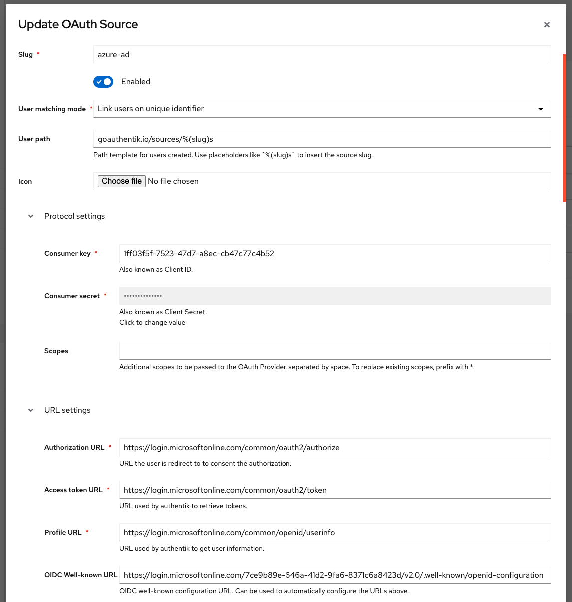

<span class="badge badge--secondary">Support level: Community</span>

## Preparation

The following placeholders will be used:

-   `authentik.company` is the FQDN of the authentik install.

## Azure setup

1. Navigate to [portal.azure.com](https://portal.azure.com), and open the _App registration_ service
2. Register a new application

    Under _Supported account types_, select whichever account type applies to your use-case.

    

3. Take note of the _Application (client) ID_ value.

    If you selected _Single tenant_ in the _Supported account types_ prompt, also note the _Directory (tenant) ID_ value.

4. Navigate to _Certificates & secrets_ in the sidebar, and to the _Client secrets_ tab.
5. Add a new secret, with an identifier of your choice, and select any expiration. Currently the secret in authentik has to be rotated manually or via API, so it is recommended to choose at least 12 months.
6. Note the secret's value in the _Value_ column.

## authentik Setup

In authentik, create a new _Azure AD OAuth Source_ in Resources -> Sources.

Use the following settings:

-   Name: `Azure AD`
-   Slug: `azure-ad` (this must match the URL being used above)
-   Consumer key: `*Application (client) ID* value from above`
-   Consumer secret: `*Value* of the secret from above`

If you kept the default _Supported account types_ selection of _Single tenant_, then you must change the URL below as well:

-   OIDC Well-known URL: `https://login.microsoftonline.com/*Directory (tenant) ID* from above/v2.0/.well-known/openid-configuration`



Save, and you now have Azure AD as a source.

:::note
For more details on how-to have the new source display on the Login Page see [here](../index.md#add-sources-to-default-login-page).
:::

### Automatic user enrollment and attribute mapping

Using the following process you can auto-enroll your users without interaction, and directly control the mapping Azure attribute to authentik.
attribute.

1. Create a new _Expression Policy_ (see [here](../../../docs/policies/) for details).
2. Use _azure-ad-mapping_ as the name.
3. Add the following code and adjust to your needs.

```python
# save existing prompt data
current_prompt_data = context.get('prompt_data', {})
# make sure we are used in an oauth flow
if 'oauth_userinfo' not in context:
  ak_logger.warning(f"Missing expected oauth_userinfo in context. Context{context}")
  return False
oauth_data = context['oauth_userinfo']
# map fields directly to user left hand are the field names provided by
# the microsoft graph api on the right the user field names as used by authentik
required_fields_map = {
  'name': 'username',
  'upn': 'email',
  'given_name': 'name'
}
missing_fields = set(required_fields_map.keys()) - set(oauth_data.keys())
if missing_fields:
  ak_logger.warning(f"Missing expected fields. Missing fields {missing_fields}.")
  return False
for oauth_field, user_field in required_fields_map.items():
  current_prompt_data[user_field] = oauth_data[oauth_field]
# Define fields that should be mapped as extra user attributes
attributes_map = {
  'upn': 'upn',
  'family_name': 'sn',
  'name': 'name'
}
missing_attributes = set(attributes_map.keys()) - set(oauth_data.keys())
if missing_attributes:
  ak_logger.warning(f"Missing attributes: {missing_attributes}.")
  return False
# again make sure not to overwrite existing data
current_attributes = current_prompt_data.get('attributes', {})
for oauth_field, user_field in attributes_map.items():
  current_attributes[user_field] = oauth_data[oauth_field]
current_prompt_data['attributes'] = current_attributes
context['prompt_data'] = current_prompt_data
return True
```

4. Create a new enrollment flow _azure-ad-enrollment_ (see [here](../../../docs/flow/) for details).
5. Add the policy _default-source-enrollment-if-sso_ to the flow. To do so open the newly created flow.
   Click on the tab **Policy/Group/User Bindings**. Click on **Bind existing policy** and choose _default-source-enrollment-if-sso_
   from the list.
6. Bind the stages _default-source-enrollment-write_ (order 0) and _default-source-enrollment-login_ (order 10) to the flow.
7. Bind the policy _azure-ad-mapping_ to the stage _default-source-enrollment-write_. To do so open the flow _azure-ad-enrollment_
   open the tab **Stage Bindings**, open the dropdown menu for the stage _default-source-enrollment-write_ and click on **Bind existing policy**
   Select _azure-ad-mapping_.
8. Open the source _azure-ad_. Click on edit.
9. Open **Flow settings** and choose _azure-ad-enrollment_ as enrollment flow.

Try to login with a **_new_** user. You should see no prompts and the user should have the correct information.
