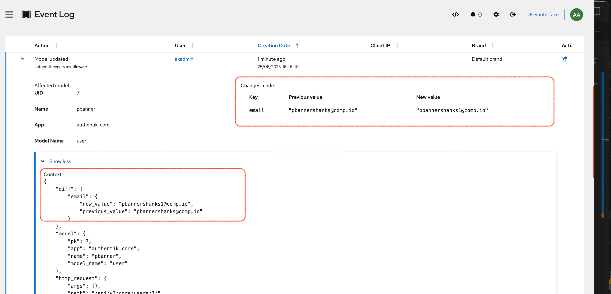

Logs are a vital tool for system diagnostics, event auditing, user management, reporting, and more. They capture detailed information about each event including the client's IP address, the user involved, the date and time, and the specific action taken.

Event logging in authentik is highly configurable. You can set the [retention period](./index.md#event-retention-and-forwarding) for storing and displaying events, specify which events should trigger a [notification](./notifications.md), and access low-level details about when and where each event occurred.

## Troubleshooting with event logs

For guidance on troubleshooting with logs, including setting log levels (info, warning, etc.), enabling `trace` mode, viewing historical logs, and streaming logs in real-time, see [Capturing logs in authentik](../../troubleshooting/logs.mdx).

## Enhanced audit logging :ak-enterprise

In the enterprise version, two enhancements make reading the logs even easier:

- the Event details page in the user interface presents abstracted and easily accessible information about each event in an easy-to-access table.

- for any event that involves the creation or modification of an object, the corresponding code differences are displayed, allowing for comparison of the previous and new configuration settings or values. For example, if an authentik administrator updates a user's email address, both the old and new email addresses are displayed in the event's detailed view. (In the open source version, event details only show that a change was made and which application and model was involved.)

You can view audit details in the following areas of the authentik Admin interface:

- **Admin interface > Dashboards > Overview**: In the **Recent events** section click an event name to view its details.

- **Admin interface > Events > Logs**: In the event list, click the arrow toggle next to the event you want to view.

## Viewing events in maps and charts :ak-enterprise

With the enterprise version, you can view recent events on both a world map view with pinpoints indicating where each event occurred and also a color-coded chart that highlights event types and volume.

## Advanced queries for event logs:ak-enterprise {#tell-me-more}

You can construct advanced queries to find specific event logs. In the Admin interface, navigate to **Events > Logs**, and then use the auto-complete in the **Search** field or enter your own queries to return results with greater specificity.

- **Field**: `action`, `event_uuid`, `app`, `client_ip`, `user`, `brand`, `context`, `created`

- **Operators**: `=`, `!=`, `~`, `!~`, `startswith`, `not startswith`, `endswith`, `not endswith`, `in`, `not in`

- **Values**: `True`, `False`, `None`, and more

- **Example queries**:
    - search event by application name: `app startswith "N"`
    - search event by action: `action = "login"`
    - search event by authorized application context: `authorized_application.name = "My app"`
    - search event by country: `context.geo.country = "Germany"`
    - search event by IP address: `client_ip = "10.0.0.1"`
    - search event by brand: `brand.name = "my brand"`
    - search event by user: `user.username in ["ana", "akadmin"]`

For more examples, refer to the list of [Event actions](./event-actions.md) and the related examples for each type of event.

:::info

1. To dismiss the drop-down menu option, click **ESC**.
2. If the list of operators does not appear in a drop-down menu you will need to manually enter it.
3. For queries that include `user`, `brand`, or `context` you need to use a compound term such as `user.username` or `brand.name`.
   :::

## Export events :ak-enterprise

You can export your authentik instance's events to a CSV file. To generate a data export, follow these steps:

1. Log in to authentik as an administrator and navigate to **Events > Logs**.
2. Set a [search query](#tell-me-more) as well as the ordering, as needed. The data export will honor these settings.
3. Click **Export** above the event list.
4. Note that the export is processed in the background. Once the export is ready, you will receive a notification in the Admin interface's notification area.
5. In the notification, click **Download**.

6. Log in to authentik as an administrator and open the authentik Admin interface.
7. Navigate to **Events** > **Logs**.
8. Set a [search query](#tell-me-more) as well as the ordering for the data export.
9. Click **Export** above the event list.
10. The export is processed in the background and once it's ready, you will receive a notification in the Admin interface's notification area.
11. In the notification, click **Download**.

To review, download, or delete past data exports, navigate to **Events** > **Data Exports** in the Admin interface.
