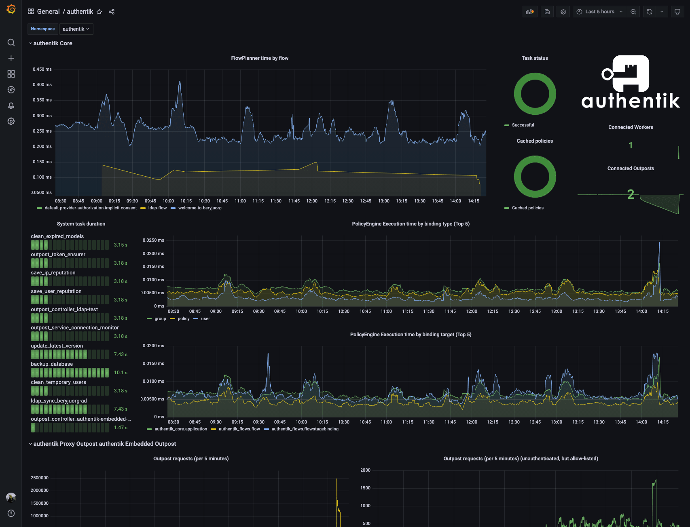

authentik can be easily monitored in multiple ways.

## Server monitoring

Configure your monitoring software to send requests to `/-/health/live/`, which will return a `HTTP 200` response as long as authentik is running. You can also send HTTP requests to `/-/health/ready/`, which will return `HTTP 200` if both PostgreSQL and Redis connections can be established correctly.

## Worker monitoring

The worker container can be monitored by running `ak healthcheck` in the worker container. This will check that the worker is running and ensure that both PostgreSQL and Redis connections can be established correctly.

You can also send HTTP requests to `/-/health/ready/`, which will return `HTTP 200` if both PostgreSQL and Redis connections can be established correctly.

## Outpost monitoring

Both kinds of outpost (proxy and LDAP) listen on a separate port (9300) and can be monitored by sending HTTP requests to `/outpost.goauthentik.io/ping`.

---

Both Docker Compose and Kubernetes deployments use these methods by default to determine when authentik is ready after starting, and to only route traffic to healthy instances; unhealthy instances are restarted.

## Metrics

Both the core authentik server, worker and any outposts expose Prometheus metrics on a separate port (9300), which can be scraped to gather further insight into authentik's state. The metrics require no authentication, as they are hosted on a separate, non-exposed port by default.

You can find an example dashboard here: [grafana.com](https://grafana.com/grafana/dashboards/14837-authentik/)

