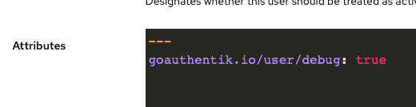
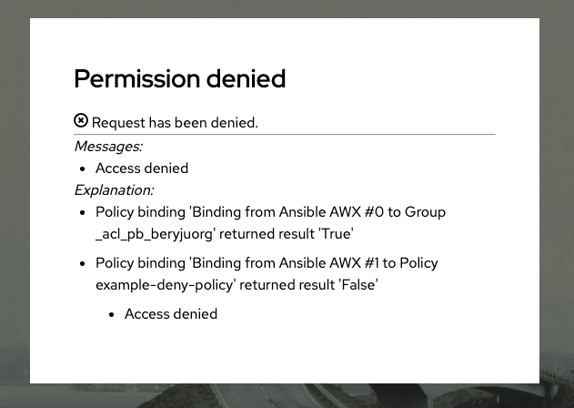

If your user is a superuser, or has the attribute `goauthentik.io/user/debug` set to true (can also be set on a group level):

Afterwards, try to access the application again. You will now see a message explaining which policy denied you access:

