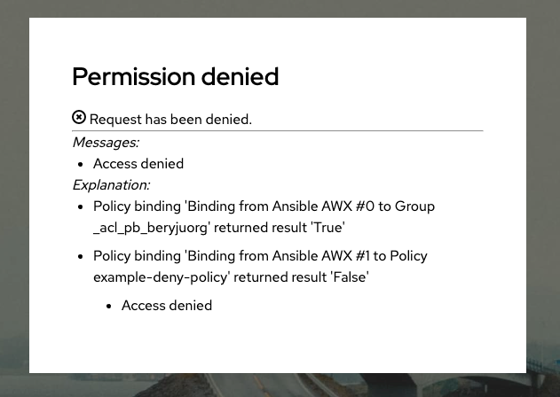

import TabItem from "@theme/TabItem";
import Tabs from "@theme/Tabs";

When authentik denies access to an application, detailed policy evaluation logs are made available to pinpoint the failure.

## Enable user debugging

Debug details appear when the requesting user is in debug mode. Superusers see this information automatically, and you can enable it for any other account while you troubleshoot.

### Superuser accounts

If you are logged in with a superuser account, retry the request. The access denied screen automatically displays the additional diagnostics.

### Enable the debug attribute

Use one of the following options to grant debug information visibility.

<Tabs
  defaultValue="user"
  values={[
    { label: "User", value: "user" },
    { label: "Group", value: "group" },
  ]}
>
  <TabItem value="user">

1. Log in to authentik as an administrator and open the authentik Admin interface.
2. Go to **Directory** > **Users** and click the **Edit** icon next to the user who needs debug access.
3. Under **Attributes**, add the following attribute:

```
goauthentik.io/user/debug: true
```

4. Click **Update**.

  </TabItem>
  <TabItem value="group">

1. Log in to authentik as an administrator and open the authentik Admin interface.
2. Go to **Directory** > **Groups** and click the **Edit** icon next to the group that needs debug access.
3. Under **Attributes**, add the following attribute:

```
goauthentik.io/user/debug: true
```

4. Click **Update**.

  </TabItem>
</Tabs>

## View debug information

After enabling debug mode, attempt to access the application again. The denial page should now list the following details:

- The policy that blocked access.
- The evaluation result and reason.
- Any additional context that helps validate the failure.



## Disable debugging

Turn off debug output after you resolve the issue by either removing the `goauthentik.io/user/debug` attribute or setting its value to `false`.

:::info
Enable debug mode only while you troubleshoot to avoid exposing internal policy details in production.
:::
