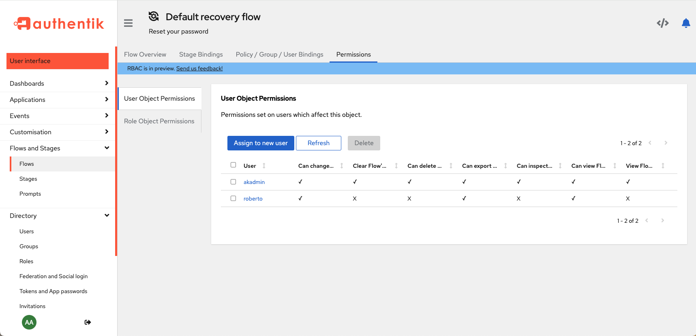

Permissions are the central components in all access control systems, the lowest-level component, the controlling piece of access data. Permissions are assigned to (or removed from!) to define exactly WHO can do WHAT to WHICH part of the overall software system.

## Fundamentals of authentik permissions

There are two main types of permissions in authentik:

*   [**global permissions**](#global-permissions)
*   [**object permissions**](#object-permissions)

### Global permissions

Global permissions define who can do what on a global level, across the entire system. Some examples in authentik are the ability to add new [flows](../../flow/index.md) or to create a URL for users to recover their login credentials.

You can assign _global permissions_ to individual [users](../user/index.mdx) or to [roles](../roles/index.mdx) (most common and best practice).

### Object permissions

Object permissions have two categories:

-   **_user_ object permissions**: defines WHO (which user) can change the **_object_**
-   **_role_ object permissions**: defines which ROLE can change the **_object_**

Object permissions are assigned, as the name indicates, to an object (users, [groups](../group.md), roles, flows, and stages), and the assigned permissions state exactly what a user or role can do TO the object (i.e. what permissions does the user or role have on that object).

When working with object permissions, it is important to understand that when you are viewing a page for a specific object (a flow, a stage, user, role, or group), the permissions table on that page displays which users or roles have permissions ON that object.

For example, the UI below shows a user page for the user named Peter.

You can see in the **User Object Permissions** table that another user, roberto, has permissions on Peter (that is, on the user object Peter).

Looking at another example, with a flow object called `default-recovery-flow` you can see that the Admin user (akadmin) has all object permissions on the flow, but roberto only has a few permissions on that flow.

## View permissions

You can view all permissions that are assigned to a user, group, or role.

### View user permissions

To view _object_ permissions for a specific user:

1. Go to the Admin interface and navigate to **Directory -> Users**.
2. Select a specific user by clicking on the name, to open the user's details page.
3. Click the **Permissions** tab at the top of the page.

To view _global_ permissions for a user:

1. Go to the Admin interface and navigate to **Directory -> Users**.
2. Select a specific user by clicking on the name, to open the user's details page.
3. Click the **Assigned Permissions** tab at the top of the page (to the right of the **Permissions** tab).

### View group permissions

To view _object_ permissions for a specific group (groups do not have global permissions):

1. Go to the Admin interface and navigate to **Directory -> Groups**.
2. Select a specific group by clicking on the name, to open the group's details page.
3. Click the **Permissions** tab at the top of the page.

### View role permissions

To view _object_ permissions for a specific role:

1. Go to the Admin interface and navigate to **Directory -> Roles**.
2. Select a specific role by clicking on the name, to open the role's details page.
3. Click the **Permissions** tab at the top of the page.

To view _global_ permissions for a role:

1. Go to the Admin interface and navigate to **Directory -> Roles**.
2. Select a specific role by clicking on the role's name, to open the user details page.
3. The **Overview** tab at the top of the page displays all assigned global permissions for the role.

### View flow permissions

### View stage permissions

## Manage permissions

You can assign or remove permissions to a user, role, or group.

### Assign or remove permissions for a user

To assign or remove _object_ permissions for a specific user:

1. Go to the Admin interface and navigate to **Directory -> Users**.
2. Select a specific user the clicking on the name, to open the user's details page.
3. Click the **Permissions** tab at the top of the page.
4. To assign or remove permissions that this specific user has on another _user object_ (i.e. a team member):
    1. Click the **User Object Permissions** tab, click **Assign to new user**.
    2. In the **User** drop-down, select the user object.
    3. Use the toggles to set which permissions on that selected user object you want to grant to the specific user.
    4. Click **Assign** to save your settings and close the modal.

To assign or remove _global_ permissions for a user:

1. Go to the Admin interface and navigate to **Directory -> Users**.
2. Select a specific user the clicking on the name, to open the user's details page.
3. Click the **Assigned Permissions** tab at the top of the page (to the right of the **Permissions** tab).

### Assign or remove permissions for a specific group

To assign or remove _object_ permissions for a specific group (there are no global permissions for groups):

1. Go to the Admin interface and navigate to **Directory -> Groups**.
2. Select a specific group the clicking on the name, to open the group's details page.
3. Click the **Permissions** tab at the top of the page.

### Assign or remove permissions for a specific role

To assign or remove _object_ permissions for a specific role:

1. Go to the Admin interface and navigate to **Directory -> Roles**.
2. Select a specific role the clicking on the name, to open the role's details page.
3. Click the **Permissions** tab at the top of the page.

To assign or remove _global_ permissions for a role:

1. Go to the Admin interface and navigate to **Directory -> Roles**.
2. Select a specific role by clicking on the name, to open the user details page.
3. The **Overview** tab at the top of the page displays all assigned global permissions for the role.
