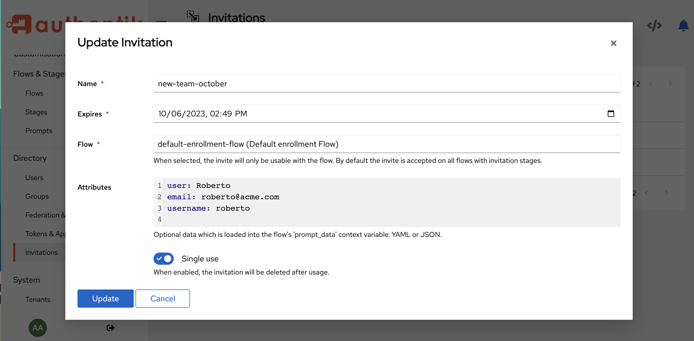

Invitations are another way to create a user, by inviting someone to join your authentik instance, as a new user. With invitations, you can either email an enrollment invitation URL to one or more specific recipients with pre-defined credentials, or you can email a URL to users, who can then log in and define their own credentials.

:::info
You can also create a policy to see if the invitation was ever used.
:::

## Create an invitation

The fastest way to create an invitation is to use our pre-defined `default-enrollment-flow` that has the necessary stages and prompts already included.

**Step 1. Download the `default-enrollment-flow` file**

To download the `default-enrollment-flow` file, run this command:

```
wget https://raw.githubusercontent.com/goauthentik/authentik/main/website/developer-docs/blueprints/example/flows-enrollment-2-stage.yaml
```

Alternatively, use this [link](/blueprints/example/flows-enrollment-2-stage.yaml) to view and save the file. For more details, refer to the [documentation](https://goauthentik.io/docs/flow/examples/flows#enrollment-2-stage).

**Step 2. Import the `default-enrollment-flow` file**

In authentik, navigate to the Admin UI, and then click **Flows** in the left navigation pane.

At the top of the Flows page, click **Import**, and then select the `flows-enrollment-2-stage.yaml` file that you just downloaded.

**Step 3. Create the invitation object**

In the Admin UI, navigate to **Directory --> Invitations**, and then click **Create** to open the **Create Invitation** modal. Define the following fields:

-   **Name**: provide a name for your invitation object.
-   **Expires**: select a date for when you want the invitation to expire.
-   **Flow**: in the drop-down menu, select the **default-enrollment-flow** Flow.
-   **Custom attributes**: (_optional_) enter optional key/value pairs here, to pre-define any information about the user that you will invite to enroll. The data entered here is considered as a variable, specifically the `context['prompt_data']` variable. This data is read by the context flow's [prompt stage](../../flow/stages/prompt/index.md) in an expression policy.



-   **Single use**: specify whether or not you want the invitation to expire after a single use.

Click **Save** to save the new invitation and close the modal and return to the **Invitations** page.

**Step 3. Email the invitation**

On the **Invitations** page, click the chevron beside your new invitation, to expand the details. The **Link to use the invitation** displays with the URL. Copy the URL and send it in an email to the people you want to invite to enroll.
