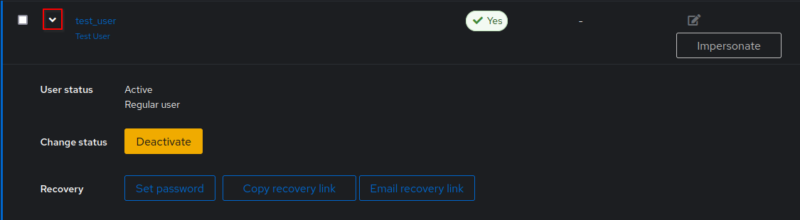
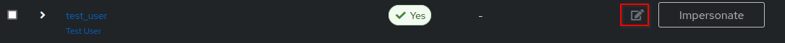

# User basic operations

## Add a user

In this section, we will describe the procedure to add a user manually.

If you are looking for a way to automate those steps, you can do that either by [invitations](./invitation.md), [user write stage](../../flow/stages/user_write.md) or by [looking at the API](../../../developer-docs/api/browser).

-   In the Admin interface of your Authentik instance, select Directory > Users on the left menu.

-   Select the user folder where you want to create your user.

-   Click on the "Create" buton if you want to create a normal user.

-   Fill the required fields:

    -   Username: Username of the user. This value must be unique across your user folders
    -   Path: The path where the user will be created. It will be automatically populated with the folder you selected in the previous step.
    -   Attributes: Custom attributes defintion for the user, in YAML or JSON format. They can be used to enforce additionnal prompts on authentication stages or define specific conditions to enforce specific policies if the current implementation does not fit your use case. The value is an empty dictionary by default.

-   Fill the optionnal fields if needed:

    -   Name: The display name of the user.
    -   Email: The email of the user. That will be used if there is a [notification rule](../../events/notifications.md) triggered or for [email stages](../../flow/stages/email/index.mdx).
    -   Is active: Define is the newly created user accound is active. Selected by default.

-   Click "Create"

You should see a confirmation pop-up on the top-right of the screen that the user has been created, and see the new user in the user list.
You can directly click on the username if you want to [modify your user](./user_basic_operations.md#modify-a-user).

## View user details

In the Directory > Users menu, you can browse all the users created in your Authentik instance. If you need more details about a user, you can do it either:

-   By clicking on the scrolling tab of the user you want to check:

    
    This gives you basic information about the user, and also quick access to perform basic actions to the user.

-   Click on the username for a complete view of the user informations. You will land on a page with multiple tabs:

    -   Overview gives you info on the actions made by the user, acces to diffrent user modifcation actions, ans infos about the user.
    -   Session shows the active sessions established by the user. If there is any need, you can clean up the connected devices for a user by selecting them with the checkbox and click on "Delete". It will force the user to authenticate again on the deleted devices.
    -   Groups allows you to manage the group membership of the user. You can find more details on [groups](../group.md).
    -   User events displays all the events generated by the user during a session, such as login, logout, application authorisation, password reset, user info update...
    -   Explicit consent lists all the permissions the user has given explicitly to an application. Entries will only appear if the user is validating an [explicit consent flow in an OAuth2 provider](../../providers/oauth2/index.md). If you want to delete the explicit consent (because the application is requiring new permissions, or the user has explicitly asked to reset his consent on third-party apps), you can select the applications with the checkbox and click on "Delete". The user will be asked to give explicitly is consent again to share informations with the application.
    -   OAuth Refresh Tokens lists all the current OAuth tokens distributed. You can remove them by selecting the applications with the checkbox and click on "Delete".
    -   MFA Authenticators shows all the authentications the user has registered to its profile. You can remove then if the user has lost its authenticator and wished to enroll a new one.

## Modify a user

After the creation of the user, you can edit any parameter set during the creation:

-   Go to Directory > Users, and select the quick edit button:
    
-   You can also go into [user details](#user-details), and click on the "Edit" button.

## User recovery

I the user has lost its credentials, you can send a recovery link when selecting a user in list or detail view:

-   Generate a recover link by on the "Copy recover link" button.
    A notification will appear on your browser with the link to sent to the user.
-   Send an email with the recovery link to the user address by clicking on the "Email recovery link" button.
    This option will only work if you avec properly [configured a SMTP server during the installation](../../installation/docker-compose.md#email-configuration-optional-but-recommended) and set an email address for the user.

    After clicking on the button, the user should have recieved the mail. If that's not the case, check if the mail server parameters [are properly configured](../../troubleshooting/emails.md).

## Deactivate/Delete user

To deactivate a user:

-   Go into the user list or detail, and select "Deactivate".
-   Review the changes and click "Update".

The active sessions will be revoked and the authentication of the user blocked. You can reactivate the account by following the same procedure.

:::caution
This deletion is not reversible, so be sure you do not need to recover any identity data of the user.
Otherwise, you can deactivate the account.
:::

To delete an user:

-   Go into the user list and select one (or multiple users) to delete and click on the "Delete" button on the top-right of the page.
-   Review the changes and click "Delete".

The user list will be refreshed without the removed users.
