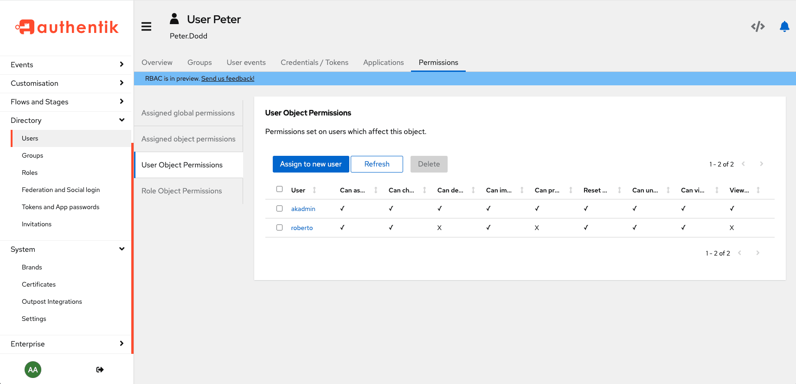

Permissions are the central components in all access control systems, the lowest-level components, the controlling pieces of access data. Permissions are assigned to (or removed from!) to define exactly WHO can do WHAT to WHICH part of the overall software system.

:::info
Note that global and object permissions only apply to objects within authentik, and not to who can access certain applications (which are access-controlled using [policies](../../customize/policies/index.md)).
:::

For instructions to add, remove, and manage permissions, refer to [Manage Permissions](./manage_permissions.md).

## Fundamentals of authentik permissions

There are two main types of permissions in authentik:

- [**Global permissions**](#global-permissions)
- [**Object permissions**](#object-permissions)

Additionally, authentik employs _initial permissions_ to streamline the process of granting object-level permissions when an object (user or role) is created. This feature enables an Admin to proactively assign specific rights to a user for object creation, as well as for viewing and managing those objects and other objects created by individuals in the same role. For more details, refer to [Initial permissions](./initial_permissions.mdx).

### Global permissions

Global permissions define who can do what on a global level across the entire system. Some examples in authentik are the ability to add new [flows](../../add-secure-apps/flows-stages/flow/index.md) or to create a URL for users to recover their login credentials.

You can assign _global permissions_ to individual [users](../user/index.mdx) or to [roles](../roles/index.md). The most common and best practice is to assign permissions to roles.

### Object permissions

Object permissions have two categories:

- **_User_ object permissions**: defines WHO (which user) can change the **_object_**
- **_Role_ object permissions**: defines which ROLE can change the **_object_**

Object permissions are assigned, as the name indicates, to an object ([users](../user/index.mdx), [groups](../groups/index.mdx), [roles](../roles/index.md), [flows](../../add-secure-apps/flows-stages/flow/index.md), and stages), and the assigned permissions state exactly what a user or role can do TO the object (i.e. what permissions does the user or role have on that object).

When working with object permissions it is important to understand that when you are viewing the page for an object, the permissions table shows which users or roles have permissions ON that specific object. Those permissions describe what those users or roles can do TO the object detailed on the page.

For example, the Admin interface UI shown below shows a user page for the user named Peter.

You can see in the **User Object Permissions** table that the Admin user (`akadmin`) and one other user (roberto) has permissions on Peter (that is, on the user object named Peter).

Looking at another example, with a flow object called `default-recovery-flow`, you can see that the Admin user (akadmin) has all object permissions on the flow, but roberto only has a few permissions on that flow.

