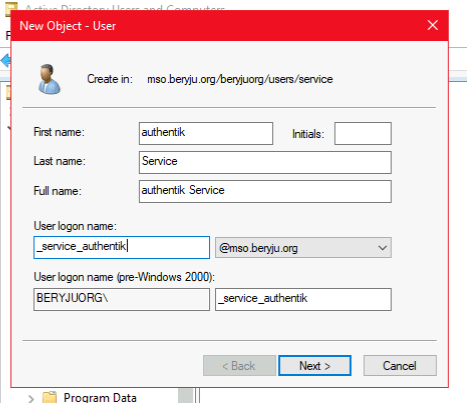
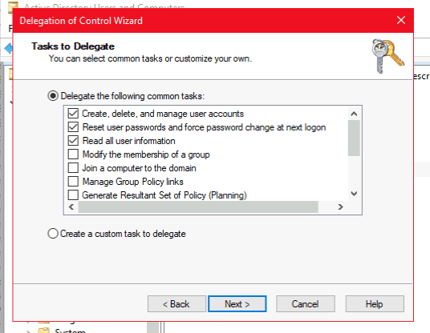
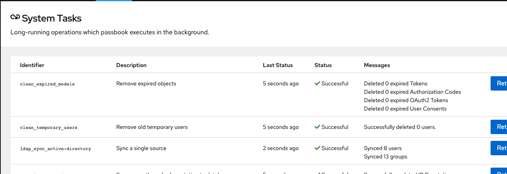
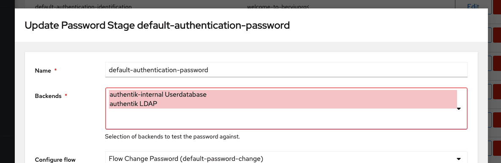

## Preparation

The following placeholders are used in this guide:

- `ad.company` is the name of the Active Directory domain.
- `authentik.company` is the FQDN of the authentik installation.

## Active Directory configuration

To support the integration of Active Directory with authentik, you need to create a service account in Active Directory.

1. Open **Active Directory Users and Computers** on a domain controller or computer with **Active Directory Remote Server Administration Tools** installed.
2. Navigate to an Organizational Unit, right-click it, and select **New** > **User**.
3. Create a service account, matching your naming scheme, for example:

    

4. Set the password for the service account. Ensure that the **Reset user password and force password change at next logon** option is not checked.

    Either one of the following commands can be used to generate the password:

    ```sh
    pwgen 64 1
    ```

    ```sh
    openssl rand 36 | base64 -w 0
    ```

5. Open the **Delegation of Control Wizard** by right-clicking the domain Active Directory Users and Computers, and selecting **All Tasks**.
6. Select the authentik service account that you've just created.
7. Grant these additional permissions. They are required only when _User password writeback_ is enabled on the LDAP source in authentik, and depend on your Active Directory domain.

    

:::note Limiting service account permissions
Optionally, if you don't want authentik to be able to view and sync objects within certain Organizational Units, you can limit the service account's permissions:

1. Right-click the Organizational Unit in question and navigate to **Properties** > **Security**.
2. Select the authentik service account that you created.
3. Under the **Deny** column, check **Read**.
4. Click **Apply**.

You can repeat this process for other OUs and objects within Active Directory.
:::

:::note LDAP signing
By default, Windows Server 2025 requires LDAP signing, which can disrupt authentik's Active Directory connectivity if LDAPS is not in use. You can address this by enabling LDAPS or by disabling LDAP signing on the domain controller. Disabling LDAP signing has security implications.
:::

## authentik setup

To support the integration of authentik with Active Directory, create a new LDAP source in authentik.

1. Log in to authentik as an administrator and open the authentik Admin interface.
2. Navigate to **Directory** > **Federation and Social login**.
3. Click **Create** and select **LDAP Source** as the type.
4. Provide a name, slug, and the following required configurations:

    Under **Connection settings**:
    - **Server URI**: `ldap://ad.company`

    :::info
    For authentik to be able to write passwords back to Active Directory, make sure to use `ldaps://` as a prefix. You can verify that LDAPS is working by opening the `ldp.exe` tool on a domain controller and attempting a connection to the server via port 636. If a connection can be established, LDAPS is functioning as expected. More information can be found in the [Microsoft LDAPS documentation](https://learn.microsoft.com/en-us/troubleshoot/windows-server/active-directory/ldap-over-ssl-connection-issues).

    Multiple servers can be specified by separating URIs with a comma (for example, `ldap://dc1.ad.company,ldap://dc2.ad.company`). If a DNS entry with multiple records is used, authentik selects a random entry when first connecting.
    :::
    - **Bind CN**: `<service account>@ad.company`
    - **Bind Password**: the password of the service account created in the previous section.
    - **Base DN**: the base DN that you want authentik to sync.

    Under **LDAP attribute mapping**:
    - **User Property Mappings**: select all mappings that start with `authentik default LDAP` and `authentik default Active Directory`.
    - **Group Property Mappings**: select `authentik default LDAP Mapping: Name`.

    Under **Additional settings**, adjust these optional configurations based on the setup of your domain:
    - **Group**: if enabled, all synchronized groups will be given this group as a parent.
    - **Addition User/Group DN**: additional DN that is _prepended_ to the base DN configured above to limit the scope of user and group synchronization.
    - **User object filter**: objects that should be considered users (for example, `(objectClass=user)`). For Active Directory, set it to `(&(objectClass=user)(!(objectClass=computer)))` to exclude computer accounts.
    - **Group object filter**: objects that should be considered groups (for example, `(objectClass=group)`).
    - **Lookup using a user attribute**: acquire group membership from a user object attribute (`memberOf`) instead of a group attribute (`member`). This works with directories and nested group memberships (Active Directory, Red Hat IDM/FreeIPA), using `memberOf:1.2.840.113556.1.4.1941:` as the group membership field.
    - **Group membership field**: the user object attribute or group object attribute that determines the group membership of a user (for example, `member`). If **Lookup using a user attribute** is set, this should be a user object attribute. Otherwise, this should be a group object attribute.
    - **User membership attribute**: ensure that this is set to `distinguishedName`.
    - **Object uniqueness field**: a user attribute that contains a unique identifier (for example, `objectSid`).

5. Click **Finish** to save the LDAP source. An LDAP synchronization begins in the background. After it is complete, view the summary by navigating to **Dashboards** > **System Tasks**:

    

6. To finalize the Active Directory setup, enable the `authentik LDAP` backend in the password stage.

    
