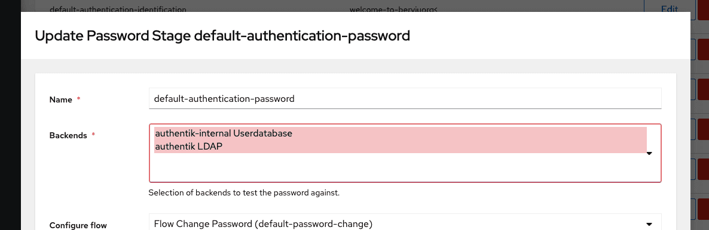

## Preparation

The following placeholders are used in this guide:

- `ad.company` is the name of the Active Directory domain.
- `authentik.company` is the FQDN of the authentik install.

## Active Directory configuration

To support the integration of Active Directory with authentik, you need to create a service account in Active Directory.

1. Open Active Directory Users and Computers.
2. Create a service account in Active Directory, matching your naming scheme, for example:

    

3. Set the password for the service account. Ensure that the **Reset user password and force password change at next logon** option is not checked.

    The following commands can be used to generate the password:

    ```sh
    pwgen 64 1
    ```

    ```sh
    openssl rand 36 | base64 -w 0
    ```

4. Open the **Delegation of Control Wizard** by right-clicking the domain Active Directory Users and Computers, and selecting **All Tasks**.
5. Select the authentik service account that you've just created.
6. Grant these additional permissions (only required when _User password writeback_ is enabled on the LDAP source in authentik, and dependent on your AD Domain)

    

## authentik Setup

To support the integration of authentik with Active Directory, you will need to create a new LDAP Source in authentik.

1. Log in to authentik as an admin, and open the authentik Admin interface.
2. Navigate to **Directory** > **Federation & Social login**.
3. Click **Create** and select **LDAP Source** as the type.
4. Provide a name, slug, and the following required configurations:

    Under **Connection Settings**:

    - **Server URI**: `ldap://ad.company`

    :::note
    For authentik to be able to write passwords back to Active Directory, make sure to use `ldaps://` as a prefix. You can verify LDAPS is working via `ldp.exe`. Multiple servers can be specified by separating URIs with a comma (e.g. `ldap://dc1.ad.company,ldap://dc2.ad.company`). If a DNS entry with multiple records is used, authentik will select a random entry when first connecting.
    :::

    - **Bind CN**: `<service account>@ad.company`
    - **Bind Password**: the password of the service account created in the previous section.
    - **Base DN**: the base DN which you want authentik to sync.

    Under **LDAP Attribute Mapping**:

    - **User Property Mappings**: select all Mappings which start with "authentik default LDAP" and "authentik default Active Directory"
    - **Group Property Mappings**: select "authentik default LDAP Mapping: Name"

    Under **Additional Settings** _(optional)_ configurations that may need to be adjusted based on the setup of your domain:

    - **Group**: if enabled, all synchronized groups will be given this group as a parent.
    - **Addition User/Group DN**: additional DN which is _prepended_ to your Base DN configured above, to limit the scope of synchronization for Users and Groups.
    - **User object filter**: which objects should be considered users (e.g. `(objectClass=user)`). For Active Directory set it to `(&(objectClass=user)(!(objectClass=computer)))` to exclude Computer accounts.
    - **Group object filter**: which objects should be considered groups (e.g `(objectClass=group)`).
    - **Lookup using a user attribute**: acquire group membership from a User object attribute (`memberOf`) instead of a Group attribute (`member`). This works with directories and nested groups memberships (Active Directory, RedHat IDM/FreeIPA), using `memberOf:1.2.840.113556.1.4.1941:` as the group membership field.
    - **Group membership field**: the user object attribute or the group object attribute that determines the group membership of a user. If you defined a "Lookup using a user attribute", this should be a user object attribute, otherwise a group object attribute.
    - **Object uniqueness field**: a user attribute that contains a unique identifier.

5. Click **Finish** to save the LDAP Source. An LDAP synchronization will begin in the background. Once completed, you can view the summary by navigating to **Dashboards** > **System Tasks**:

    

6. To finalise the Active Directory setup, you need to enable the backend "authentik LDAP" in the Password Stage.

    
