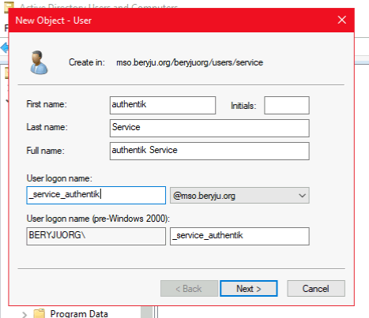
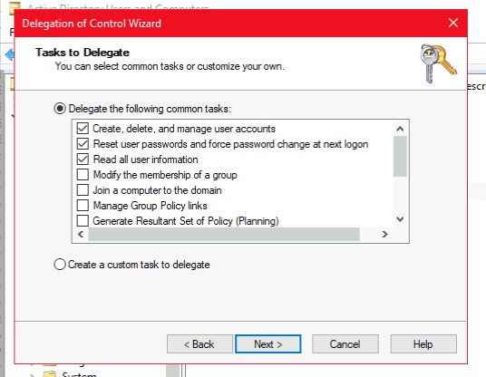

## Preparation

The following placeholders are used in this guide:

- `ad.company` is the name of the Active Directory (AD) domain.
- `authentik.company` is the FQDN of the authentik installation.

## Active Directory configuration

To integrate Active Directory with authentik, create an Active Directory service account that can read the users, groups, and attributes that you want to synchronize.

1. Open **Active Directory Users and Computers** on a domain controller or a computer with AD DS Remote Server Administration Tools installed.
2. Navigate to an organizational unit (OU), right-click it, and select **New** > **User**.
3. Create a service account that follows your naming scheme. For example:

    

4. Set the password for the service account. Ensure that the **Reset user password and force password change at next logon** option is not checked.

    Use either of the following commands to generate the password:

    ```sh
    pwgen 64 1
    ```

    ```sh
    openssl rand 36 | base64 -w 0
    ```

5. If you want authentik to write passwords back to Active Directory, delegate additional permissions to the service account. Otherwise, skip the remaining steps in this section. To open the **Delegation of Control Wizard**, right-click the domain in **Active Directory Users and Computers**, then select **All Tasks**.
6. Select the authentik service account that you created.
7. On **Tasks to Delegate**, select **Reset user passwords and force password change at next logon**, **Read all user information**, **Create, delete, and manage user accounts**, and then complete the wizard.



:::info Limiting service account permissions
If you do not want authentik to view or synchronize objects within certain OUs, you can limit the service account's permissions:

1. Right-click the relevant OU and navigate to **Properties** > **Security**.
2. Select the authentik service account that you created.
3. Under the **Deny** column, check **Read**.
4. Click **Apply**.

You can repeat this process for other OUs and objects within Active Directory.
:::

:::info LDAP signing
Active Directory deployments on Windows Server 2025 require LDAP signing by default. A domain controller that requires signing rejects simple binds over unencrypted connections. We recommend configuring TLS using LDAPS or StartTLS rather than disabling signing.
:::

## authentik setup

:::note Settings and defaults
This guide identifies required and optional settings and notes when to retain default values. For settings not listed here, keep the defaults unless your deployment requires otherwise.

See the [LDAP source documentation](../../protocols/ldap/index.mdx) for more information on these settings.
:::

### 1. Create the LDAP source

To integrate authentik with Active Directory, create an LDAP source in authentik.

1. Log in to authentik as an administrator and open the authentik Admin interface.
2. Navigate to **Directory** > **Federation and Social login**.
3. Click **New Source** and select **LDAP Source**.

### 2. Configure general settings

Configure the top-level settings in the following table. For **Sync Group Hierarchy** and the three membership fields under **Additional settings**, use one complete setup from [Membership configuration](#membership-configuration).

| Setting                                     | Value                                                          | Notes                                                                                                                                                                                                                                                                                                                                                          |
| ------------------------------------------- | -------------------------------------------------------------- | -------------------------------------------------------------------------------------------------------------------------------------------------------------------------------------------------------------------------------------------------------------------------------------------------------------------------------------------------------------- |
| **Name**                                    | A descriptive name                                             | Identifies the LDAP source.                                                                                                                                                                                                                                                                                                                                    |
| **Slug**                                    | A descriptive slug                                             | Identifies the source in URLs and API requests.                                                                                                                                                                                                                                                                                                                |
| **Enabled**                                 | Enabled                                                        | Allows authentik to use the source.                                                                                                                                                                                                                                                                                                                            |
| **Update internal password on login**       | Disabled unless required                                       | Enable only if you want authentik to update a user's stored password after a successful LDAP login. See [Password login](../../protocols/ldap/index.mdx#password-login) for security considerations.                                                                                                                                                           |
| **Sync users**                              | Enabled                                                        | Imports users from AD.                                                                                                                                                                                                                                                                                                                                         |
| **User password writeback**                 | Disabled unless required                                       | This setting is enabled by default. Disable it unless you want password changes made in authentik to be written back to AD. Only one LDAP source can have writeback enabled. Writeback requires the delegated permissions described above and a TLS-protected connection.                                                                                      |
| **Sync groups**                             | Enabled                                                        | Imports groups from AD.                                                                                                                                                                                                                                                                                                                                        |
| **Sync Group Hierarchy**:ak-version[2026.8] | [Select a membership configuration](#membership-configuration) | Configure this setting together with **Group membership field**, **User membership attribute**, and **Lookup using user attribute**. This setting requires **Sync groups** to be enabled.                                                                                                                                                                      |
| **Delete Not Found Objects**                | Disabled unless required                                       | Enable only if you want authentik to delete previously synchronized users and groups that are absent from the source's search results. User deletion requires **Sync users** to be enabled; group deletion requires **Sync groups** to be enabled. Review the [deletion behavior](../../protocols/ldap/index.mdx#delete-not-found-objects) before enabling it. |

### 3. Configure connection settings

Under **Connection settings**, configure the following settings:

| Setting                          | Value                           | Notes                                                                                                                                                                                                                                                                                                                      |
| -------------------------------- | ------------------------------- | -------------------------------------------------------------------------------------------------------------------------------------------------------------------------------------------------------------------------------------------------------------------------------------------------------------------------- |
| **Server URI**                   | `ldap://ad.company`             | —                                                                                                                                                                                                                                                                                                                          |
| **Enable StartTLS**              | Enabled                         | For `ldap://`, leave enabled to upgrade the connection to TLS before binding. Disable only if you intentionally use LDAP without TLS. For `ldaps://`, disable this option because TLS is established when connecting. Both LDAPS and StartTLS can provide the TLS-protected connection required for AD password writeback. |
| **TLS Verification Certificate** | Optional                        | Select a certificate/keypair containing the CA chain that issued the domain controller's certificate. Leaving this field empty skips certificate validation for both LDAPS and StartTLS.                                                                                                                                   |
| **Bind CN**                      | `<service_account>@ad.company`  | Enter the service account's user principal name (UPN).                                                                                                                                                                                                                                                                     |
| **Bind Password**                | The service account password    | —                                                                                                                                                                                                                                                                                                                          |
| **Base DN**                      | For example, `DC=ad,DC=company` | Defines the search base.                                                                                                                                                                                                                                                                                                   |

:::tip Multiple server URIs
You can specify multiple server URIs separated by commas. For example, specify `ldap://dc1.ad.company,ldap://dc2.ad.company`. If you use a DNS record with multiple entries, authentik picks one at random on the first connection.
:::

:::info Check TLS connectivity
For LDAPS, use `ldp.exe` to connect to the domain controller on port 636 with **SSL** selected. A successful connection from that computer does not verify authentik's network access, certificate validation, or bind credentials. See Microsoft's [LDAPS troubleshooting guide](https://learn.microsoft.com/en-us/troubleshoot/windows-server/active-directory/ldap-over-ssl-connection-issues).
:::

### 4. Configure LDAP attribute mappings

Under **LDAP Attribute mapping**, configure the following settings:

| Setting                     | Value                                                                                                         |
| --------------------------- | ------------------------------------------------------------------------------------------------------------- |
| **User Property Mappings**  | Select all mappings whose names begin with `authentik default LDAP` and `authentik default Active Directory`. |
| **Group Property Mappings** | Select only `authentik default LDAP Mapping: Name`. Deselect any other mappings selected by default.          |

### 5. Configure additional settings

Under **Additional settings**, configure the following settings:

| Setting                         | Value                                                          | Notes                                                                                                                                                             |
| ------------------------------- | -------------------------------------------------------------- | ----------------------------------------------------------------------------------------------------------------------------------------------------------------- |
| **Additional Parent Group**     | Optional                                                       | Select a parent for all imported groups. See [how this interacts with hierarchy synchronization](../../protocols/ldap/index.mdx#synchronize-the-group-hierarchy). |
| **Additional User DN**          | Optional                                                       | Prepended to the base DN to limit the scope of user synchronization.                                                                                              |
| **Additional Group DN**         | Optional                                                       | Prepended to the base DN to limit the scope of group synchronization.                                                                                             |
| **User object filter**          | `(&(objectClass=user)(!(objectClass=computer)))`               | Excludes computer accounts.                                                                                                                                       |
| **Group object filter**         | `(objectClass=group)`                                          | Searches for AD groups.                                                                                                                                           |
| **Group membership field**      | [Select a membership configuration](#membership-configuration) | Configure this setting together with the other membership and hierarchy settings.                                                                                 |
| **User membership attribute**   | [Select a membership configuration](#membership-configuration) | Configure this setting together with the other membership and hierarchy settings.                                                                                 |
| **Lookup using user attribute** | [Select a membership configuration](#membership-configuration) | Configure this setting together with the other membership and hierarchy settings.                                                                                 |
| **Object uniqueness field**     | `objectSid`                                                    | Identifies AD users and groups.                                                                                                                                   |

### 6. Save the source and enable LDAP password login

1. Click **Create** to save the LDAP source and queue a background synchronization. Open the source's **Overview** tab and review **Sync status**.
2. Creating the source configures synchronization but does not enable LDAP password authentication in your authentication flow. To enable authentication with LDAP credentials, navigate to **Flows and Stages** > **Stages**, then edit the password stage used by the flow. Under **Stage-specific settings** > **Backends**, select **User database + LDAP password**, then save the stage.

## Membership configuration

authentik can represent nested Active Directory groups in two ways. It can synchronize direct user and group relationships to reproduce the AD group hierarchy, or it can ask AD to resolve recursive user membership for each group. Both approaches can provide effective memberships, but they create different relationships in authentik. Hierarchy synchronization preserves the distinction between direct and inherited membership, while AD-resolved results are stored as direct memberships.

Choose the approach that matches how you want to use synchronized groups in authentik. Select one complete configuration; do not combine the two sets of settings. **Sync Group Hierarchy** is a top-level setting; the other three fields are under **Additional settings**. For details, see [Group membership and hierarchy](../../protocols/ldap/index.mdx#group-membership-and-hierarchy).

| Configuration                                     | Use when                                                      | Result                                                                     |
| ------------------------------------------------- | ------------------------------------------------------------- | -------------------------------------------------------------------------- |
| Preserve the Active Directory group hierarchy     | You need authentik to reproduce nested AD groups.             | Direct and inherited memberships remain distinct.                          |
| Let Active Directory resolve recursive membership | You need effective membership but not the AD group structure. | Recursively discovered memberships become direct memberships in authentik. |

### Preserve the Active Directory group hierarchy

Use this configuration to synchronize direct user and group relationships:

```text
Sync Group Hierarchy: Enabled
Group membership field: member
User membership attribute: distinguishedName
Lookup using user attribute: Disabled
```

User DNs in `member` create direct user memberships when they match users in authentik. Matching group DNs create child-group relationships. Include the users and all groups needed for the hierarchy in the synchronization scope. authentik derives inherited membership from the synchronized hierarchy, preserving the distinction between [direct and inherited membership](../../protocols/ldap/index.mdx#group-membership-and-hierarchy).

### Let Active Directory resolve recursive membership

Active Directory's matching-rule-in-chain expression uses OID `1.2.840.113556.1.4.1941` to search a linked attribute recursively. Use this setup to let AD resolve recursive user membership:

```text
Sync Group Hierarchy: Disabled
Group membership field: memberOf:1.2.840.113556.1.4.1941:
User membership attribute: distinguishedName
Lookup using user attribute: Enabled
```

This is an LDAP search-filter expression, not a plain attribute name. Support for this matching rule depends on the directory server. For FreeIPA, follow the [FreeIPA guide](../freeipa/index.mdx).

When returned user DNs match users in authentik, those users become direct members of the queried group. Users found recursively for an ancestor group therefore also become direct members of that group. This setup does not reproduce the hierarchy or preserve the distinction between direct and inherited membership.

:::warning Incompatible membership and hierarchy settings
Do not enable **Sync Group Hierarchy** when **Group membership field** contains the matching-rule-in-chain expression `memberOf:1.2.840.113556.1.4.1941:`. The hierarchy synchronizer requests the configured field as an attribute on group objects, but the expression is valid only in an LDAP search filter.

To preserve the Active Directory hierarchy, use the [group-based `member` configuration](#preserve-the-active-directory-group-hierarchy).
:::

### Membership limits

Both configurations follow AD's `member`/`memberOf` links, not `primaryGroupID`. They do not import membership represented only by a user's primary group, which is commonly **Domain Users**. Use explicit membership in dedicated AD groups for access decisions in authentik rather than relying on primary-group membership.

For multi-domain directories, membership results also depend on which domain controller or global catalog you query. Verify the expected memberships before using synchronized groups to control access.

## Manual synchronization

Use manual synchronization to test changes to directory memberships or property mappings without waiting for the next scheduled run. Manual synchronization applies changes to authentik; it is not a dry run.

See [Run a synchronization](../../protocols/ldap/index.mdx#run-a-synchronization) for instructions.

## Resources

- [Microsoft: Delegation of control in Active Directory Domain Services](https://learn.microsoft.com/en-us/windows-server/identity/ad-ds/manage/delegation-control-wizard)
- [Microsoft: Change an Active Directory user password through LDAP](https://learn.microsoft.com/en-us/troubleshoot/windows-server/active-directory/change-windows-active-directory-user-password)
- [Microsoft: LDAP signing for Active Directory Domain Services](https://learn.microsoft.com/en-us/windows-server/identity/ad-ds/ldap-signing)
- [Microsoft: User security attributes, including memberOf and primaryGroupId](https://learn.microsoft.com/en-us/windows/win32/ad/security-properties)
