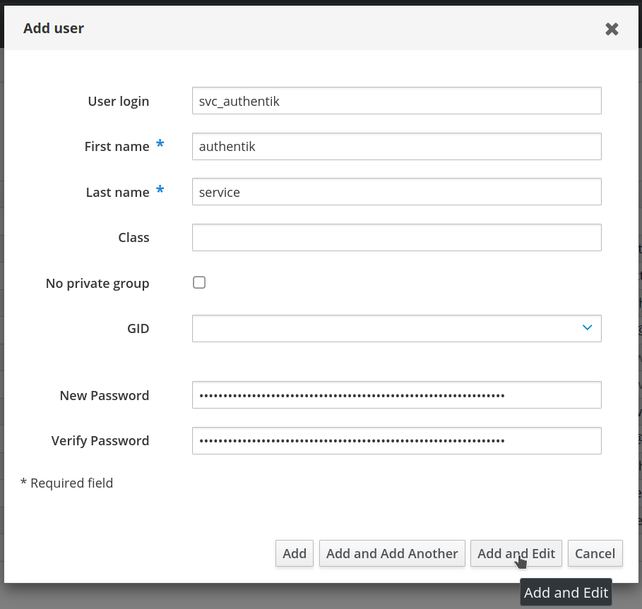
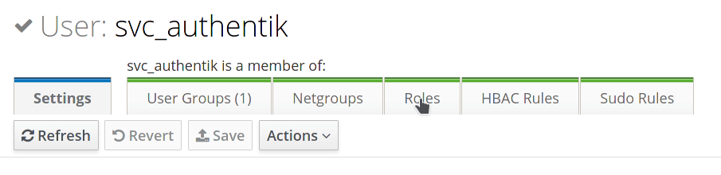
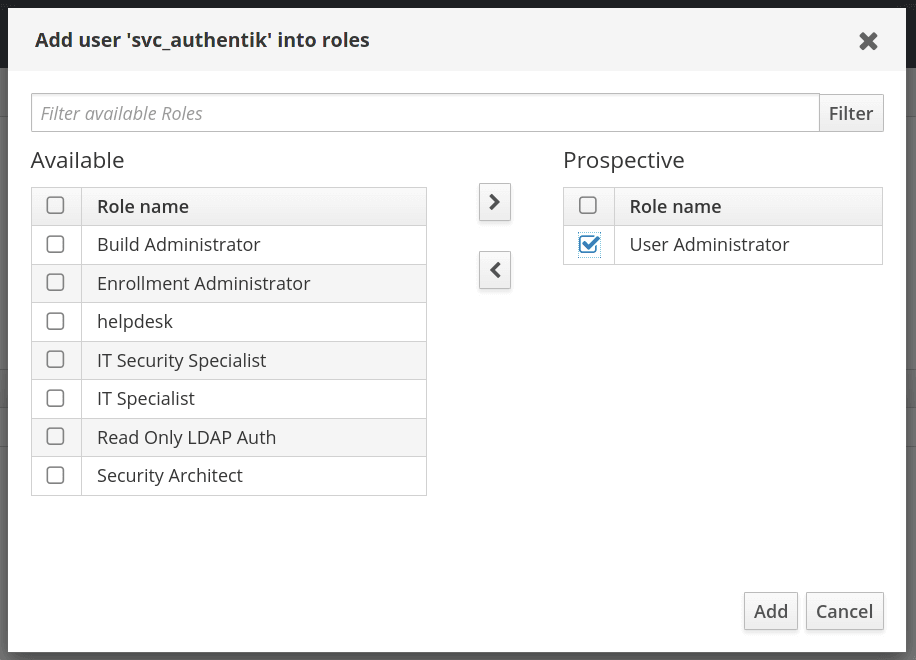
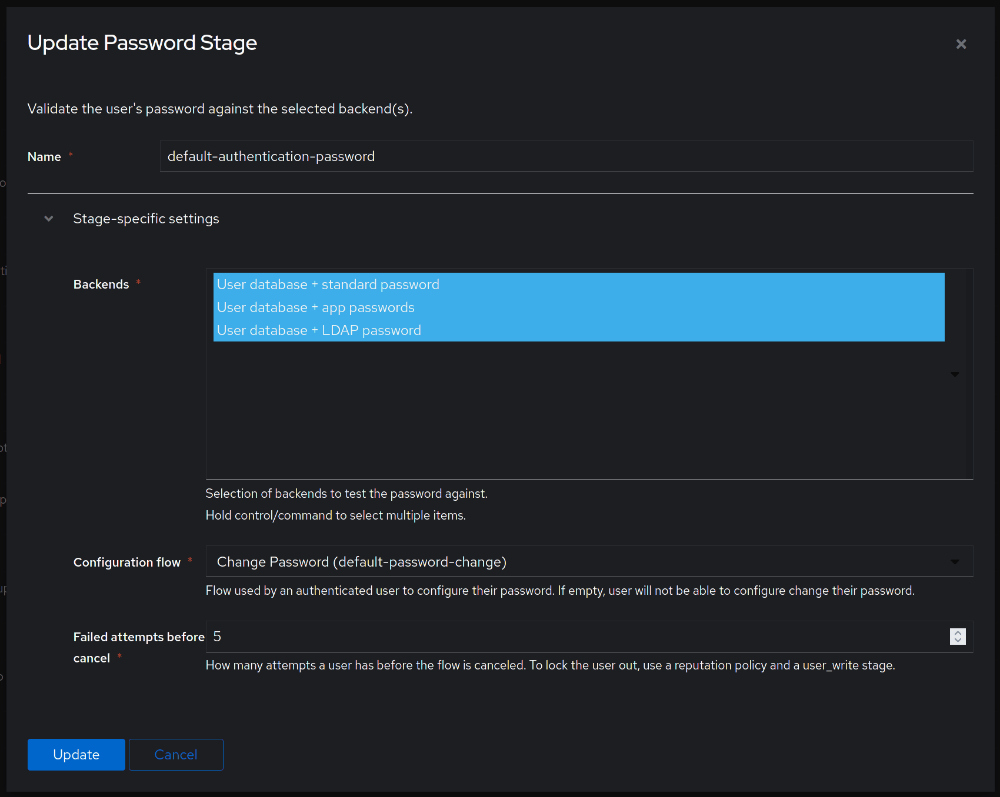

## Preparation

The following placeholders are used in this guide:

- `svc_authentik` is the name of the bind account.
- `freeipa.company` is the Name of the domain.
- `ipa1.freeipa.company` is the Name of the FreeIPA server.

## FreeIPA Setup

1. Log in to FreeIPA.

2. Create a user in FreeIPA, matching your naming scheme. Provide a strong password, example generation methods: `pwgen 64 1` or `openssl rand 36 | base64 -w 0`. After you are done click **Add and Edit**.

    

3. In the user management screen, select the Roles tab.

    

4. Add a role that has privileges to change user passwords, the default `User Administrators` role is sufficient. This is needed to support password resets from within authentik.

    

5. By default, if an administrator account resets a user's password in FreeIPA the user's password expires after the first use and must be reset again. This is a security feature to ensure password complexity and history policies are enforced. To bypass this feature for a more seamless experience, you can make the following modification on each of your FreeIPA servers:

    ```
    $ ldapmodify -x -D "cn=Directory Manager" -W -h ipa1.freeipa.company -p 389

    dn: cn=ipa_pwd_extop,cn=plugins,cn=config
    changetype: modify
    add: passSyncManagersDNs
    passSyncManagersDNs: uid=svc_authentik,cn=users,cn=accounts,dc=freeipa,dc=company
    ```

:::info
Additional info: [22.1.2. Enabling Password Reset Without Prompting for a Password Change at the Next Login](https://access.redhat.com/documentation/en-us/red_hat_enterprise_linux/7/html/linux_domain_identity_authentication_and_policy_guide/user-authentication#user-passwords-no-expiry)
:::

## authentik Setup

:::note
This documentation lists only the settings that you need to change from their default values. Be aware that any changes other than those explicitly mentioned in this guide could cause issues.

See the [LDAP Source documentation](../../protocols/ldap) for more information on these settings.
:::

To create a new LDAP Source in authentik:

1. Log in to authentik as an administrator, and open the authentik Admin interface.
2. Navigate to **Directory** > **Federation and Social Login**, click **Create**, select **LDAP Source**, and click **Next**.
3. Configure the following settings:
    - **Name**: Provide a descriptive name for the LDAP source.
    - **Slug**: Provide a slug for the LDAP source.
    - **Update internal password on login**: Enable if you want your users to be able to log in if FreeIPA is not accessible.
    - **Delete not found object**: Enable to delete users from authentik when they are deleted in FreeIPA.

    - Under **Connection settings**:
        - **Server URI**: `ldaps://ipa1.freeipa.company`
          :::tip
          You can specify multiple servers by separating URIs with a comma, like `ldap://ipa1.freeipa.company,ldap://ipa2.freeipa.company`. When using a DNS entry with multiple Records, authentik will select a random entry when first connecting.
          :::
        - **Enable StartTLS**: Enable for `ldap://` protocol, disable for `ldaps://`.
        - **TLS Verification Certificate**: Used to validate the remote certificate.
        - **Bind CN**: `uid=svc_authentik,cn=users,cn=accounts,dc=freeipa,dc=company`
        - **Bind Password**: The password for the above user account.
        - **Base DN**: `dc=freeipa,dc=company`

    - Under **LDAP Attribute mapping**:
        - **User Property Mappings**: Select all Mappings which start with `authentik default LDAP` and `authentik default OpenLDAP`. Remove the mappings that are selected by default.
        - **Group property mappings**: Select `authentik default OpenLDAP Mapping: cn`

    - Under **Additional settings**:
        - **Parent Group**: If selected, all synchronized groups will be given this authentik group as a parent.
        - **User Path**: The path that users will be saved under in authentik.
        - **Addition User/Group DN**: `cn=users,cn=accounts`
        - **Addition Group DN**: `cn=groups,cn=accounts`
        - **User object filter**: `(objectClass=person)`
        - **Group object filter**: `(objectClass=groupofnames)`
        - **Group membership field**: `memberOf`
        - **User membership attribute**: `distinguishedName`
        - **Lookup using user attribute**: Enabled.
        - **Object uniqueness field**: `ipaUniqueID`

    :::caution
    FreeIPA groups can contain nested groups. The `memberOf` user attribute lists all group memberships, direct and indirect.

    If you want to sync only direct group memberships, use the following settings:
    - **Group membership field**: `member`
    - **User membership attribute**: `distinguishedName`
    - **Lookup using user attribute**: Disabled.
      :::

4. Click **Finish** to create the LDAP Source.

### Manual synchronization

After you save the source, you can kick off a synchronization by navigating to the source, clicking on the **Sync** tab, and clicking the **Run sync again** button.

Lastly, verify that the **User database + LDAP password** backend is selected in the **Password Stage** under **Flows and Stages > Stages**.



### Blueprints

You can also configure the LDAP source with a blueprint:

```yaml
# yaml-language-server: $schema=https://goauthentik.io/blueprints/schema.json
version: 1
metadata:
    name: FreeIPA LDAP Source
    labels:
        blueprints.goauthentik.io/description: "LDAP Source configuration for FreeIPA"
entries:
    - model: authentik_sources_ldap.ldapsource
      identifiers:
          slug: ldap-source-freeipa
      attrs:
          enabled: true
          base_dn: dc=freeipa,dc=company
          additional_user_dn: cn=users,cn=accounts
          additional_group_dn: cn=groups,cn=accounts
          bind_cn: !Env FREEIPA_DN
          bind_password: !Env FREEIPA_PASSWORD
          delete_not_found_objects: true
          group_membership_field: memberOf
          group_object_filter: (objectClass=groupofnames)
          lookup_groups_from_user: true
          object_uniqueness_field: ipaUniqueID
          server_uri: ldaps://ipa1.freeipa.company,ldaps://ipa2.freeipa.company
          sni: true
          sync_groups: true
          sync_users: true
          sync_users_password: true
          user_membership_attribute: distinguishedName
          user_object_filter: (objectClass=person)
          user_property_mappings:
              - !Find [
                    authentik_sources_ldap.ldapsourcepropertymapping,
                    [managed, goauthentik.io/sources/ldap/openldap-cn],
                ]
              - !Find [
                    authentik_sources_ldap.ldapsourcepropertymapping,
                    [managed, goauthentik.io/sources/ldap/openldap-uid],
                ]
              - !Find [
                    authentik_sources_ldap.ldapsourcepropertymapping,
                    [managed, goauthentik.io/sources/ldap/default-mail],
                ]
              - !Find [
                    authentik_sources_ldap.ldapsourcepropertymapping,
                    [managed, goauthentik.io/sources/ldap/default-dn-path],
                ]
              - !Find [
                    authentik_sources_ldap.ldapsourcepropertymapping,
                    [managed, goauthentik.io/sources/ldap/default-name],
                ]
          group_property_mappings:
              - !Find [
                    authentik_sources_ldap.ldapsourcepropertymapping,
                    [managed, goauthentik.io/sources/ldap/openldap-cn],
                ]
```

You must set the username (dn) and password in the environment variables FREEIPA_DN and FREEIPA_PASSWORD.
