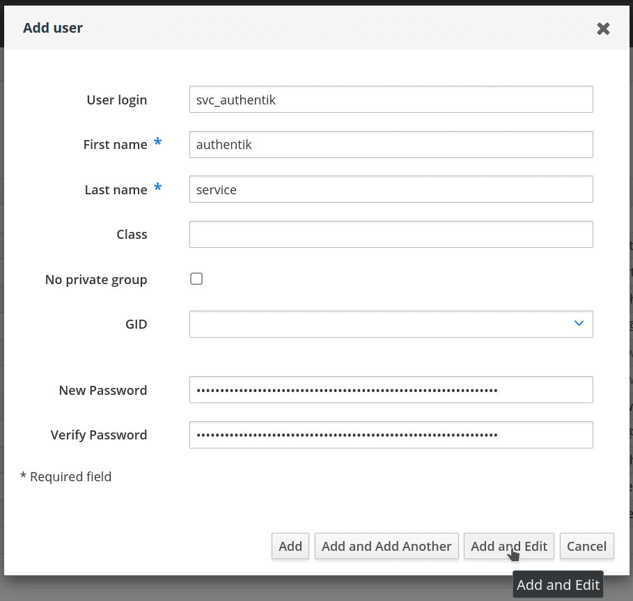
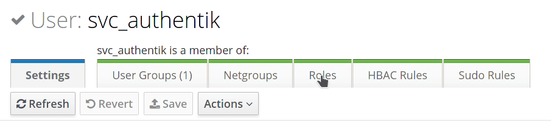
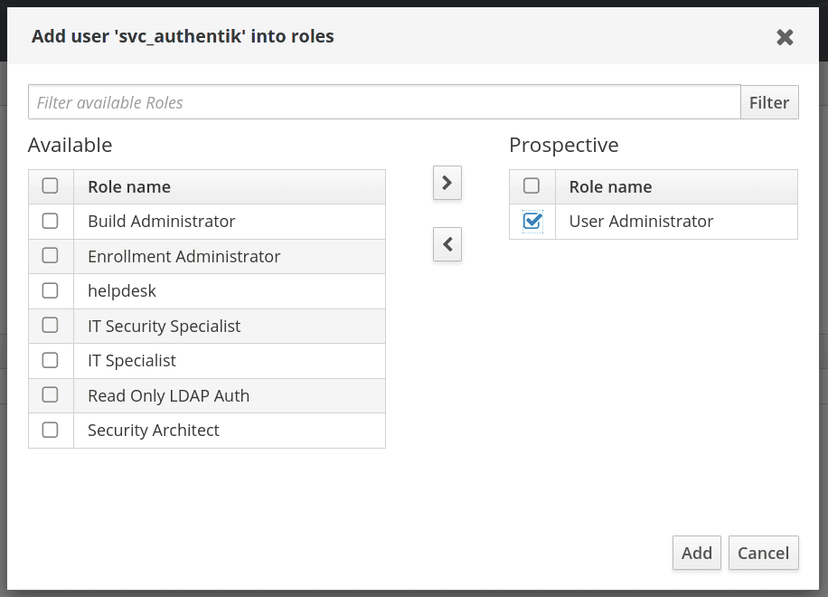

## Preparation

The following placeholders are used in this guide:

- `svc_authentik` is the name of the bind account.
- `freeipa.company` is the name of the domain.
- `ipa1.freeipa.company` is the name of the FreeIPA server.

## FreeIPA setup

1. Log in to FreeIPA as an administrator.

2. Create a user in FreeIPA that matches your naming scheme. Provide a strong password.

    Use either of the following commands to generate the password:

    ```sh
    pwgen 64 1
    ```

    ```sh
    openssl rand 36 | base64 -w 0
    ```

    After entering the user details, click **Add and Edit**.

    

3. If you want password writeback, open the bind user's management screen and select the **Roles** tab. Otherwise, skip the remaining FreeIPA setup steps.

    

4. Add a role that has privileges to change user passwords. The default `User Administrators` role is sufficient. This is needed to support password resets from within authentik.

    

5. By default, when an administrator resets a user's password in FreeIPA, the password expires after its first use, and the user must reset it again. This security feature ensures that password complexity and history policies are enforced. To prevent the additional password-change prompt after a reset through authentik, apply the following configuration to each FreeIPA server:

    ```
    $ ldapmodify -x -D "cn=Directory Manager" -W -h ipa1.freeipa.company -p 389

    dn: cn=ipa_pwd_extop,cn=plugins,cn=config
    changetype: modify
    add: passSyncManagersDNs
    passSyncManagersDNs: uid=svc_authentik,cn=users,cn=accounts,dc=freeipa,dc=company
    ```

:::info
For more information, see [22.1.2. Enabling Password Reset Without Prompting for a Password Change at the Next Login](https://access.redhat.com/documentation/en-us/red_hat_enterprise_linux/7/html/linux_domain_identity_authentication_and_policy_guide/user-authentication#user-passwords-no-expiry).
:::

## authentik setup

Keep the defaults for settings not listed below. See the [LDAP source reference](../../protocols/ldap/index.mdx) for all configuration options.

### 1. Create the LDAP source

1. Log in to authentik as an administrator and open the authentik Admin interface.
2. Navigate to **Directory** > **Federation and Social login**.
3. Click **New Source** and select **LDAP Source**.

### 2. Configure general settings

Configure the following settings. Choose a [membership configuration](#membership-configuration) for **Sync Group Hierarchy** and the membership fields under **Additional settings**.

| Setting                                      | Value                                                          | Notes                                                                                                                                                                                                                                             |
| -------------------------------------------- | -------------------------------------------------------------- | ------------------------------------------------------------------------------------------------------------------------------------------------------------------------------------------------------------------------------------------------- |
| **Name**                                     | A descriptive name                                             | Identifies the LDAP source.                                                                                                                                                                                                                       |
| **Slug**                                     | A descriptive slug                                             | Identifies the source in URLs and API requests.                                                                                                                                                                                                   |
| **Enabled**                                  | Enabled                                                        | Allows authentik to use the source.                                                                                                                                                                                                               |
| **Update internal password on login**        | Disabled unless required                                       | Stores a local password hash after a successful LDAP login. See [Password login](../../protocols/ldap/index.mdx#password-login) before enabling.                                                                                                  |
| **Sync users**                               | Enabled                                                        | Imports users from FreeIPA.                                                                                                                                                                                                                       |
| **User password writeback**                  | Disabled unless required                                       | This setting is enabled by default. Disable it unless you want password changes made in authentik to be written back to FreeIPA. Only one LDAP source can have writeback enabled, and writeback requires the account permissions described above. |
| **Sync groups**                              | Enabled                                                        | Imports groups from FreeIPA.                                                                                                                                                                                                                      |
| **Sync Group Hierarchy** :ak-version[2026.8] | [Select a membership configuration](#membership-configuration) | Requires **Sync groups**.                                                                                                                                                                                                                         |
| **Delete Not Found Objects**                 | Disabled unless required                                       | Deletes synchronized users and groups that disappear from LDAP search results. Review the [deletion behavior](../../protocols/ldap/index.mdx#delete-not-found-objects) before enabling.                                                           |

### 3. Configure connection settings

Under **Connection settings**, configure the following settings:

| Setting                                 | Value                                                          | Notes                                                                                                                                                    |
| --------------------------------------- | -------------------------------------------------------------- | -------------------------------------------------------------------------------------------------------------------------------------------------------- |
| **Server URI**                          | `ldaps://ipa1.freeipa.company`                                 | —                                                                                                                                                        |
| **Enable StartTLS**                     | Disabled                                                       | To use StartTLS instead, use `ldap://` and enable this setting.                                                                                          |
| **Use Server URI for SNI verification** | Enabled                                                        | Sends the server hostname during the TLS handshake.                                                                                                      |
| **TLS Verification Certificate**        | Optional                                                       | Select a certificate containing the FreeIPA server's CA chain to validate the remote certificate. Leaving this field empty skips certificate validation. |
| **Bind CN**                             | `uid=svc_authentik,cn=users,cn=accounts,dc=freeipa,dc=company` | Enter the bind account's full distinguished name (DN).                                                                                                   |
| **Bind Password**                       | The service account password                                   | —                                                                                                                                                        |
| **Base DN**                             | `dc=freeipa,dc=company`                                        | Defines the search base.                                                                                                                                 |

:::tip Multiple server URIs
You can specify multiple server URIs separated by commas. For example, specify `ldaps://ipa1.freeipa.company,ldaps://ipa2.freeipa.company`. If you use a DNS record with multiple entries, authentik picks one at random on the first connection.
:::

### 4. Configure LDAP attribute mappings

Under **LDAP Attribute mapping**, configure the following settings:

- **User Property Mappings**: Select all mappings whose names begin with `authentik default LDAP` and `authentik default OpenLDAP`. Deselect any other mappings that are selected by default.
- **Group Property Mappings**: Select only `authentik default OpenLDAP Mapping: cn`. Deselect any other mappings selected by default.

### 5. Configure additional settings

Under **Additional settings**, configure the following settings:

| Setting                         | Value                                                          | Notes                                                                                                                                                                           |
| ------------------------------- | -------------------------------------------------------------- | ------------------------------------------------------------------------------------------------------------------------------------------------------------------------------- |
| **Additional Parent Group**     | Optional                                                       | Select a parent for all imported groups. See [how this interacts with hierarchy synchronization](../../protocols/ldap/index.mdx#synchronize-the-group-hierarchy).               |
| **User path**                   | Deployment-specific                                            | Base path template for synchronized users, including existing users. See [User path](../../protocols/ldap/index.mdx#user-path) for how property mappings affect the final path. |
| **Additional User DN**          | `cn=users,cn=accounts`                                         | —                                                                                                                                                                               |
| **Additional Group DN**         | `cn=groups,cn=accounts`                                        | —                                                                                                                                                                               |
| **User object filter**          | `(objectClass=person)`                                         | —                                                                                                                                                                               |
| **Group object filter**         | `(objectClass=groupofnames)`                                   | —                                                                                                                                                                               |
| **Group membership field**      | [Select a membership configuration](#membership-configuration) | Use the values from the same membership configuration.                                                                                                                          |
| **User membership attribute**   | [Select a membership configuration](#membership-configuration) | Use the values from the same membership configuration.                                                                                                                          |
| **Lookup using user attribute** | [Select a membership configuration](#membership-configuration) | Use the values from the same membership configuration.                                                                                                                          |
| **Object uniqueness field**     | `ipaUniqueID`                                                  | —                                                                                                                                                                               |

### 6. Save the source and enable LDAP password login

1. Click **Create** to save the LDAP source and queue a background synchronization. Open the source's **Overview** tab and review **Sync status**.
2. To allow LDAP password login, navigate to **Flows and Stages** > **Stages** and edit the password stage used by your authentication flow. Under **Stage-specific settings** > **Backends**, select **User database + LDAP password** and save the stage.

## Membership configuration

Choose how authentik represents nested FreeIPA groups:

- [Let FreeIPA resolve effective membership](#let-freeipa-resolve-effective-membership) to store direct and indirect memberships as direct memberships in authentik.
- [Preserve the FreeIPA group hierarchy](#preserve-the-freeipa-group-hierarchy) to keep direct and inherited memberships distinct.

Use all four settings from your chosen configuration. **Sync Group Hierarchy** is a top-level setting; the other three fields are under **Additional settings**. See [Group membership and hierarchy](../../protocols/ldap/index.mdx#group-membership-and-hierarchy) for how these settings work.

### Let FreeIPA resolve effective membership

| Setting                         | Value               |
| ------------------------------- | ------------------- |
| **Sync Group Hierarchy**        | Disabled            |
| **Group membership field**      | `memberOf`          |
| **User membership attribute**   | `distinguishedName` |
| **Lookup using user attribute** | Enabled             |

FreeIPA's raw LDAP `memberOf` values can include both direct and indirect memberships. If Alice belongs directly to `backend` and `backend` is a child of `engineering`, LDAP searches for either group can return Alice. authentik then stores both relationships as direct memberships. Use this setup when you want FreeIPA to resolve effective membership and do not need to preserve the distinction between direct and inherited membership.

### Preserve the FreeIPA group hierarchy

| Setting                         | Value               |
| ------------------------------- | ------------------- |
| **Sync Group Hierarchy**        | Enabled             |
| **Group membership field**      | `member`            |
| **User membership attribute**   | `distinguishedName` |
| **Lookup using user attribute** | Disabled            |

User DNs in `member` create direct user memberships when they match users in authentik. Matching group DNs create child-group relationships. Include all users and groups needed for the hierarchy in the synchronization scope. For example, authentik stores Alice as a direct member of `backend`, sets `engineering` as the parent of `backend`, and then calculates Alice's effective membership in `engineering`. Use this setup to reproduce FreeIPA's nested group structure while preserving [direct and inherited membership](../../protocols/ldap/index.mdx#group-membership-and-hierarchy).

## Manual synchronization

After changing memberships or property mappings, [run a synchronization](../../protocols/ldap/index.mdx#run-a-synchronization) to apply the changes without waiting for the next scheduled run.

## Blueprints

This blueprint uses the settings above with FreeIPA-resolved membership. Password writeback, local password updates, and deletion of missing objects are disabled. To enable writeback, complete the permissions setup in [FreeIPA setup](#freeipa-setup) and set `sync_users_password: true`.

Before applying the blueprint, import the FreeIPA CA chain under **System** > **Certificates**. Set these environment variables on the authentik worker:

- `FREEIPA_DN`: The bind account's full DN.
- `FREEIPA_PASSWORD`: The bind account's password.
- `FREEIPA_CA_UUID`: The UUID of the imported CA certificate.

```yaml
# yaml-language-server: $schema=https://goauthentik.io/blueprints/schema.json
version: 1
metadata:
    name: FreeIPA LDAP Source
    labels:
        blueprints.goauthentik.io/description: "LDAP Source configuration for FreeIPA"
entries:
    - model: authentik_sources_ldap.ldapsource
      identifiers:
          slug: ldap-source-freeipa
      attrs:
          name: FreeIPA
          enabled: true
          base_dn: dc=freeipa,dc=company
          additional_user_dn: cn=users,cn=accounts
          additional_group_dn: cn=groups,cn=accounts
          bind_cn: !Env FREEIPA_DN
          bind_password: !Env FREEIPA_PASSWORD
          delete_not_found_objects: false
          group_membership_field: memberOf
          group_object_filter: (objectClass=groupofnames)
          lookup_groups_from_user: true
          object_uniqueness_field: ipaUniqueID
          peer_certificate: !Env FREEIPA_CA_UUID

          server_uri: ldaps://ipa1.freeipa.company,ldaps://ipa2.freeipa.company
          sni: true
          start_tls: false
          sync_group_hierarchy: false
          sync_groups: true
          sync_users: true
          sync_users_password: false
          user_membership_attribute: distinguishedName
          user_object_filter: (objectClass=person)
          user_property_mappings:
              - !Find [
                    authentik_sources_ldap.ldapsourcepropertymapping,
                    [managed, goauthentik.io/sources/ldap/openldap-cn],
                ]
              - !Find [
                    authentik_sources_ldap.ldapsourcepropertymapping,
                    [managed, goauthentik.io/sources/ldap/openldap-uid],
                ]
              - !Find [
                    authentik_sources_ldap.ldapsourcepropertymapping,
                    [managed, goauthentik.io/sources/ldap/default-mail],
                ]
              - !Find [
                    authentik_sources_ldap.ldapsourcepropertymapping,
                    [managed, goauthentik.io/sources/ldap/default-dn-path],
                ]
              - !Find [
                    authentik_sources_ldap.ldapsourcepropertymapping,
                    [managed, goauthentik.io/sources/ldap/default-name],
                ]
          group_property_mappings:
              - !Find [
                    authentik_sources_ldap.ldapsourcepropertymapping,
                    [managed, goauthentik.io/sources/ldap/openldap-cn],
                ]
```

The blueprint creates the source, not the password stage. To enable LDAP password login, also configure the **Backends** setting in the password stage as described in [authentik setup](#authentik-setup).

This blueprint lets FreeIPA resolve effective membership and does not synchronize the group hierarchy. To preserve the FreeIPA group hierarchy instead, replace the membership settings with:

```yaml
group_membership_field: member
lookup_groups_from_user: false
sync_group_hierarchy: true
user_membership_attribute: distinguishedName
```

To use StartTLS instead of LDAPS, use `ldap://` in `server_uri` and set `start_tls: true`.

## Resources

- [FreeIPA: Why newly set and administratively reset passwords expire](https://www.freeipa.org/page/New_Passwords_Expired)
- [FreeIPA: LDAP directory layout, TLS, and CA certificate location](https://www.freeipa.org/page/HowTo/LDAP)
