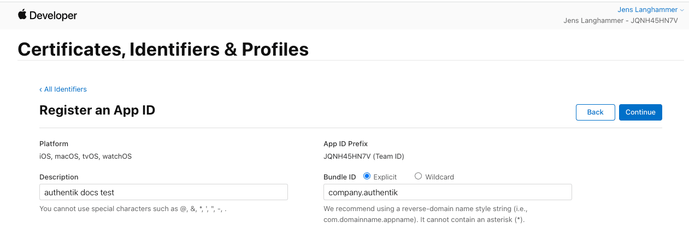
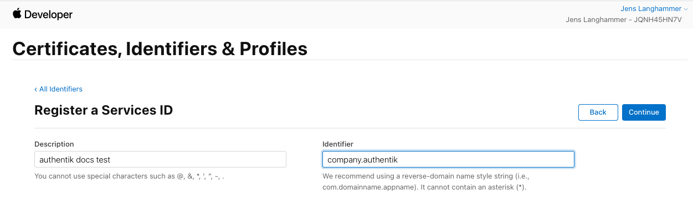
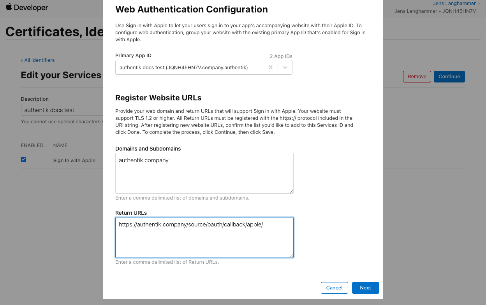
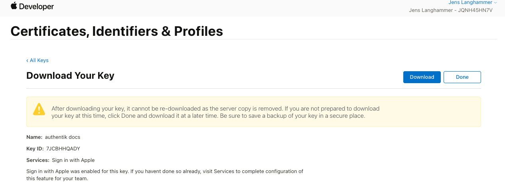

Allows users to authenticate using their Apple ID credentials by configuring Apple as a federated identity provider via OAuth2.

## Preparation

The following placeholders are used in this guide:

Apple mandates the use of a [registered top-level domain](https://en.wikipedia.org/wiki/List_of_Internet_top-level_domains), therefore this source will not work with `.local` and other non-public TLDs.

## Apple configuration

To integrate Apple with authentik, you will need to register two identifiers and a key in the Apple Developer Portal.

### Registering identifiers

1. Log in to the [Apple Developer Portal](https://developer.apple.com/account/), and navigate to **Account** > **Certificates, IDs & Profiles**, then click **Identifiers** in the sidebar.
2. Register a new identifier with the type of **App IDs**, and the subtype **App**.
3. Choose a name that users will recognize for the **Description** field (e.g. `authentik`).
4. For your **Bundle ID**, use the reverse of your authentik domain, for example: `company.authentik`.
5. Scroll down the list of capabilities, and check the box next to **Sign In with Apple**.
6. At the top, click **Continue** and **Register**.

7. Register another new identifier with the type of **Services IDs**.
8. Again, choose the same name as above for your **Description** field.
9. Use the same identifier as above, but add a suffix like `signin` or `oauth`, as identifiers are unique.
10. At the top, click **Continue** and **Register**.

### Configuring identifier

11. Once back at the overview list, click on the just-created identifier.
12. Enable the checkbox next to **Sign In with Apple**, and click **Configure**
13. Under **Domains and Subdomains**, enter `authentik.company`.
14. Under **Return URLs**, enter `https://authentik.company/source/oauth/callback/apple/`.

### Registering a key

15. Click **Keys** in the sidebar, then register a new key with any name, and select **Sign in with Apple**.
16. Click **Configure**, then select the App ID that you created.
17. At the top, click **Save**, **Continue** and **Register**.
18. Download the Key file and note the **Key ID**.

19. Take note of the **Team ID** visible at the top of the page.

## authentik configuration

To support the integration of Apple with authentik, you need to create an Apple OAuth source in authentik.

1. Log in to authentik as an administrator and open the authentik Admin interface.
2. Navigate to **Directory** > **Federation and Social login**, click **Create**, then configure the following settings:
    - **Select type**: select **Apple OAuth Source**.
    - **Create Apple OAuth Source**: provide a name, a slug which must match the slug used in the Apple `Return URL`, and the following required configurations:
        - Under **Protocol Settings**:
            - **Consumer key**: The identifier from step 9, then `;`, then your **Team ID** from step 19, then `;`, then the **Key ID** from step 18. (e.g. `company.authentik;JQNH45HN7V;XFBNJ82BV6`).
            - **Consumer secret**: Paste the contents of the keyfile you've downloaded.
            - **Scopes** _(optional)_: define any further access scopes.

3. Click **Save**.

:::info Display new source on login screen
For instructions on how to display the new source on the authentik login page, refer to the [Add sources to default login page documentation](../../index.md#add-sources-to-default-login-page).
:::

:::info Embed new source in flow :ak-enterprise
For instructions on embedding the new source within a flow, such as an authorization flow, refer to the [Source Stage documentation](../../../../../add-secure-apps/flows-stages/stages/source).
:::

## Source property mappings

Source property mappings allow you to modify or gather extra information from sources. See the [overview](../../property-mappings/index.md) for more information.
