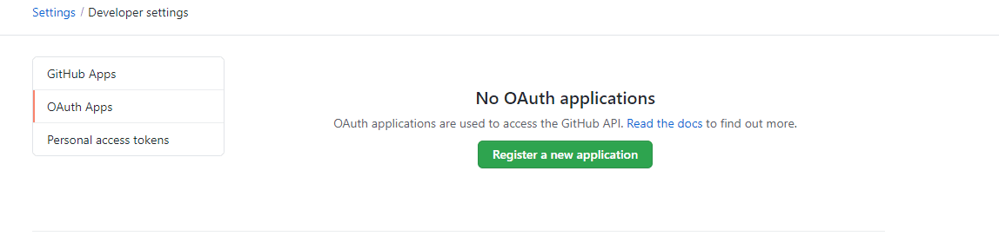
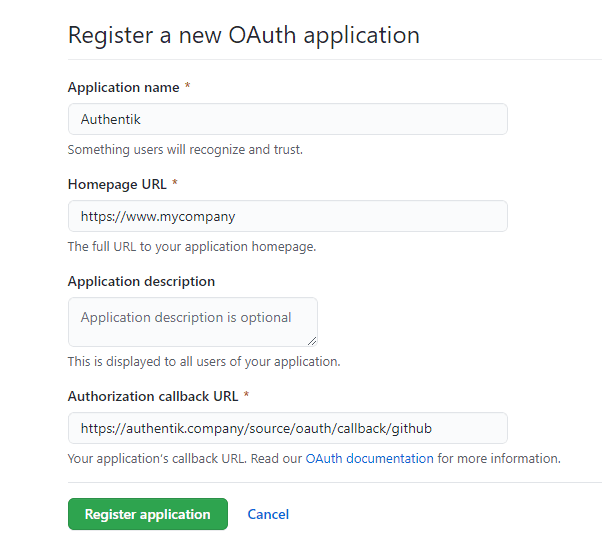
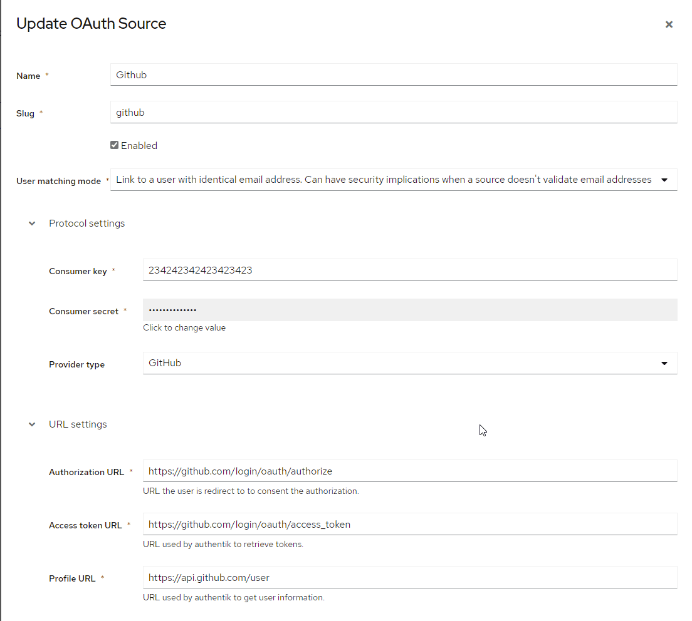
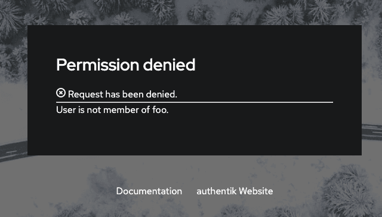

<span class="badge badge--primary">Support level: authentik</span>

Allows users to authenticate using their Github credentials

## Preparation

The following placeholders are used in this guide:

- `authentik.company` is the FQDN of the authentik installation.
- `www.my.company` Homepage URL for your site

## Github

1. Create an OAuth app under Developer Settings https://github.com/settings/developers by clicking on the **Register a new application**



2. **Application Name:** Choose a name users will recognize ie: authentik
3. **Homepage URL:** www.my.company
4. **Authorization callback URL:**: https://authentik.company/source/oauth/callback/github
5. Click **Register Application**

Example screenshot



6. Copy the **Client ID** and _save it for later_
7. Click **Generate a new client secret** and _save it for later_ You will not be able to see the secret again, so be sure to copy it now.

## authentik

8. Under _Directory -> Federation & Social login_ Click **Create Github OAuth Source**

9. **Name:** Choose a name (For the example I use Github)
10. **Slug:** github (If you choose a different slug the URLs will need to be updated to reflect the change)
11. **Consumer Key:** Client ID from step 6
12. **Consumer Secret:** Client Secret from step 7

Here is an example of a complete authentik Github OAuth Source



Save, and you now have Github as a source.

:::note
For more details on how-to have the new source display on the Login Page see [here](../../index.md#add-sources-to-default-login-page).
:::

### Checking for membership of a GitHub Organisation

To check if the user is member of an organisation, you can use the following policy on your flows:

:::info
Make sure to include `read:org` in the sources' _Scopes_ setting.
:::

```python
# Ensure flow is only run during oauth logins via Github
if context["source"].provider_type != "github":
    return True

accepted_org = "foo"

# Get the user-source connection object from the context, and get the access token
connection = context["goauthentik.io/sources/connection"]
access_token = connection.access_token

# We also access the user info authentik already retrieved, to get the correct username
github_username = context["oauth_userinfo"]

# Github does not include Organisations in the userinfo endpoint, so we have to call another URL

orgs_response = requests.get(
    "https://api.github.com/user/orgs",
    auth=(github_username["login"], access_token),
    headers={
        "accept": "application/vnd.github.v3+json"
    }
)
orgs_response.raise_for_status()
orgs = orgs_response.json()

# `orgs` will be formatted like this
# [
#     {
#         "login": "goauthentik",
#         [...]
#     }
# ]
user_matched = any(org['login'] == accepted_org for org in orgs)
if not user_matched:
    ak_message(f"User is not member of {accepted_org}.")
return user_matched
```

If a user is not member of the chosen organisation, they will see this message


