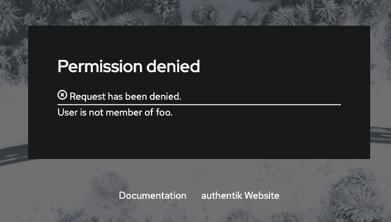

Allows users to authenticate using their Github credentials by configuring GitHub as a federated identity provider via OAuth2.

## Preparation

The following placeholders are used in this guide:

- `authentik.company` is the FQDN of the authentik installation.
- `www.my.company` is the Homepage URL for your site

## Github configuration

To integrate GitHub with authentik you will need to create an OAuth application in the Discord Developer Portal.

1. Log in to the GitHub and open the [Developer Settings](https://github.com/settings/developers) menu.
2. Create an OAuth app by clicking on the **Register a new application** button and set the following values:
    - **Application Name**: `authentik`
    - **Homepage URL**: `www.my.company`
    - **Authorization callback URL**: `https://authentik.company/source/oauth/callback/github`

3. Click **Register Application**
4. Click **Generate a new client secret** and take note of the **Client Secret** and **Client ID**. These values will be required in the next section.

## authentik configuration

To support the integration of GitHub with authentik, you need to create an GitHub OAuth source in authentik.

1. Log in to authentik as an administrator and open the authentik Admin interface.
2. Navigate to **Directory** > **Federation and Social login**, click **Create**, and then configure the following settings:
    - **Select type**: select **GitHub OAuth Source** as the source type.
    - **Create Facebook OAuth Source**: provide a name, a slug which must match the slug used in the GitHub `Authorization callback URL` field (e.g. `github`), and set the following required configurations:
        - **Protocol settings**
            - **Consumer Key**: `<client_ID>`
            - **Consumer Secret**: `<client_secret>`
            - **Scopes** _(optional)_: define any further access scopes.
3. Click **Finish** to save your settings.

:::info Display new source on login screen
For instructions on how to display the new source on the authentik login page, refer to the [Add sources to default login page documentation](../../index.md#add-sources-to-default-login-page).
:::

:::info Embed new source in flow :ak-enterprise
For instructions on embedding the new source within a flow, such as an authorization flow, refer to the [Source Stage documentation](../../../../../add-secure-apps/flows-stages/stages/source/).
:::

## Optional additional configuration

### Checking for membership of a GitHub Organization

:::info
Ensure that the GitHub OAuth source in **Federation & Social login** has the additional `read:org` scope added under **Protocol settings** > **Scopes**.
:::

To check if the user is member of an organization, you can use the following policy on your flows.

1. Log in to authentik as an administrator and open the authentik Admin interface.
2. Navigate to **Customization** > **Policies**.
3. Click **Create**, select **Expression Policy** and then **Next**.
4. Provide a name for the policy and set the following expression:

```python
from authentik.sources.oauth.models import OAuthSource

# Set this value
accepted_org = "your_organization"

# Ensure flow is only run during oauth logins via Github
if not isinstance(context['source'], OAuthSource) or context["source"].provider_type != "github":
    return True

# Get the user-source connection object from the context, and get the access token
connection = context["goauthentik.io/sources/connection"]
access_token = connection.access_token

# We also access the user info authentik already retrieved, to get the correct username
github_username = context["oauth_userinfo"]

# Github does not include Organisations in the userinfo endpoint, so we have to call another URL
orgs_response = requests.get(
    "https://api.github.com/user/orgs",
    auth=(github_username["login"], access_token),
    headers={
        "accept": "application/vnd.github.v3+json"
    }
)
orgs_response.raise_for_status()
orgs = orgs_response.json()

# `orgs` will be formatted like this
# [
#     {
#         "login": "goauthentik",
#         [...]
#     }
# ]
user_matched = any(org['login'] == accepted_org for org in orgs)
if not user_matched:
    ak_message(f"User is not member of {accepted_org}.")
return user_matched
```

5. Click **Finish**. You can now bind this policy to the chosen enrollment and/or authentication flow of the GitHub OAuth source.
6. Navigate to **Flows and Stages** > **Flows** and click the name of the flow in question.
7. Open the **Policy/Group/User Bindings** tab and click **Bind existing Policy/Group/User**.
8. Select the policy that you previously created and click **Create**.
9. Optionally, repeat the process for any other flows that you want the policy applied to.

If a user is not member of the chosen organization, they will see this message:



## Source property mappings

Source property mappings allow you to modify or gather extra information from sources. See the [overview](../../property-mappings/index.md) for more information.

## Resources
