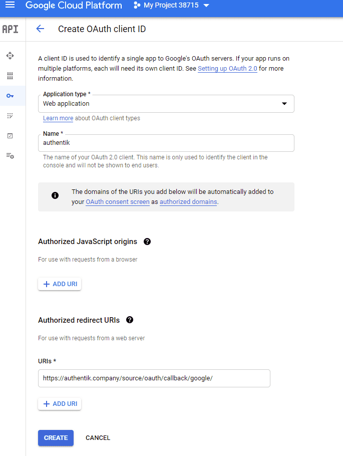

Allows users to authenticate using their Google credentials by configuring Google Cloud as a federated identity provider via OAuth2.

## Preparation

The following placeholders are used in this guide:

- `authentik.company` is the FQDN of the authentik installation.

## Google configuration

To integrate Google with authentik you will need to create a new project, and OAuth credentials in the Google Developer console.

1. Log in to the [Google Developer Console](https://console.developers.google.com/).
2. Click on **GLogin** in the top left and then **New Project**.


3. Set the following values:
    - **Project Name**: Provide a name
    - **Organization**: Leave as default if unsure
    - **Location**: Leave as default if unsure

4. Click **Create**.
5. Select your project from the drop down at the top.
6. Click the **Credentials** menu icon on the left which looks like a key.


7. On the right side, click on **Configure Consent Screen**.


8. Set the following required fields:
    - **User Type**: If you do not have a Google Workspace (GSuite) account choose _External_. If you do have a Google Workspace (GSuite) account and want to limit access to only users inside of your organization choose _Internal_.
    - **App Name**: `authentik`
    - **User Support Email**: Must have a value
    - **Authorized Domains**: authentik.company
    - **Developer Contact Info**: Must have a value
9. Click **Save and Continue**
10. If you have special scopes configured for Google, enter them on this screen. If not click **Save and Continue**.
11. If you want to create test users enter them here, if not click **Save and Continue**.
12. From the **Summary** page click on the **Credentials** menu icon on the left (the icon looks like a key.)
13. Click **Create Credentials** on the top of the screen and select **OAuth Client ID**.
14. Set the following required fields:
    - **Application Type**: `Web Application`
    - **Name**: Provide a name
    - **Authorized redirect URIs**: `https://authentik.company/source/oauth/callback/google/`



15. Click **Create**.
16. Take note of the **Client ID** and **Client Secret**. These values will be required in the next section.

## authentik configuration

To support the integration of Google with authentik, you need to create a Google OAuth source in authentik.

1. Log in to authentik as an administrator and open the authentik Admin interface.
2. Navigate to **Directory** > **Federation and Social login**, click **Create**, and then configure the following settings:
    - **Select type**: select **Google OAuth Source** as the source type.
    - **Create Google OAuth Source**: provide a name, a slug which must match the slug used in the Google `Authorized redirect URI` field (e.g. `google`), and set the following required configurations:
        - **Protocol settings**
            - **Consumer Key**: `<client_ID>`
            - **Consumer Secret**: `<client_secret>`
            - **Scopes** _(optional)_: define any further access scopes.
3. Click **Finish** to save your settings.

:::info Display new source on login screen
For instructions on how to display the new source on the authentik login page, refer to the [Add sources to default login page documentation](../../../index.md#add-sources-to-default-login-page).
:::

:::info Embed new source in flow :ak-enterprise
For instructions on embedding the new source within a flow, such as an authorization flow, refer to the [Source Stage documentation](../../../../../add-secure-apps/flows-stages/stages/source/).
:::

## Optional additional configuration

### Username mapping

Google does not have the concept of a username, therefore authentik will by default prompt the user for a username when they first enroll through a google source. To change this behaviour and automatically use the email address as username, create an expression policy to set the username to the email, and bind it to the enrollment flow.

1. Log in to authentik as an administrator and open the authentik Admin interface.
2. Navigate to **Customization** > **Policies**.
3. Click **Create**, select **Expression Policy** and then **Next**.
4. Provide a name for the policy and set the following expression:

```python
email = request.context["prompt_data"]["email"]
# Direct set username to email

request.context["prompt_data"]["username"] = email
# Set username to email without domain
# request.context["prompt_data"]["username"] = email.split("@")[0]
return False
```

5. Click **Finish**. You can now bind this policy to the chosen enrollment flow of the Google OAuth source.
6. Navigate to **Flows and Stages** > **Flows** and click the name of the flow in question.
7. Open the **Stage Bindings** tab, expand the policies bound to the first stage and click **Bind existing Policy/Group/User**.
8. Select the policy that you previously created and click **Create**.

:::note
If using the default enrollment flow the policy should be bound to the **default-source-enrollment-prompt** stage. Ensure that the policy comes before **default-source-enrollment-if-username**.
:::

Afterwards, any new logins will automatically have their Google email address used as their username. This can be combined with disallowing users from changing their usernames, see [Configuration](../../../../../sys-mgmt/settings.md#allow-users-to-change-username).
