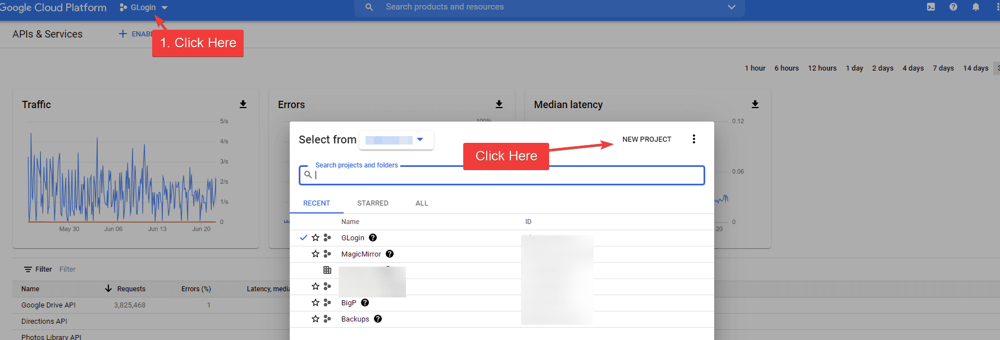
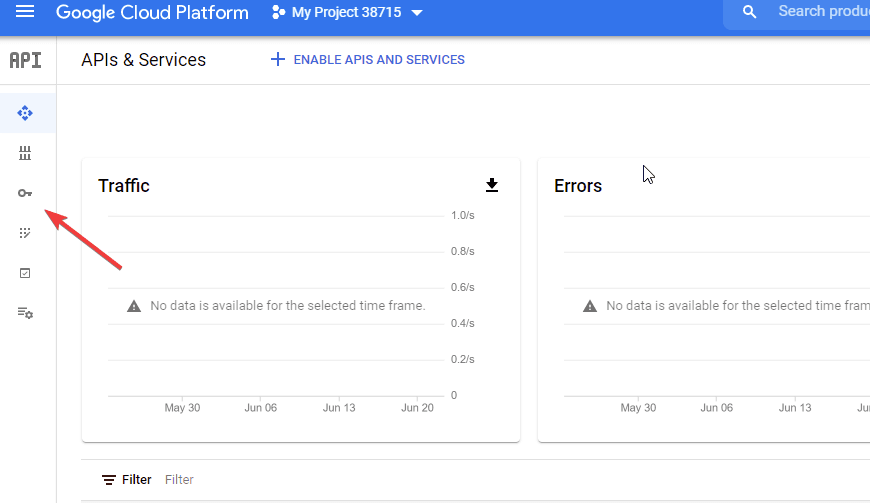
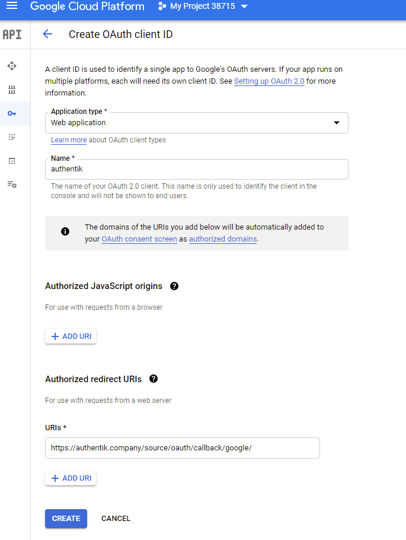

This source lets users authenticate with their Google credentials by configuring Google Cloud as a federated identity provider with OAuth 2.0.

## Preparation

The following placeholders are used in this guide:

- `authentik.company` is the FQDN of the authentik installation.

## Google configuration

To integrate Google with authentik, you need to create a new project and OAuth credentials in the Google Developer Console.

1. Log in to the [Google Developer Console](https://console.developers.google.com/).
2. Click the project selector in the top bar, and then click **New Project**.



3. Set the following values:
    - **Project Name**: Provide a name
    - **Organization**: Leave as default if unsure
    - **Location**: Leave as default if unsure

4. Click **Create**.
5. Select your project from the drop-down at the top.
6. Click the **Credentials** menu icon on the left which looks like a key.


7. On the right side, click **Configure Consent Screen**.



8. Set the following required fields:
    - **User Type**: If you do not have a Google Workspace account, choose _External_. If you do have a Google Workspace account and want to limit access to users inside your organization, choose _Internal_.
    - **App Name**: `authentik`
    - **User Support Email**: Must have a value
    - **Authorized Domains**: authentik.company
    - **Developer Contact Info**: Must have a value
9. Click **Save and Continue**.
10. If you have special scopes configured for Google, enter them on this screen. If not, click **Save and Continue**.
11. If you want to create test users, enter them here. If not, click **Save and Continue**.
12. From the **Summary** page, click the **Credentials** menu icon on the left (the icon looks like a key).
13. Click **Create Credentials** on the top of the screen and select **OAuth Client ID**.
14. Set the following required fields:
    - **Application Type**: `Web Application`
    - **Name**: Provide a name
    - **Authorized redirect URIs**: `https://authentik.company/source/oauth/callback/google/`



15. Click **Create**.
16. Take note of the **Client ID** and **Client Secret**. These values will be required in the next section.

## authentik configuration

To support the integration of Google with authentik, you need to create a Google OAuth source in authentik.

1. Log in to authentik as an administrator and open the authentik Admin interface.
2. Navigate to **Directory** > **Federation and Social login**, click **New Source**, and then configure the following settings:
    - **Select type**: select **Google OAuth Source** as the source type.
    - **Create Google OAuth Source**: provide a name, a slug that must match the slug used in the Google `Authorized redirect URI` field (e.g. `google`), and set the following required configurations:
        - **Protocol settings**
            - **Consumer key**: `<client_ID>`
            - **Consumer secret**: `<client_secret>`
            - **Scopes** _(optional)_: define any additional access scopes.
3. Click **Finish** to save your settings.

:::info Display new source on login screen
For instructions on how to display the new source on the authentik login page, refer to the [Add sources to default login page documentation](../../../index.mdx#add-sources-to-default-login-page).
:::

:::info Embed new source in flow :ak-enterprise
For instructions on embedding the new source within a flow, such as an authorization flow, refer to the [Source Stage documentation](../../../../../add-secure-apps/flows-stages/stages/source/).
:::

## Optional additional configuration

### Username mapping

Google does not provide a separate username. By default, authentik prompts new users to choose one. To use the Google email address as the username, add an OAuth source property mapping. This sets the username before authentik starts the enrollment flow.

1. Log in to authentik as an administrator and open the authentik Admin interface.
2. Navigate to **Customization** > **Property Mappings**.
3. Click **Create**, select **OAuth Source Property Mapping**, and then click **Next**.
4. Provide a name for the mapping and enter this expression:

```python
return {"username": info.get("email")}
```

5. Click **Finish**.
6. Navigate to **Directory** > **Federation and Social login** and edit the Google OAuth source.
7. Under **OAuth Attribute mapping** > **User Property Mappings**, add the mapping to **Selected User Property Mappings**.
8. Click **Update**.

The source's default `email` value remains unchanged. If Google does not return an email address, this mapping cannot set a username and the enrollment flow still asks the user for one.

This mapping also runs on later logins and can update an existing user's username. To control whether users can change their usernames themselves, see [Configuration](../../../../../sys-mgmt/settings.mdx#allow-users-to-change-username).

For other fields available to OAuth source mappings, see [OAuth source property mappings](../../../protocols/oauth/index.mdx#oauth-source-property-mappings).
