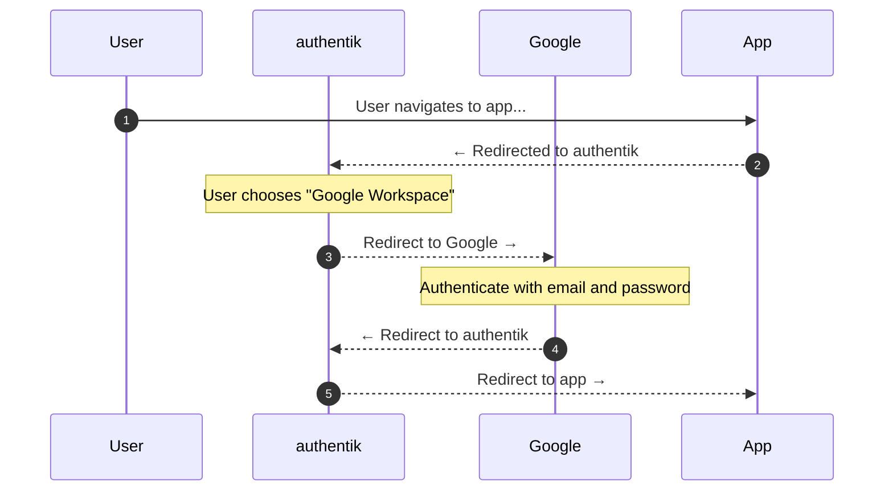

Allows users to authenticate using their Google Workspace credentials by configuring Google Workspace as a federated identity provider via SAML.

## What is Google Workspace?

Google Workspace (formerly G Suite) is a collection of cloud computing, productivity and collaboration tools, software and products developed and marketed by Google.

Organizations using Google Workspace allow their users to authenticate into applications using their company email addresses. This guide shows how to set up Security Assertion Markup Language (SAML) as the authentication method between Google Workspace and authentik.

## SAML Authentication Flow

This sequence diagram shows a high-level flow between user, authentik, Google Workspace, and the target application.

In short, the user navigates to the application, is redirected to authentik, chooses Google Workspace as the authentication method, authenticates with Google, and is redirected back to the application.

The key characteristic that makes this an IdP-to-IdP flow is that authentik is acting as an intermediary identity provider, brokering trust between your application and Google Workspace.

## Preparation

The following placeholders are used in this guide:

- `authentik.company` is the FQDN of the authentik installation.

## Google Workspace configuration

To integrate Google Workspace with authentik you will need to create a SAML application in the Google Workspace Admin Console.

### Create a new application

1. Log in to the [Google Workspace Admin Console](https://admin.google.com/) as a super-admin.
2. Navigate to **Apps** > **Web and mobile apps**.
3. Expand the **Add app** dropdown and select **Add custom SAML app**.
4. Set the following fields:
    - **Name**: `authentik`
    - **Description**: `Single Sign-On for authentik`
5. Press **Continue** to generate the SAML configuration.
6. Under **Option 2**, download the certificate and take note of the **SSO URL**. Both will be required when configuring authentik.

:::info Entity ID
authentik is acting as both a Service Provider (SP) to Google and an Identity Provider (IdP) to your applications. Since we only need the SP configuration, you can ignore the Entity ID provided by Google.
:::

7. Click **Continue**.

### Service Provider details

8. We'll need to provide Google with some information about our authentik instance. Set the following fields:
    - **ACS URL**: `https://authentik.company/source/saml/google/acs/`
    - **Entity ID**: `https://authentik.company`
    - **Start URL**: `https://authentik.company`
    - **Name ID format**: `EMAIL`
    - **Name ID**: Basic Information › Primary Email
    - **Signed Response**: Enabled

:::info Verify signed responses
Enabling signed responses indicates that the entire SAML authentication response will be signed by Google. You'll need to [configure certificates in authentik](../../../../../sys-mgmt/certificates) if you enable this option.
:::

### Attribute mapping

9. Next, we configure which user attributes Google should send to authentik, and map them to the attributes that authentik expects. Set the following field:
    - **Basic Information › Primary Email**: `email`

### Enable the application for your organization

10. Finally, we complete the application creation process by saving the configuration.

You should now see the new application in the list of SAML apps. View the application details and confirm that the **SSO URL** and **Entity ID** are correct. You may need to **Enable the app** for your organization to allow users to authenticate.

## authentik configuration

To support the integration of Google Workspace with authentik, you need to create an SAML source in authentik.

1. Log in to authentik as an administrator and open the authentik Admin interface.
2. Navigate to **Directory** > **Federation and Social login**, click **Create**, and then configure the following settings:
    - **Select type**: select **SAML Source** as the source type.
    - **Create SAML Source**: provide a name, a slug which must match the slug used in the Google Workspace `ACS URL` field (e.g. `google`), and set the following required configurations:
        - **Protocol settings**
            - **SSO URL**: SSO URL from Google Workspace
            - **Issuer (Entity ID)**: `https://authentik.company`
            - **Verification Certificate**: Certificate downloaded from Google Workspace
        - **Advanced Protocol Settings**:
            - **Allow IdP-initiated Login**: Enabled
            - **NameID Policy**: `Email address`
3. Click **Finish** to save your settings.

:::info Display new source on login screen
For instructions on how to display the new source on the authentik login page, refer to the [Add sources to default login page documentation](../../../index.md#add-sources-to-default-login-page).
:::

:::info Embed new source in flow :ak-enterprise
For instructions on embedding the new source within a flow, such as an authorization flow, refer to the [Source Stage documentation](../../../../../add-secure-apps/flows-stages/stages/source/index.md).
:::

## Source property mappings

Source property mappings allow you to modify or gather extra information from sources. See the [overview](../../../property-mappings/index.md) for more information.

## Troubleshooting

Most issues stem from a misconfiguration on Google Workspace or authentik. However, your workspace may take a few minutes to propagate changes depending on the size of your organization.

### `403 app_not_configured_for_user`

Confirm that the entity ID (AKA "Issuer") matches the value you've provided both in Google Workspace and authentik. This can be any unique identifier, but it must match between the two services.

### `403 app_not_enabled_for_user`

In the Google Workspace Admin Console, go to **Menu > Apps > Web and mobile apps**.

1. In the application list, locate the SAML app generating the error.
2. Click the application to open its Settings page.
3. Click **User access**.
4. Turn the application ON for everyone or for the user’s organization.

This may take a few minutes to propagate, so try logging in again after a short wait.

## Resources

- [Google Workspace Admin Help - Creating custom attributes using the user schema](https://support.google.com/a/answer/6327792)
- [Google Workspace Admin Help - Set up your own custom SAML app](https://support.google.com/a/answer/6087519)
- [Google Workspace Admin Help - SAML app error messages](https://support.google.com/a/answer/6301076)
