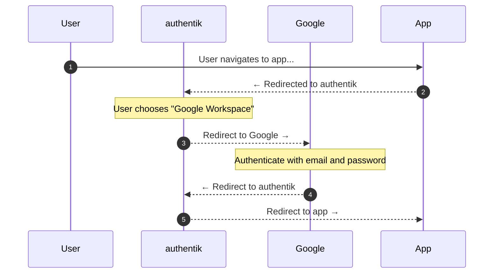

# Google Workspace with SAML

Support level: authentik

## What is Google Workspace?

Google Workspace is a collection of cloud computing, productivity and collaboration tools, software and products developed and marketed by Google.

Organizations using Google Workspace (formerly G Suite) can allow their users to authenticate into applications using their company email addresses. This guide shows how to set up Security Assertion Markup Language (<abbr>SAML</abbr>) as the authentication method between Google Workspace and authentik.

## SAML Authentication Flow

This sequence diagram shows a high-level flow between user, authentik, Google, and the target application.

In short, the user navigates to the application, is redirected to authentik, chooses Google Workspace as the authentication method, authenticates with Google, and is redirected back to the application.

***

## Integration

By the end of this integration, your authentik instance will allow users to authenticate using their Google Workspace credentials.

You'll need to have authentik instance running and accessible on an HTTPS domain, and a Google Workspace domain with super-administrator access.

Keep a text-editor handy because we'll be copying and pasting values between the two services.

:::info

The following placeholders are used in this guide:

|             |                                                                   |
|-------------|-------------------------------------------------------------------|
| `authentik.company` | The Fully Qualified Domain Name of the authentik install. |

:::

## Google Workspace Configuration

We'll need some information from Google to complete the integration, so we'll
start by logging into [Workspace Admin Console](https://admin.google.com/) as a super-admin.

### Creating a new app

From the Workspace Admin Console, navigate to the _Apps_ section, and then to _Web and mobile apps_.
Continue by expanding the **"Add app"** dropdown and selecting **"Add custom SAML app".**

Within the app creation page, fill in the following fields with your desired values:

| Field | Value  |
|-------|--------|
| Name | authentik |
| Description | Single Sign-On for authentik |

### Google Identity Provider details

Next, you'll be presented with information we'll need to configure authentik. Under "Option 2", copy the values to your text editor and download the certificate.

:::warning
Take care not to mix up each field. While they are similar, the values are unique and must be copied correctly.

|       |                                                               |
|-------|---------------------------------------------------------------|
| SSO URL   | `https://accounts.google.com/o/saml2/idp?idpid=#########` |
| Entity ID | `https://accounts.google.com/o/saml2?idpid=#########`     |

:::

### Service Provider details

We'll need to provide Google with some information about our authentik instance, specifically the Assertion Consumer Service (ACS) URL. This URL is where Google will send the SAML response after a user has authenticated. We'll also need to provide the Entity ID, which can be any unique identifier, but we recommend using the URL of your authentik instance.

| Field | Value                                                       |
|-------|-------------------------------------------------------------|
| ACS URL        | `https://authentik.company/source/saml/google/acs/` |
| Entity ID      | `https://authentik.company`                         |
| Name ID format | EMAIL                                              |
| Name ID        | Basic Information › Primary Email                  |

Keep these values handy in your text editor, as we'll need them later.

### Attribute Mapping

Next, we configure which user attributes Google should send to authentik.
This is where we map the Google Directory attributes to the attributes that authentik expects.

| Google Directory attributes       | App attributes |
|-----------------------------------|----------------|
| Basic Information > Primary Email | `email`        |

### Enable the app for your organization

Finally, we complete the app creation process by saving the configuration.

You should now see the new app in the list of SAML apps. View the app details and confirm that the SSO URL and Entity ID are correct. Note that you may need to **enable the app** for your organization to allow users to authenticate.

***

## authentik Configuration

We'll now configure authentik to accept SAML authentication from Google Workspace.

Start by logging into your authentik instance as an administrator and navigating to the _admin interface_.

### Creating a Federation Source

From the admin interface, navigate to _Directory_ › _Federation & Social login_ and press **Create**.

Within the new source dialog, choose **"SAML Source"** and continue by filling in the following fields with your desired values:

| Field | Value            |
|-------|------------------|
| Name  | Google Workspace |
| Slug  | `google`         |

:::info

Heads up! Your choice of `slug` should match the ACS URL you provided to Google Workspace.
You can choose a different slug, but you will need to update the ACS URL in Google Workspace to match.

:::

#### Protocol Settings

Next, we'll configure the SAML protocol settings for the source. Fill in the following fields with the values you copied from Google Workspace:

|                  |                                                               |
|------------------|---------------------------------------------------------------|
| SSO URL          | `https://accounts.google.com/o/saml2/idp?idpid=#########`     |
| Entity ID/Issuer | `https://accounts.google.com/o/saml2?idpid=#########`         |

#### Advanced Protocol Settings

Depending on your Google Workspace configuration, you may need to adjust the advanced protocol settings.

| Field                     | Value          |
|---------------------------|----------------|
| Allow idP-initiated Login | Enabled ✅      |
| NameID Policy             | Email Address  |

Finally, save the source configuration and confirm the SAML confirmation is present in the list of federated sources.

## Testing your configuration

To test your configuration, navigate to the login page of your authentik instance and confirm the Google Workspace option is available as an alternative login method.

Next, click on the Google Workspace button and confirm that you are redirected to authenticate via your Google Workspace credentials. After successful authentication **with a non-super-admin account**, you should be redirected back to your authentik instance and logged in.

## Troubleshooting

Most issues stem from a misconfiguration on Google Workspace or authentik. However, your workspace may take a few minutes to propagate changes depending on the size of your organization.

### `403 app_not_configured_for_user`

Confirm that the entity ID (AKA "Issuer") matches the value you've provided both in Google Workspace and authentik. This can be any unique identifier, but it must match between the two services.

### `403 app_not_enabled_for_user`

In the Google Workspace Admin Console, go to Menu › Apps › Web and mobile apps.

1. In the app list, locate the SAML app generating the error.
2. Click the app to open its Settings page.
3. Click User access.
4. Turn the app ON for everyone or for the user’s organization.

This may take a few minutes to propagate, so try logging in again after a short wait.

## External links

- [Google Workspace Admin Console](https://admin.google.com/)
- [Google Developer Console](https://support.google.com/a/answer/6327792)
- [Setting up SAML with Google Workspace](https://support.google.com/a/answer/6087519)
- [SAML app error messages](https://support.google.com/a/answer/6301076)
- [SAML authentication flow](https://infosec.mozilla.org/guidelines/iam/saml.html)
