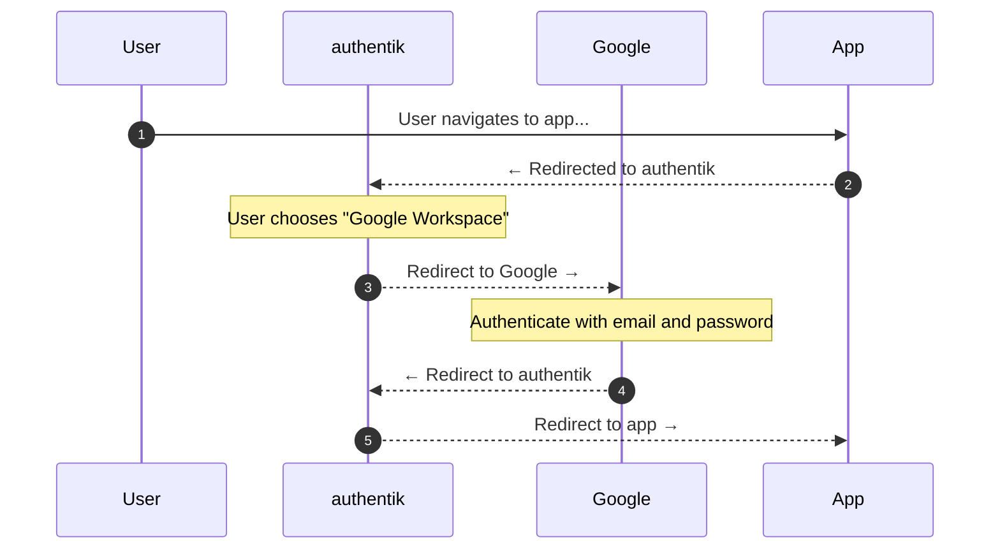

Allows users to authenticate using their Google Workspace credentials by configuring Google Workspace as a federated identity provider via SAML.

## What is Google Workspace?

Google Workspace (formerly G Suite) is a collection of cloud computing, productivity and collaboration tools, software and products developed and marketed by Google.

Organizations using Google Workspace allow their users to authenticate into applications using their company email addresses. This guide shows how to set up Security Assertion Markup Language (SAML) as the authentication method between Google Workspace and authentik.

## SAML Authentication Flow

This sequence diagram shows a high-level flow between user, authentik, Google Workspace, and the target application.

In short, the user navigates to the application, is redirected to authentik, chooses Google Workspace as the authentication method, authenticates with Google, and is redirected back to the application.

The key characteristic that makes this an IdP-to-IdP flow is that authentik is acting as an intermediary identity provider, brokering trust between your application and Google Workspace.

## Preparation

The following placeholders are used in this guide:

- `authentik.company` is the FQDN of the authentik installation.
- `google-slug` is the slug you will assign to the SAML source in authentik (e.g., `google`).

## Google Workspace configuration

### Create a SAML application

1. Log in to the [Google Workspace Admin Console](https://admin.google.com/) as a super-admin.
2. Navigate to **Apps** > **Web and mobile apps**.
3. Expand the **Add app** dropdown and select **Add custom SAML app**.
4. Configure the following settings:
    - Set **Name** to `authentik`.
    - Set **Description** to `Single Sign-On for authentik`.
5. Click **Continue**.
6. Under **Option 2**, click **Download Certificate** to download the signing certificate.
7. Take note of the **SSO URL**. This will be required when configuring authentik.

:::info Entity ID
authentik is acting as both a Service Provider (SP) to Google and an Identity Provider (IdP) to your applications. Since we only need the SP configuration, you can ignore the Entity ID provided by Google.
:::

8. Click **Continue** to proceed to the Service Provider configuration.

### Configure Service Provider details

1. Configure the following settings:
    - Set **ACS URL** to `https://authentik.company/source/saml/<google-slug>/acs/`.
    - Set **Entity ID** to `https://authentik.company/source/saml/<google-slug>/metadata/`.
    - Set **Start URL** to `https://authentik.company`.
    - Set **Name ID format** to `EMAIL`.
    - Set **Name ID** to `Basic Information > Primary Email`.
2. Click **Continue**.

### Configure attribute mapping

1. Click **Add Mapping** and configure the following settings:
    - Set **Google Directory attribute** to `Basic Information > Primary Email`.
    - Set **App attribute** to `email`.
2. Click **Finish**.

### Enable the application

1. In the application list, click the SAML app you created.
2. Click **User access**.
3. Turn the application **ON** for everyone or for specific organizational units.
4. Click **Save**.

## authentik configuration

### Upload the Google Workspace certificate to authentik

1. Log in to authentik as an administrator and open the authentik Admin interface.
2. Navigate to **System** > **Certificates** and click **Import**.
3. Give it a name like `Google Workspace Signing Certificate`.
4. Paste the Google Workspace certificate you exported earlier into the **Certificate** field.
5. Leave the **Private Key** field empty.
6. Click **Create**.

### Create a SAML source in authentik

1. Log in to authentik as an administrator and open the authentik Admin interface.
2. Navigate to **Directory** > **Federation and Social login** and click **Create**.
3. Select **SAML Source** and configure the following settings:
    - Set **Name** to `Google Workspace`.
    - Set **Slug** to `google` (must match the slug used in Google Workspace ACS URL).
    - Set **SSO URL** to the SSO URL from Google Workspace.
    - Set **Issuer** to `https://authentik.company/source/saml/<google-slug>/metadata/`.
    - Set **Verification Certificate** to the Google Workspace certificate you uploaded earlier.
    - Disable **Verify Response Signature**.
      :::warning Disable Verify Response Signature
      If you do not disable Verify Response Signature, your integration with Google Workspace will not work.
      :::
    - Enable **Verify Response Signature**.
    - Enable **Allow IdP-initiated Login**.
    - Set **NameID Policy** to `Email address`.
4. Click **Finish**.

:::info Display new source on login screen
For instructions on how to display the new source on the authentik login page, refer to the [Add sources to default login page documentation](../../../index.md#add-sources-to-default-login-page).
:::

:::info Embed new source in flow :ak-enterprise
For instructions on embedding the new source within a flow, such as an authorization flow, refer to the [Source Stage documentation](../../../../../add-secure-apps/flows-stages/stages/source).
:::

## Troubleshooting

- **`403 app_not_configured_for_user`**: Ensure the Entity ID matches between Google Workspace and authentik. The Entity ID must be identical in both configurations.
- **`403 app_not_enabled_for_user`**: Enable the application for your organization in the Google Workspace Admin Console under **Apps** > **Web and mobile apps**.

## Resources

- [Google Workspace Admin Help — Set up your own custom SAML app](https://support.google.com/a/answer/6087519)
- [Google Workspace Admin Help — SAML app error messages](https://support.google.com/a/answer/6301076)
