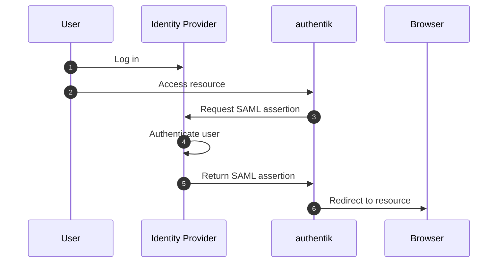
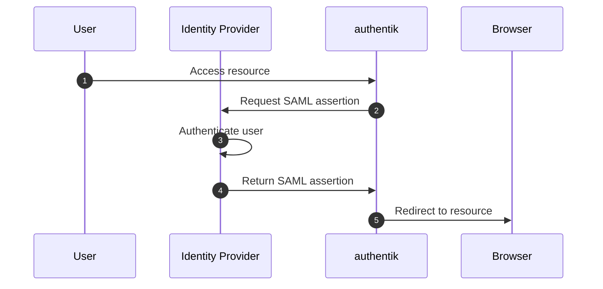

Configuring authentik with a federated identity provider allows users to authenticate with their existing credentials, such as social logins or enterprise identity providers.

Typically, identity providers use protocols such as [OAuth 2.0](https://en.wikipedia.org/wiki/OAuth), or [Security Assertion Markup Language](https://en.wikipedia.org/wiki/Security_Assertion_Markup_Language) (<abbr>SAML</abbr>). These protocols allow authentik to act as a Service Provider (<abbr>SP</abbr>), delegating the authentication process to the Identity Provider (<abbr>IP</abbr>). The choice of protocol depends on the provider and the level of integration desired.

## IdP Initiated Single Sign-On

In this scenario, a user is logged on to the IdP and attempts to access a resource on a remote SP server. In this example, the IdP would be Google, Facebook, or another social login provider. The SP would be authentik, acting as a service provider.

In short, the user logs in to the IdP, requests access to a resource on the SP, and is redirected to the SP with a SAML assertion. The SP validates the assertion and establishes a session for the user.

## SP Initiated Single Sign-On

In this scenario a user attempts to access a protected resource directly on an SP Web site without being logged on. The user does not have an account on the SP site, but does have a federated account managed by a third-party IdP. The SP sends an authentication request to the IdP. Both the request and the returned SAML assertion are sent through the user’s browser via HTTP POST.

In short, the user requests access to a resource on the SP, the SP requests a SAML assertion from the IdP, the IdP authenticates the user and returns a SAML assertion, and the SP establishes a session for the user.

## Configuring authentik

While we provide detailed guides for popular services like Google, GitHub, and Azure AD, you can configure any standards-compliant provider using the same basic process.

authentik supports most identity providers that implement standard OAuth 2.0 or SAML 2.0 protocols. While each provider may have their own administrative interface, the core information needed is consistent - typically OAuth client credentials or SAML metadata.

Our provider-specific guides walk you through any unique steps needed for each service.

## See also

- [Google Identity Providers](./google/index.mdx)
- [Application Providers](./../../../add-secure-apps/providers/index.mdx)

## External references

- [Federated Identity](https://en.wikipedia.org/wiki/Federated_identity)
- [Social Login](https://en.wikipedia.org/wiki/Social_login)
- [OAuth](https://en.wikipedia.org/wiki/OAuth)
- [SAML](https://en.wikipedia.org/wiki/Security_Assertion_Markup_Language)
