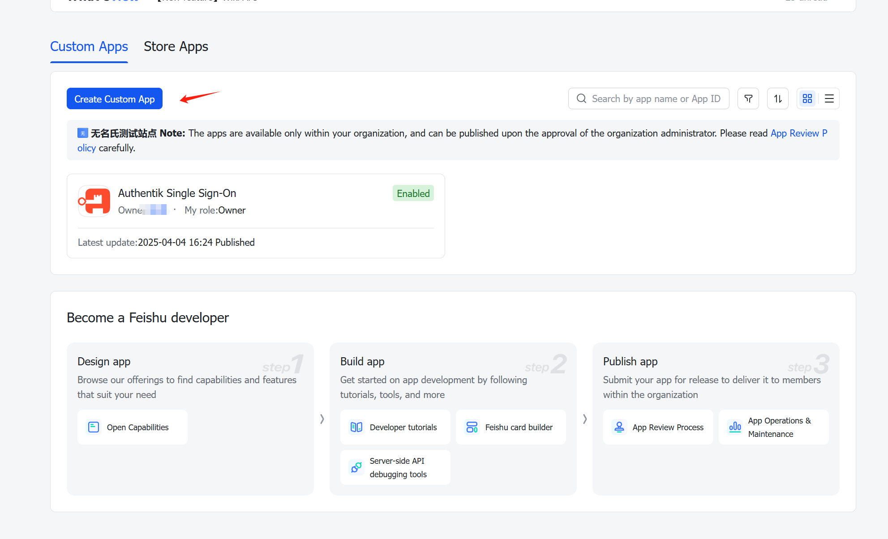
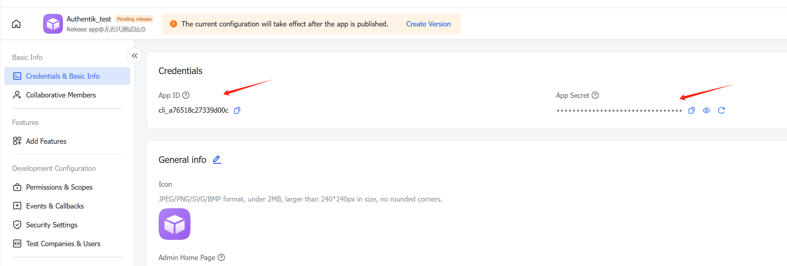
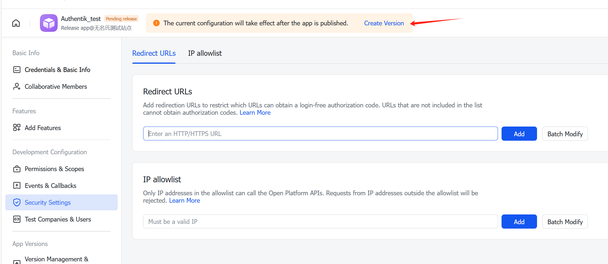
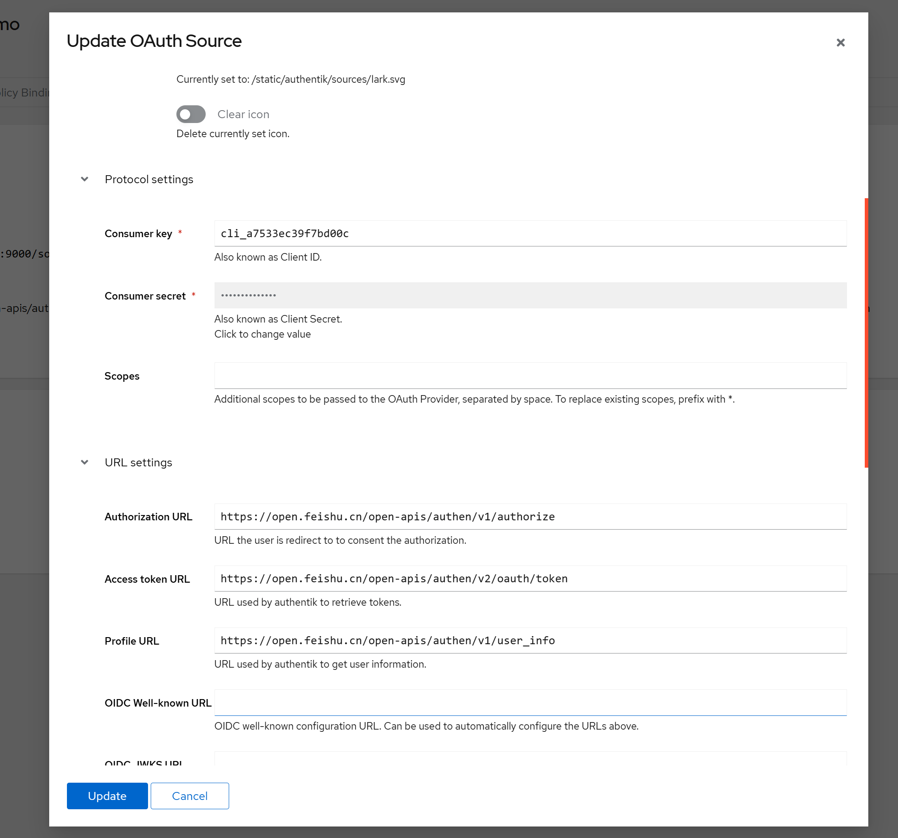

[Lark](https://www.larksuite.com/en_sg) (FeiShu) is an office suite that integrates messaging, schedule management, collaborative documents, video conferencing, and other applications in one platform. Feishu is used in mainland China; outside of China, Lark is the equivalent application.

## Preparation

The following placeholders are used in this guide:

- `authentik.company` is the FQDN of the authentik installation.

:::info
A user with an administrator role is required to create clients on the Lark (FeiShu) Developer Platform.
:::

## Lark (Feishu) Configuration

1. Login into .

2. Click **Create Custom App** to create a new application.

3. After creation, in the **Credentials & Basic Info**, find the **APP ID** and **APP Secret** and _save it for later_
   

4. Go to security settings. In **Redirect URLs** add a redirect URI: <kbd>https://<em>authentik.company</em>/source/oauth/callback/lark/</kbd>
   

5. Publish your application. Changes only take effect after you have published.

## authentik configuration

1. Log in to authentik as an admin, and open the authentik Admin interface.

2. Go to security settings. In **Redirect URLs** add a redirect URI: <kbd>https://<em>authentik.company</em>/source/oauth/callback/lark/</kbd>

**Select type**: Choose **Lark OAuth Source*.
**Create Lark OAuth Source**:
     - **Name**: Choose a name (the example below uses Lark).
     - **Slug:** lark (You can choose a different slug, if you do you will need to update the Lark redirect URL and point it to the correct slug.)
     - **Consumer Key:** App ID from step 4
     - **Consumer Secret:** App Secret from step 4
     - **Authorization URL:** Leave it as default, the default value is: https://open.feishu.cn/open-apis/authen/v1/authorize
     - **Access token URL:** Leave it as default, the default value is: https://open.feishu.cn/open-apis/authen/v2/oauth/token
     - **Profile URL:** Leave it as default, the default value is: https://open.feishu.cn/open-apis/authen/v1/user_info
    Here is an example of a complete authentik Lark OAuth Source

3. Click **Finish** and you now have Lark as a source.

## Property Mapping

In this function, **open_id** in Lark was used as default username, since **email** is empty when there is no email setup.
It's highly suggested using a flow to re-map the properties when user was write to authentik.

:::note
For more details on how to display the new source on the Login page see [our documentation](../../index.md#add-sources-to-default-login-page).
:::
