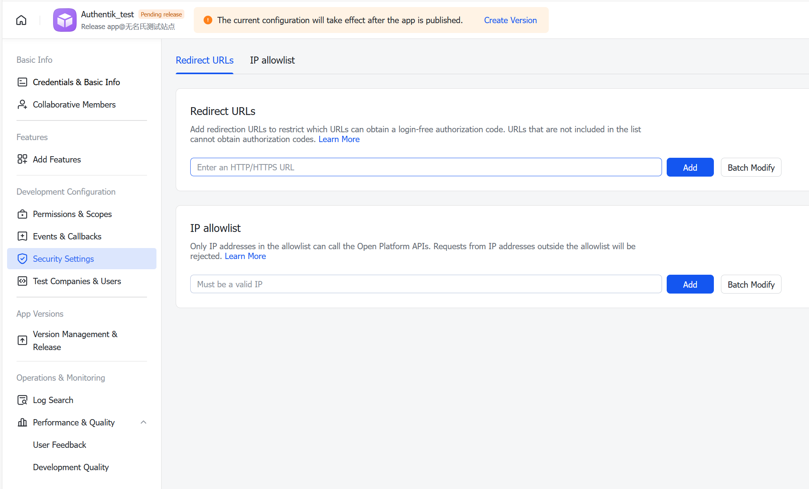

Allows users to authenticate using their Lark(Feishu) credentials.

## Preparation

The following placeholders are used in this guide:

- `authentik.company` is the FQDN of the authentik installation.

:::caution
Administrator role for Lark(Feishu) is required to create clients on Lark(Feishu) developer platform.
:::

## Lark(Feishu)

1. Login into .

2. Click **Create Custom App** to create a new application. 

3. After creation, in the **Credentials & Basic Info**, find the **APP ID** and **APP Secret** and _save it for later_

4. Go to security settings.Insert the redirect URL: `https://authentik.company/source/oauth/callback/lark/`

5. Publish your application, changes only take effect after you have published.

## authentik

6. Under _Directory -> Federation & Social login_ Click **Create > Lark OAuth Source**

6. **Name:** Choose a name (For the example I used Lark)
7. **Slug:** lark (You can choose a different slug, if you do you will need to update the Mailcow redirect URL and point it to the correct slug.)
8. **Consumer Key:** App ID from step 4
9. **Consumer Secret:** App Secret from step 4
10. **Authorization URL:** Leave it as default, the default value is: https://open.feishu.cn/open-apis/authen/v1/authorize
11. **Access token URL:** Leave it as default, the default value is: https://open.feishu.cn/open-apis/authen/v2/oauth/token
12. **Profile URL:** Leave it as default, the default value is: https://open.feishu.cn/open-apis/authen/v1/user_info
Here is an example of a complete authentik Lark OAuth Source

Save, and you now have Lark as a source.

## Property Mapping
In this function, **open_id** in Lark was used as default username, since **email** is empty when there is no email setup.
It's highly suggested using a flow to re-map the properties when user was write to Authentik.

:::note
For more details on how-to have the new source display on the Login Page see [here](../../index.md#add-sources-to-default-login-page).
:::
