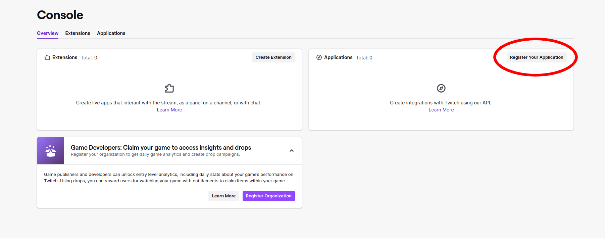
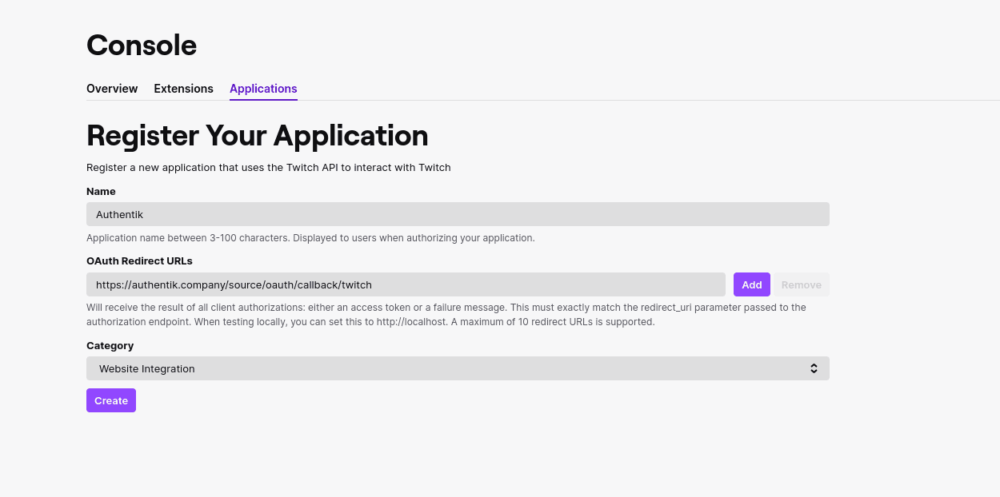
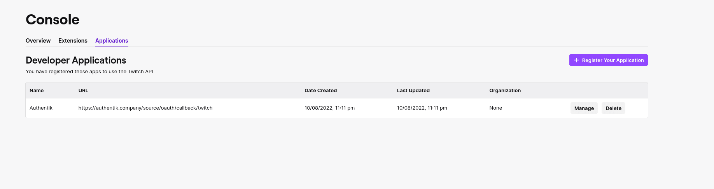
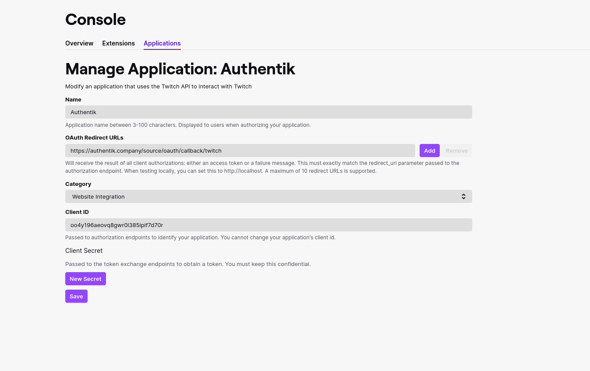
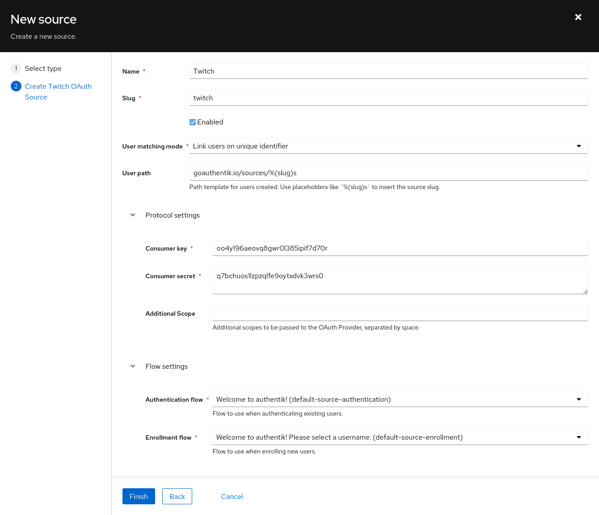

Support level: Community

Allows users to authenticate using their Twitch credentials

## Preparation

The following placeholders are used in this guide:

- `authentik.company` is the FQDN of the authentik installation.

## Twitch

1. Click **Register Your Application** in the Twitch Developers Console https://dev.twitch.tv/console

2. Name your Application

3. Add https://authentik.company/source/oauth/callback/twitch in the **OAuth Redirect URLs** field

4. Select a Category for your Application

5. Click **Create** to finish the registration of your Application

6. Click **Manage** on your newly created Application

7. Copy your Client ID and save it for later

8. Click **New Secret** to create a new Secret

9. Copy the above Secret and also save it for later

## authentik

10. Under _Directory -> Federation & Social login_ Click **Create Twitch OAuth Source**

11. **Name:** Choose a name (For the example I used Twitch)
12. **Slug:** twitch (You can choose a different slug, if you do you will need to update the Twitch redirect URL and point it to the correct slug.)
13. **Consumer Key:** Client ID from step 7
14. **Consumer Secret:** Secret from step 9

Here is an example of a complete authentik Twitch OAuth Source

Save, and you now have Twitch as a source.

:::note
For more details on how-to have the new source display on the Login Page see [here](../../index.md#add-sources-to-default-login-page).
:::
