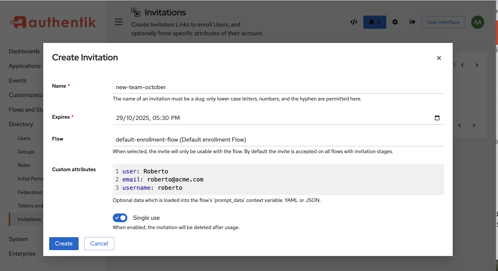

Invitations are another way to create a user, by inviting someone to join your authentik instance as a new user. With invitations, you can either email an enrollment invitation URL to one or more specific recipients with pre-defined credentials, or you can email a URL to users, who can then log in and define their own credentials.

You can configure invitations either by:

- using [pre-built blueprints](#use-pre-built-blueprints-to-configure-invitations) (recommended for quick setup).
- [manually creating flows and stages](#manual-setup-without-blueprints) (for custom configurations).

:::info
You can also create a [policy](../../../customize/policies/) to see if the invitation was ever used.
:::

## Use pre-built blueprints to configure invitations

The fastest way to configure invitations in authentik is to use our pre-defined blueprints that have the necessary flows, stages, and prompts already included.

### Step 1. Download a blueprint

We have two pre-defined blueprints, the`Example - Invitation-based Enrollment` blueprint and the `Example - Enrollment (2 Stage)`blueprint.

- #### Option 1: Download the `Example - Invitation-based Enrollment` blueprint (Recommended)

    This blueprint provides several examples of how to configure different invitation features and serves as a helpful starting point:
    - Separate flows for external and internal users
    - An example of [automatic group assignment](#automatic-group-assignment) (creates an example group called `engineering-team`)
    - [User path organization](#user-paths)
    - Five example invitations demonstrating different use cases

    Download the `Example - Invitation-based Enrollment` blueprint by running this command:

    ```shell
    wget https://goauthentik.io/blueprints/example/flows-invitation-enrollment.yaml
    ```

    Alternatively, use this [link](/blueprints/example/flows-invitation-enrollment.yaml) to view and save the file.

- #### Option 2: Download the `Example - Enrollment (2 Stage)` blueprint

    For a simpler invitation flow that doesn't include separate flows for internal/external user types, [automatic group assignment](#automatic-group-assignment), and [set user paths](#user-paths), download the `Example - Enrollment (2 Stage)` blueprint by running this command:

    ```shell
    wget https://goauthentik.io/blueprints/example/flows-enrollment-2-stage.yaml
    ```

    Alternatively, use this [link](/blueprints/example/flows-enrollment-2-stage.yaml) to view and save the file.

### Step 2. Import the blueprint file

1. Log in to authentik as an administrator and open the authentik Admin interface.
2. Navigate to **Flows and Stages** > **Flows** and click **Import**.
3. Click **Choose file**, select the blueprint file that you downloaded, and then click **Import**.

### Step 3. Create the invitation object

1. Log in to authentik as an administrator and open the authentik Admin interface.
2. Navigate to **Directory** > **Invitations** and click **Create**.

    The Create Invitation box appears.



Configure the following settings:

- **Name**: provide a name for your invitation object.
- **Expires**: select a date for when you want the invitation to expire.
- **Flow**: In the drop-down menu, select the enrollment flow to use (`invitation-enrollment-flow-external`, `invitation-enrollment-flow-internal`, `invitation-enrollment-flow-internal-engineering`, or ` default-enrollment-flow` depending on which blueprint you used).
- **Custom attributes**: (_optional_) Enter JSON or YAML to pre-fill user information. This data is merged with the user's input during enrollment.

<details>
<summary>Example custom attributes:</summary>

        **Pre-fill email only (JSON)**:

            ```json
            {
                "email": "user@example.com"
            }
            ```

        **Pre-fill multiple fields (YAML)**:

            ```yaml
            name: Jane Smith
            email: jane.smith@company.com
            ```

        **Pre-fill with custom attributes (JSON)**:

            ```json
            {
                "name": "John Doe",
                "email": "john@example.com",
                "attributes": {
                    "department": "Engineering",
                    "employee_type": "contractor",
                    "start_date": "2025-01-15"
                }
            }
            ```
    </details>

    :::info
    The field keys (e.g., `email`, `name`) must match the field keys configured in your flow's [prompt stage](../../add-secure-apps/flows-stages/stages/prompt/index.md).
    :::

    - **Single use**: Specify whether the invitation should expire after a single use.
        - Enable for invitations sent to specific individuals.
        - Disable for invitations shared with multiple people (e.g., department onboarding links).

3. Click **Save**.

### Step 4. Share the invitation

On the **Invitations** page, click the chevron beside your new invitation to expand the details. The **Link to use the invitation** displays with the URL.

You can share the invitation in two ways:

#### Option 1: Copy the link manually

Copy the URL and send it in an email to the people you want to invite to enroll.

The invitation link format is:

```
https://authentik.company/if/flow/<flow-slug>/?itoken=<invitation-uuid>
```

#### Option 2: Send an invitation email directly from authentik

Follow the steps below to send invitation emails directly from authentik:

1. On the **Invitations** page, click the chevron beside your invitation to expand the details.
2. Click **Send via Email** and configure the following settings:
    - **To**: Enter the email addresses of the recipients. You can enter multiple addresses, one per line, or separated by commas or semicolons. Each recipient will receive a separate email with the invitation link.
    - **CC**: (_optional_) Enter the email addresses to carbon copy.
    - **BCC**: (_optional_) Enter the email addresses to blind carbon copy.
    - **Template**: Select the email template to use. The default `Invitation` template is recommended.
3. Click **Send**.

The emails are queued and sent asynchronously by the background worker. Each recipient receives an email containing the invitation link.

:::note Email configuration required
To use this feature, you must have email configured in authentik, refer to the [Email configuration](../../install-config/email.mdx) documentation for details.
:::

## Manual setup (without blueprints)

If you prefer to create your invitation flow manually instead of using a blueprint, follow these steps:

### Step 1: Create an Invitation stage

1. Log in to authentik as an administrator and open the authentik Admin interface.
2. Navigate to **Flows and Stages** > **Stages** and click **Create**.
3. Select **Invitation Stage** from the stage type list.
4. Configure the stage:
    - **Name**: Provide a descriptive name (e.g., `enrollment-invitation-stage`)
    - **Continue flow without invitation**:
        - Set to `false` if you want to require a valid invitation token (recommended for invitation-only flows).
        - Set to `true` if you want to allow both invited and non-invited users to use the same enrollment flow.

5. Click **Create**.

:::info
The **Continue flow without invitation** setting determines whether users can proceed through the flow without a valid invitation token. When set to `false`, only users with valid invitation links can complete enrollment.
:::

### Step 2: Create or modify an Enrollment flow

1. Navigate to **Flows and Stages** > **Flows**.
2. Either create a new flow or edit an existing enrollment flow:
    - **Name**: Provide a descriptive name.
    - **Title**: Enter the title shown to users during enrollment.
    - **Slug**: Enter a unique identifier (e.g., `invitation-enrollment`).
    - **Designation**: Must be set to **Enrollment**.
    - **Authentication**: Set to **Require unauthenticated** (users shouldn't be logged in to enroll).

### Step 3: Bind the Invitation stage to the flow

1. In your enrollment flow, go to the **Stage Bindings** tab.
2. Click **Bind Stage** and select your invitation stage.
3. Configure the binding:
    - **Order**: Set to a low number (e.g., `5` or `10`) so it evaluates early in the flow.
    - **Evaluate on plan**: Enable this option so the invitation is validated when the flow starts.
    - **Re-evaluate policies**: Enable this to ensure policies are checked.

4. Add other necessary stages to your flow (in order):
    - **Prompt Stage** for collecting credentials (username, password)
    - **Prompt Stage** for collecting user details (name, email)
    - **User Write Stage** to create the user account
    - **User Login Stage** to log the user in after enrollment

### Step 4: Create invitations

Now you can create invitations that reference your custom flow. Follow the steps in [Create the invitation object](#step-3-create-the-invitation-object) above.

## Advanced features

### Automatic group assignment

To automatically add users to a group when they enroll via invitation, you need to configure the enrollment flow's User Write Stage:

1. Log in to authentik as an administrator and open the authentik Admin interface.
2. Navigate to **Flows and Stages** > **Stages**.
3. Create or edit a **User Write Stage** used by your enrollment flow.
4. Set **Create users group** to your desired group.
5. All users enrolling through that flow will automatically be added to the selected group.

:::info
Groups cannot be set directly in invitation custom attributes because they require database relationships. They must be configured at the flow/stage level.
:::

### User paths

[User paths](user_ref.mdx#path) organize users in a directory structure (e.g., `users/external`, `users/internal/engineering`). To configure user paths:

1. Log in to authentik as an administrator and open the authentik Admin interface.
2. Navigate to **Flows and Stages** > **Stages**.
3. Create or edit a **User Write Stage** used by your enrollment flow.
4. Set **User path template** to your desired path.
5. All users enrolling through that flow will be created under that path.

### Expression policies with invitations

You can use [expression policies](../../../customize/policies/expression/) to make decisions based on invitation data:

```python
# Check if user was invited
return context.get('invitation_in_effect', False)

# Access invitation data
invitation = context.get('invitation')
if invitation:
    return invitation.fixed_data.get('department') == 'Engineering'

# Access pre-filled prompt data
prompt_data = context.get('prompt_data', {})
return prompt_data.get('email', '').endswith('@example.com')
```

## Troubleshooting

### "Permission denied" error for external users

**Problem**: External user sees "Interface can only be accessed by internal users" after enrollment.

**Solution**: Configure a Default Application in your brand settings (System → Brands) so external users have somewhere to go after login.

### Invitation not working

Possible causes:

- Invitation has expired (check the expiration date)
- Single-use invitation has already been used
- Flow slug doesn't match the invitation's configured flow
- Invitation stage is not bound to the flow

### Pre-filled Data Not Appearing

Possible causes:

- Field keys in custom attributes don't match your prompt field keys
- Prompt fields are marked as `placeholder_expression: true`
- Invitation stage is not evaluated before prompt stages in the flow

:::info Invitation links validity
Be aware that when an authentik administrator or any other user creates an invitation link, that link remains valid even if the administrator is deactivated or has permissions revoked. However, if the user who created the link is deleted and removed from the authentik system, the link is also deleted.
:::
