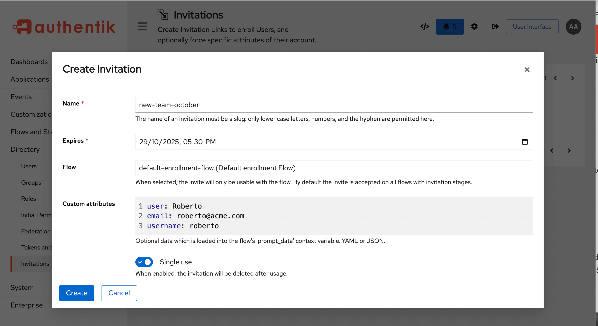

Invitations are another way to create a user, by inviting someone to join your authentik instance, as a new user. With invitations, you can either email an enrollment invitation URL to one or more specific recipients with pre-defined credentials, or you can email a URL to users, who can then log in and define their own credentials.

:::info
You can also create a policy to see if the invitation was ever used.
:::

## Create an invitation

The fastest way to create an invitation is to use our pre-defined `default-enrollment-flow` that has the necessary stages and prompts already included.

**Step 1. Download the `default-enrollment-flow` file**

To download the `default-enrollment-flow` file, run this command:

```shell
wget https://goauthentik.io/blueprints/example/flows-enrollment-2-stage.yaml
```

Alternatively, use this [link](/blueprints/example/flows-enrollment-2-stage.yaml) to view and save the file.

**Option 2: Advanced Invitation Flow (Recommended)**

For more advanced features including internal/external user types, group assignment, and user paths:

```shell
wget https://goauthentik.io/blueprints/example/flows-invitation-enrollment.yaml
```

This blueprint includes:

- Separate flows for external and internal users
- Automatic group assignment example (creates an example group called `engineering-team`)
- User path organization
- Five example invitations demonstrating different use cases

**Step 2. Import the enrollment flow file**

In authentik, navigate to the Admin UI, and then click **Flows** in the left navigation pane.

At the top of the Flows page, click **Import**, and then select the blueprint file you just downloaded.

**Step 3. Create the invitation object**

In the Admin UI, navigate to **Directory --> Invitations**, and then click **Create** to open the **Create Invitation** box. Define the following fields:

- **Name**: provide a name for your invitation object.

- **Expires**: select a date for when you want the invitation to expire.

- **Flow**: In the drop-down menu, select the enrollment flow to use:
    - `default-enrollment-flow` for basic enrollment
    - `invitation-enrollment-flow-external` for external users (customers, partners)
    - `invitation-enrollment-flow-internal` for internal users (employees)

- **Custom attributes**: (Optional) Enter JSON or YAML to pre-fill user information. This data is merged with the user's input during enrollment. Examples:

    Pre-fill email only (JSON):

    ```json
    {
        "email": "user@example.com"
    }
    ```

    Pre-fill multiple fields (YAML):

    ```yaml
    name: Jane Smith
    email: jane.smith@company.com
    ```

    Pre-fill with custom attributes (JSON):

    ```json
    {
        "name": "John Doe",
        "email": "john@example.com",
        "attributes": {
            "department": "Engineering",
            "employee_type": "contractor",
            "start_date": "2025-01-15"
        }
    }
    ```

    :::info
    The field keys (e.g., `email`, `name`) must match the field keys configured in your flow's [prompt stage](../../add-secure-apps/flows-stages/stages/prompt/index.md).
    :::



- **Single use**: Specify whether the invitation should expire after a single use.
    - Enable for invitations sent to specific individuals
    - Disable for invitations shared with multiple people (e.g., department onboarding links)

Click **Save** to save the new invitation and close the box and return to the **Invitations** page.

**Step 4. Share the invitation**

On the **Invitations** page, click the chevron beside your new invitation, to expand the details. The **Link to use the invitation** displays with the URL. Copy the URL and send it in an email to the people you want to invite to enroll.

The invitation link format is:

```
https://your-authentik-domain/if/flow/flow-slug/?itoken=<invitation-uuid>
```

## Advanced Features

### Automatic Group Assignment

To automatically add users to a group when they enroll via invitation, you need to configure the enrollment flow's User Write Stage:

1. Navigate to **Flows & Stages → Stages**
2. Create or edit a **User Write Stage**
3. Set **Create users group** to your desired group
4. Ensure your enrollment flow uses this User Write Stage
5. All invitations using that flow will automatically add users to the group

:::info
Groups cannot be set directly in invitation custom attributes because they require database relationships. They must be configured at the flow/stage level.
:::

### User Paths

[User paths](user_ref.mdx#path) organize users in a directory structure (e.g., `users/external`, `users/internal/engineering`). To configure user paths:

1. Navigate to **Flows & Stages → Stages**
2. Edit the **User Write Stage** used by your enrollment flow
3. Set **User path template** to your desired path
4. All users enrolling through that flow will be created in that path

User paths are useful for organizing users by department or type

### Expression Policies with Invitations

You can use expression policies to make decisions based on invitation data:

```python
# Check if user was invited
return context.get('invitation_in_effect', False)

# Access invitation data
invitation = context.get('invitation')
if invitation:
    return invitation.fixed_data.get('department') == 'Engineering'

# Access pre-filled prompt data
prompt_data = context.get('prompt_data', {})
return prompt_data.get('email', '').endswith('@example.com')
```

## Troubleshooting

### "Permission denied" Error for External Users

**Problem**: External user sees "Interface can only be accessed by internal users" after enrollment.

**Solution**: Configure a Default Application in your brand settings (System → Brands) so external users have somewhere to go after login.

### Invitation Not Working

**Possible causes**:

- Invitation has expired (check the expiration date)
- Single-use invitation has already been used
- Flow slug doesn't match the invitation's configured flow
- Invitation stage is not bound to the flow

### Pre-filled Data Not Appearing

**Possible causes**:

- Field keys in custom attributes don't match your prompt field keys
- Prompt fields are marked as `placeholder_expression: true`
- Invitation stage is not evaluated before prompt stages in the flow

:::info Invitation links validity
Be aware that when an authentik administrator or any other user creates an invitation link, that link remains valid even if the administrator is deactivated or has permissionss revoked. However, if the user who created the link is deleted and removed from the authentik system, the link is also deleted.
:::
