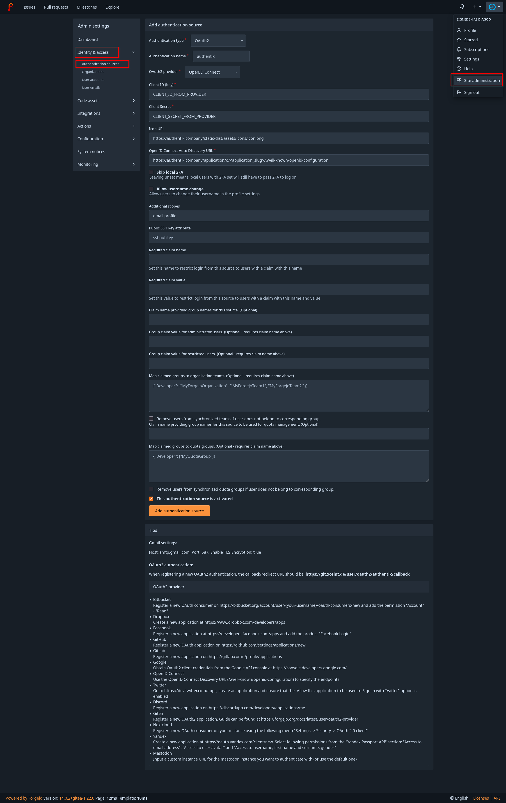

## What is Forgejo

> Forgejo is a self-hosted lightweight software forge. Easy to install and low maintenance, it just does the job.
>
> -- https://forgejo.org/

## Preparation

The following placeholders are used in this guide:

- `authentik.company` is the FQDN of the authentik installation.
- `forgejo.company` is the FQDN of the Forgejo installation.

:::info
This documentation lists only the settings that you need to change from their default values. Be aware that any changes other than those explicitly mentioned in this guide could cause issues accessing your application.
:::

## authentik configuration

To support the integration of Forgejo with authentik, you need to create an application/provider pair in authentik.

### Create an application and provider in authentik

1. Log in to authentik as an administrator and open the authentik Admin interface.
2. Navigate to **Applications** > **Applications** and click **Create with Provider** to create an application and provider pair. (Alternatively you can first create a provider separately, then create the application and connect it with the provider.)

- **Application**: provide a descriptive name, an optional group for the type of application, the policy engine mode, and optional UI settings.
- **Choose a Provider type**: select **OAuth2/OpenID Connect** as the provider type.
- **Configure the Provider**: provide a name (or accept the auto-provided name), the authorization flow to use for this provider, and the following required configurations.
    - Note the **Client ID**, **Client Secret**, and **slug** values because they will be required later.
    - Set a `Strict` redirect URI to `https://<forgejo.company>/user/oauth2/authentik/callback`.
    - Select any available signing key.
- **Configure Bindings** _(optional)_: you can create a [binding](/docs/add-secure-apps/bindings-overview/) (policy, group, or user) to manage the listing and access to applications on a user's **My applications** page.

3. Click **Submit** to save the new application and provider.

## Forgejo configuration

1. Log in to Forgejo as an administrator, then click on your profile icon at the top right and select **Site Administration**.
2. Select the **Authentication Sources** tab and then click on **Add Authentication Source**.
3. Set the following required configurations:
    - **Authentication Name**: `authentik` (This must match the name used in the **Redirect URI** in the previous section)
    - **OAuth2 Provider**: `OpenID Connect`
    - **Client ID (Key)**: Enter the Client ID from authentik.
    - **Client Secret**: Enter the Client Secret from authentik.
    - **Icon URL**: `https://authentik.company/static/dist/assets/icons/icon.png`
    - **OpenID Connect Auto Discovery URL**: `https://authentik.company/application/o/<application_slug>/.well-known/openid-configuration`
    - **Additional Scopes**: `email profile`



4. Click **Add Authentication Source**.

### Claims for authorization management (optional)

:::info
This step is _optional_ and shows how to set claims to control the permissions of users in Forgejo by adding them to groups.
:::

#### Create groups

The following groups will be created:

- `gituser`: normal Forgejo users.
- `gitadmin`: Forgejo users with administrative permissions.
- `gitrestricted`: restricted Forgejo users.

:::info
Users who are in none of these groups will not be able to log in to Forgejo.
:::

1. Log in to authentik as an administrator and open the authentik Admin interface.
2. Navigate to **Directory** > **Groups** and click **Create**.
3. Set the group name to `gituser` and click **Create**.
4. Repeat steps 2 and 3 to create two additional groups named `gitadmin` and `gitrestricted`.
5. Click the name of a newly created group and navigate to the **Users** tab.
6. Click **Add existing user**, select the user/s that need Forgejo access and click **Add**.
7. Repeat steps 5 and 6 for the two additional groups.

:::info
You can add users to the groups at any point.
:::

#### Create custom property mapping

1. Log in to authentik as an administrator and open the authentik Admin interface.
2. Navigate to **Customization** > **Property Mappings** and click **Create**. Create a **Scope Mapping** with the following configurations:
    - **Name**: Choose a descriptive name (.e.g `authentik forgejo OAuth Mapping: OpenID 'forgejo'`)
    - **Scope name**: `forgejo`
    - **Expression**:

    ```python showLineNumbers
    forgejo_claims = {}

    if request.user.groups.filter(name="gituser").exists():
        forgejo_claims["forgejo"]= "user"
    if request.user.groups.filter(name="gitadmin").exists():
        forgejo_claims["forgejo"]= "admin"
    if request.user.groups.filter(name="gitrestricted").exists():
        forgejo_claims["forgejo"]= "restricted"

    return forgejo_claims
    ```

3. Click **Finish**.

#### Add the custom property mapping to the Forgejo provider

1. Log in to authentik as an administrator and open the authentik Admin interface.
2. Navigate to **Applications** > **Providers** and click on the **Edit** icon of the Forgejo provider.
3. Under **Advanced protocol settings** > **Scopes** add the following scopes to **Selected Scopes**:
    - `authentik default OAuth Mapping: OpenID 'email'`
    - `authentik default OAuth Mapping: OpenID 'profile'`
    - `authentik default OAuth Mapping: OpenID 'openid'`
    - `authentik forgejo OAuth Mapping: OpenID 'forgejo'`

4. Click **Update**.

#### Configure Forgejo to use the new claims

:::info
For this to function, the Forgejo `ENABLE_AUTO_REGISTRATION: true` variable must be set. More information on configurations variables in the [Forgejo Configuration Cheat Sheet](https://forgejo.org/docs/latest/admin/config-cheat-sheet/).
:::

1. Log in to Forgejo as an admin. Click on your profile icon at the top right > **Site Administration**.
2. Select the **Authentication Sources** tab and edit the **authentik** Authentication Source.
3. Set the following configurations:
    - **Additional Scopes**: `email profile forgejo`
    - **Required Claim Name**: `forgejo`
    - **Claim name providing group names for this source.** (Optional): `forgejo`
    - **Group Claim value for administrator users.** (Optional - requires claim name to be set): `admin`
    - **Group Claim value for restricted users.** (Optional - requires claim name to be set): `restricted`
4. Click **Update Authentication Source**.

:::info
Users who are not part of any defined group will be denied login access.
In contrast, members of the `gitadmin` group will have full administrative privileges, while those in the `gitrestricted` group will have limited access.
:::

## Configuration verification

To verify that authentik is correctly set up with Forgejo, log out and then log back in using the **Sign in with authentik** button.

## Resources

- [Official Forgejo Documentation](https://forgejo.org/docs/latest/)
