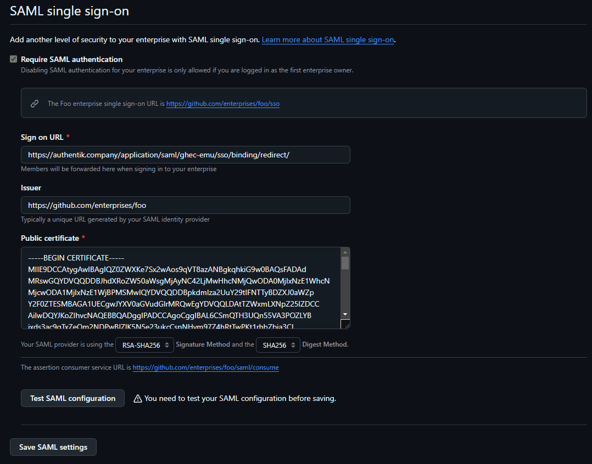

import SAMLProvider20265Warning from "../../_saml-provider-2026-5-warning.mdx";
import TabItem from "@theme/TabItem";
import Tabs from "@theme/Tabs";

## What is GitHub Enterprise Managed Users?

> GitHub Enterprise Managed Users lets organizations manage access to GitHub Enterprise Cloud with user accounts that are provisioned and authenticated from an external identity provider.
>
> -- https://github.com/enterprise

This guide configures authentik as the SAML identity provider and SCIM provider for GitHub Enterprise Cloud with Enterprise Managed Users (EMU). It applies to EMU enterprises hosted on GitHub.com and EMU enterprises with data residency on GHE.com.

## Preparation

The following placeholders are used in this guide:

- `github.com/enterprises/foo` is your GitHub.com EMU enterprise, where `foo` is the name of your enterprise.
- `foo.ghe.com` is your GHE.com EMU enterprise, where `foo` is your enterprise subdomain.
- `authentik.company` is the FQDN of the authentik installation.

:::info
This documentation lists only the settings that you need to change from their default values. Be aware that any changes other than those explicitly mentioned in this guide could cause issues accessing your application.
:::

This guide uses two application entitlements: `GitHub Users` for standard GitHub users and `GitHub Admins` for GitHub enterprise administrators.

SCIM must be configured for this integration. GitHub matches the SAML identity to the SCIM identity by comparing the SAML `NameID` value with the SCIM `userName` value, and users must be provisioned by SCIM before they can sign in with SAML. The mappings below use the `github_emu_username` user attribute when it exists and fall back to the authentik username.

Use the values for your EMU deployment when configuring authentik:

<Tabs
  groupId="github-emu-deployment"
  defaultValue="github"
  values={[
    {label: 'GitHub.com', value: 'github'},
    {label: 'GHE.com', value: 'ghec'},
  ]}>
<TabItem value="github">

| Setting      | Value                                             |
| ------------ | ------------------------------------------------- |
| **ACS URL**  | `https://github.com/enterprises/foo/saml/consume` |
| **Audience** | `https://github.com/enterprises/foo`              |
| **SCIM URL** | `https://api.github.com/scim/v2/enterprises/foo`  |

</TabItem>
<TabItem value="ghec">

| Setting      | Value                                              |
| ------------ | -------------------------------------------------- |
| **ACS URL**  | `https://foo.ghe.com/enterprises/foo/saml/consume` |
| **Audience** | `https://foo.ghe.com/enterprises/foo`              |
| **SCIM URL** | `https://api.foo.ghe.com/scim/v2/enterprises/foo`  |

</TabItem>
</Tabs>

## authentik configuration

To support the integration of GitHub Enterprise EMU with authentik, you need to create property mappings, an application/provider pair, application entitlements, and a SCIM provider.

### Create property mappings

1. Log in to authentik as an administrator and open the authentik Admin interface.
2. Navigate to **Customization** > **Property Mappings**.
3. Create the following **SAML Provider Property Mapping**s. For each mapping, click **Create**, select **SAML Provider Property Mapping**, click **Next**, and configure the following settings:
    - **Name**: `GitHub EMU username`
        - **SAML Attribute Name**: `http://schemas.goauthentik.io/2021/02/saml/username`
        - **Expression**:

            ```python
            return request.user.attributes.get("github_emu_username", request.user.username)
            ```

    - **Name**: `GitHub EMU full name`
        - **SAML Attribute Name**: `full_name`
        - **Expression**:

            ```python
            return request.user.name
            ```

    - **Name**: `GitHub EMU emails`
        - **SAML Attribute Name**: `emails`
        - **Expression**:

            ```python
            if request.user.email:
                yield request.user.email
            ```

4. Click **Create**, select **SCIM Provider Mapping**, click **Next**, and configure the following settings:
    - **Name**: `GitHub EMU user`
    - **Expression**:

        The supported `roles` values are documented in [GitHub Enterprise Cloud's SCIM API documentation](https://docs.github.com/en/enterprise-cloud@latest/rest/enterprise-admin/scim#provision-a-scim-enterprise-user).

        ```python
        username = request.user.attributes.get("github_emu_username", request.user.username)
        formatted = request.user.name or username
        given_name = formatted
        family_name = " "
        if " " in formatted:
            given_name, _, family_name = formatted.partition(" ")

        emails = []
        if request.user.email:
            emails.append(
                {
                    "value": request.user.email,
                    "type": "work",
                    "primary": True,
                }
            )

        entitlement_names = {
            entitlement.name
            for entitlement in request.user.app_entitlements(provider.application)
        }

        roles = []
        if "GitHub Admins" in entitlement_names:
            roles.append({"value": "enterprise_owner", "primary": True})
        elif "GitHub Users" in entitlement_names:
            roles.append({"value": "user", "primary": True})

        return {
            "userName": username,
            "externalId": str(request.user.uid),
            "name": {
                "formatted": formatted,
                "givenName": given_name,
                "familyName": family_name,
            },
            "displayName": formatted,
            "active": request.user.is_active,
            "emails": emails,
            "roles": roles,
        }
        ```

### Create an application and provider

<SAMLProvider20265Warning />

1. Log in to authentik as an administrator and open the authentik Admin interface.
2. Navigate to **Applications** > **Applications** and click **New Application** to create an application and provider pair. (Alternatively you can first create a provider separately, then create the application and connect it with the provider.)
    - **Application**: provide a descriptive name, an optional group for the type of application, the policy engine mode, and optional UI settings. Note the application **Slug**, because it is required later for the GitHub issuer URL.
    - **Choose a Provider type**: select **SAML Provider** as the provider type.
    - **Configure the Provider**: provide a name (or accept the auto-provided name), the authorization flow to use for this provider, and the following required configurations.
        - Set **ACS URL** to the ACS URL for your EMU deployment.
        - Set **Audience** to the audience value for your EMU deployment.
        - Under **Advanced protocol settings**:
            - Add the `GitHub EMU full name` and `GitHub EMU emails` property mappings.
            - Set **NameID Property Mapping** to `GitHub EMU username`.
            - Set **Default NameID Policy** to `urn:oasis:names:tc:SAML:2.0:nameid-format:persistent`.
            - Select an available **Signing certificate**. Download this certificate because it is required later.
            - Enable **Sign assertions** and **Sign responses**.
    - **Configure Bindings** _(optional)_: you can create a [binding](/docs/add-secure-apps/bindings-overview/) (policy, group, or user) to manage the listing and access to applications on a user's **Application Dashboard** page. If you add the SCIM provider as a backchannel provider later, only users who can view this application are synchronized.

3. Click **Submit** to save the new application and provider.

### Create application entitlements

1. In the authentik Admin interface, open the GitHub EMU application that you created.
2. Click the **Application entitlements** tab.
3. Create two entitlements named `GitHub Users` and `GitHub Admins`.
4. Open each entitlement and bind the users or groups that should receive it.

## GitHub configuration

When GitHub provisions your managed enterprise, GitHub sends an email inviting you to set the password for the setup user. The setup user has the username `<enterprise_shortcode>_admin`, cannot be linked with SSO, and is the emergency account that can bypass SSO requirements.

### Create the SCIM token

1. Log in as the setup user.
2. Navigate to the personal access tokens page:
    - GitHub.com: `https://github.com/settings/tokens`
    - GHE.com: `https://foo.ghe.com/settings/tokens`
3. Generate a new classic personal access token with the `scim:enterprise` scope and no expiration.
4. Copy the token. This value is used in the authentik SCIM provider.

### Configure SAML in GitHub

1. Log in as the setup user.
2. Navigate to your enterprise.
3. Click **Identity provider**.
4. Under **Identity Provider**, click **Single sign-on configuration**.
5. Under **Open SCIM Configuration**, select **Enable open SCIM configuration**.
6. Under **SAML single sign-on**, select **Add SAML configuration**.
7. Configure the following settings:
    - **Sign on URL**: enter the **SAML Endpoint** from the SAML provider that you created in authentik.
    - **Issuer**: `https://authentik.company/application/saml/<application_slug>/metadata/`.
    - **Public certificate**: paste the full signing certificate that you downloaded from authentik.
    - **Signature method** and **Digest method**: select the methods that match the authentik SAML provider settings.
8. Click **Test SAML configuration**.
9. After the test succeeds, click **Save SAML settings**.
10. Save the SAML recovery codes that GitHub provides.



### Create a SCIM provider in authentik

1. In the authentik Admin interface, navigate to **Applications** > **Providers** and click **Create**.
2. Select **SCIM Provider** as the provider type and click **Next**.
3. Configure the following settings:
    - **Name**: provide a descriptive name.
    - **URL**: enter the SCIM URL for your EMU deployment.
    - **Token**: paste the GitHub personal access token that you created earlier.
    - **User Property Mappings**: remove `authentik default SCIM Mapping: User`, then add the `GitHub EMU user` mapping that you created earlier.
    - **Group Property Mappings**: if you do not want authentik to synchronize groups to GitHub, remove `authentik default SCIM Mapping: Group`. To synchronize selected authentik groups to GitHub, keep `authentik default SCIM Mapping: Group` selected and add those groups to **Group Filter**.
4. Click **Finish**.
5. Navigate to **Applications** > **Applications** and open the GitHub EMU application.
6. Add the SCIM provider to **Backchannel Providers**.
7. Click **Update**.

## Configuration verification

To confirm that authentik is properly configured with GitHub Enterprise EMU, assign a test user to the `GitHub Users` entitlement and ensure that the user can view the application in authentik.

Open the SCIM provider and click **Run sync again**. After the sync completes, confirm that the user is provisioned in GitHub. Then, log in to GitHub as the test user and confirm that GitHub redirects the user to authentik for SAML authentication.

## Resources

- [GitHub Enterprise Cloud: configuring SAML single sign-on for Enterprise Managed Users](https://docs.github.com/en/enterprise-cloud@latest/admin/managing-iam/configuring-authentication-for-enterprise-managed-users/configuring-saml-single-sign-on-for-enterprise-managed-users)
- [GitHub Enterprise Cloud: configuring SCIM provisioning for Enterprise Managed Users](https://docs.github.com/en/enterprise-cloud@latest/admin/managing-iam/provisioning-user-accounts-with-scim/configuring-scim-provisioning-for-users)
- [GitHub Enterprise Cloud: SAML configuration reference](https://docs.github.com/en/enterprise-cloud@latest/admin/managing-iam/iam-configuration-reference/saml-configuration-reference)
- [GitHub Enterprise Cloud: REST API endpoints for SCIM](https://docs.github.com/en/enterprise-cloud@latest/rest/enterprise-admin/scim)
