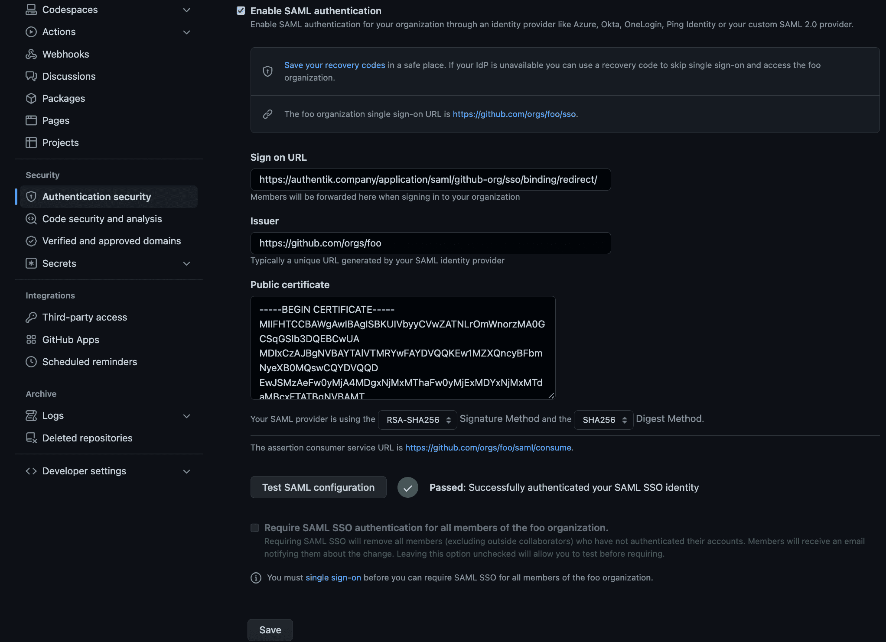

## What is GitHub Enterprise Cloud?

> GitHub Enterprise Cloud is a plan for large businesses or teams who collaborate on GitHub.com.
>
> -- https://docs.github.com/en/enterprise-cloud@latest/get-started/learning-about-github/githubs-plans

This guide configures SAML SSO for a GitHub Enterprise Cloud organization.

:::info
For GitHub Enterprise Cloud with Enterprise Managed Users, see the [GitHub Enterprise EMU](../ghec-emu/) integration guide.
:::

## Preparation

The following placeholders are used in this guide:

- `github.com/orgs/foo` is your GitHub organization, where `foo` is the name of your organization.
- `authentik.company` is the FQDN of the authentik installation.

:::info
This documentation lists only the settings that you need to change from their default values. Be aware that any changes other than those explicitly mentioned in this guide could cause issues accessing your application.
:::

## authentik configuration

To support the integration of GitHub Enterprise Cloud with authentik, you need to create an application/provider pair in authentik.

### Create an application and provider in authentik

1. Log in to authentik as an administrator and open the authentik Admin interface.
2. Navigate to **Applications** > **Applications** and click **Create with Provider** to create an application and provider pair. (Alternatively you can first create a provider separately, then create the application and connect it with the provider.)
    - **Application**: provide a descriptive name, an optional group for the type of application, the policy engine mode, and optional UI settings.
    - **Choose a Provider type**: select **SAML Provider** as the provider type.
    - **Configure the Provider**: provide a name (or accept the auto-provided name), the authorization flow to use for this provider, and the following required configurations.
        - Set **ACS URL** to `https://github.com/orgs/foo/saml/consume`.
        - Set **Audience** to `https://github.com/orgs/foo`.
        - Under **Advanced protocol settings**, select an available **Signing certificate**. Download this certificate because it is required later.
    - **Configure Bindings** _(optional)_: you can create a [binding](/docs/add-secure-apps/bindings-overview/) (policy, group, or user) to manage the listing and access to applications on a user's **My applications** page.

3. Click **Submit** to save the new application and provider.

## GitHub configuration

1. Log in to GitHub as an organization owner.
2. Navigate to your organization at `https://github.com/foo`.
3. Click **Settings**.
4. In the left sidebar, under **Security**, click **Authentication security**.
5. Under **SAML single sign-on**, select **Enable SAML authentication**.
6. Configure the following settings:
    - **Sign on URL**: enter the **SAML Endpoint** from the SAML provider that you created in authentik.
    - **Issuer**: `https://authentik.company/application/saml/<application_slug>/metadata/`.
    - **Public certificate**: paste the full signing certificate that you downloaded from authentik.
    - **Signature method** and **Digest method**: select the methods that match the authentik SAML provider settings.
7. Click **Test SAML configuration**.
8. After the test succeeds, click **Save**.

This enables SAML as an authentication option. To require SAML for all organization members, visit `https://github.com/orgs/foo/sso`, sign in with SAML, then return to **Authentication security** and select **Require SAML SSO authentication for all members of the foo organization**.

## Configuration verification

To confirm that authentik is properly configured with GitHub Enterprise Cloud, log out of GitHub and then access a resource in the organization. GitHub should prompt you to authenticate with SAML through authentik.

## Resources

- [GitHub Enterprise Cloud: managing SAML single sign-on for your organization](https://docs.github.com/en/enterprise-cloud@latest/organizations/managing-saml-single-sign-on-for-your-organization)
