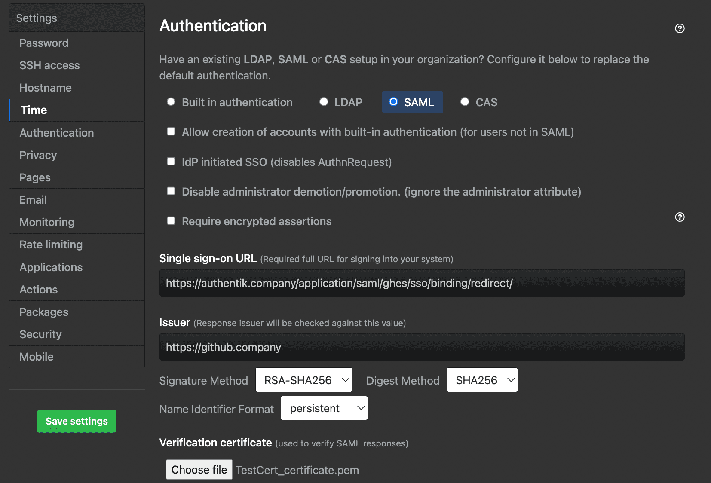

## What is GitHub Enterprise Server?

> GitHub Enterprise Server is a self-hosted platform for software development within your enterprise.
>
> -- https://docs.github.com/en/enterprise-server@latest/admin/overview/about-github-enterprise-server

## Preparation

The following placeholders are used in this guide:

- `github.company` is the FQDN of your GitHub Enterprise Server installation.
- `authentik.company` is the FQDN of the authentik installation.
- `GitHub Users` is an application entitlement used for standard GitHub Enterprise Server users.
- `GitHub Admins` is an application entitlement used for GitHub Enterprise Server administrators.

:::info
This documentation lists only the settings that you need to change from their default values. Be aware that any changes other than those explicitly mentioned in this guide could cause issues accessing your application.
:::

## authentik configuration

To support the integration of GitHub Enterprise Server with authentik, you need to create an application/provider pair in authentik. If you want to use SCIM provisioning, you also need to create application entitlements and a SCIM property mapping.

### Create an application and provider in authentik

1. Log in to authentik as an administrator and open the authentik Admin interface.
2. Navigate to **Applications** > **Applications** and click **Create with Provider** to create an application and provider pair. (Alternatively you can first create a provider separately, then create the application and connect it with the provider.)
    - **Application**: provide a descriptive name, an optional group for the type of application, the policy engine mode, and optional UI settings.
    - **Choose a Provider type**: select **SAML Provider** as the provider type.
    - **Configure the Provider**: provide a name (or accept the auto-provided name), the authorization flow to use for this provider, and the following required configurations.
        - Set **ACS URL** to `https://github.company/saml/consume`.
        - Set **Audience** to `https://github.company`.
        - Set **Issuer** to `https://github.company`.
        - Set **Service Provider Binding** to `Post`.
        - Under **Advanced protocol settings**:
            - Select an available **Signing certificate**. Download this certificate because it is required later.
            - Set **NameID Property Mapping** to `authentik default SAML Mapping: Username`.
    - **Configure Bindings** _(optional)_: you can create a [binding](/docs/add-secure-apps/bindings-overview/) (policy, group, or user) to manage the listing and access to applications on a user's **My applications** page. If you add the SCIM provider as a backchannel provider later, only users who can view this application are synchronized.

3. Click **Submit** to save the new application and provider.

### Create application entitlements

1. In the authentik Admin interface, open the GitHub Enterprise Server application that you created.
2. Click the **Application entitlements** tab.
3. Create two entitlements named `GitHub Users` and `GitHub Admins`.
4. Open each entitlement and bind the users or groups that should receive it.

### Create a SCIM property mapping

1. In the authentik Admin interface, navigate to **Customization** > **Property Mappings** and click **Create**.
2. Select **SCIM Provider Mapping** and click **Next**.
3. Create a mapping for GitHub roles:
    - **Name**: `GitHub roles`
    - **Expression**:

        The supported `roles` values are documented in [GitHub Enterprise Server's SCIM API documentation](https://docs.github.com/en/enterprise-server@latest/rest/enterprise-admin/scim#provision-a-scim-enterprise-user).

        ```python
        entitlement_names = {
            entitlement.name
            for entitlement in request.user.app_entitlements(provider.application)
        }

        roles = []
        if "GitHub Admins" in entitlement_names:
            roles.append({"value": "enterprise_owner", "primary": True})
        elif "GitHub Users" in entitlement_names:
            roles.append({"value": "user", "primary": True})

        return {
            "roles": roles,
        }
        ```

4. Click **Finish**.

## GitHub Enterprise Server configuration

### Create the SCIM token

1. Log in to GitHub Enterprise Server with the administrator account that you use for SCIM provisioning.
2. Navigate to `https://github.company/settings/tokens`.
3. Generate a new classic personal access token with the `scim:enterprise` scope.
4. Copy the token. This value is used in the authentik SCIM provider.

### Configure SAML

1. Navigate to the GitHub Enterprise Server Management Console at `https://github.company:8443`.
2. Sign in as an administrator.
3. Go to **Authentication**.
4. Configure the following settings:
    - Select **SAML**.
    - **Sign on URL**: enter the **SSO URL (Redirect)** from the SAML provider that you created in authentik.
    - **Issuer**: enter the **Issuer** that you configured in authentik.
    - **Signature method** and **Digest method**: select the methods that match the authentik SAML provider settings.
    - **Validation certificate**: upload the signing certificate that you downloaded from authentik.
    - If you plan to use SCIM, select **Allow creation of accounts with built-in authentication** and **Disable administrator demotion/promotion**.
    - In the **User attributes** section, do not configure a different username attribute unless it returns the same value as the SCIM `userName` attribute.
5. Click **Save settings** and wait for the changes to apply.



### Enable SCIM

1. Log in to GitHub Enterprise Server with an administrator account.
2. Open **Enterprise settings**.
3. In the left sidebar, click **Settings** > **Authentication security**.
4. Select **Enable SCIM configuration**.
5. Click **Save**.

### Create a SCIM provider in authentik

1. In the authentik Admin interface, navigate to **Applications** > **Providers** and click **Create**.
2. Select **SCIM Provider** as the provider type and click **Next**.
3. Configure the following settings:
    - **Name**: provide a descriptive name.
    - **URL**: `https://github.company/api/v3/scim/v2`
    - **Token**: paste the GitHub personal access token that you created earlier.
    - **User Property Mappings**: keep `authentik default SCIM Mapping: User` selected, then add the `GitHub roles` mapping that you created earlier.
    - **Group Property Mappings**: keep `authentik default SCIM Mapping: Group` selected.
4. Click **Finish**.
5. Navigate to **Applications** > **Applications** and open the GitHub Enterprise Server application.
6. Add the SCIM provider to **Backchannel Providers**.
7. Click **Update**.

## Configuration verification

To confirm that authentik is properly configured with GitHub Enterprise Server, assign a test user to the `GitHub Users` entitlement and ensure that the user can view the application in authentik.

Open the SCIM provider and click **Run sync again**. After the sync completes, confirm that the user is provisioned in GitHub Enterprise Server. Then, log in to GitHub Enterprise Server as the test user and confirm that GitHub redirects the user to authentik for SAML authentication.

## Resources

- [GitHub Enterprise Server: configuring SAML single sign-on for your enterprise](https://docs.github.com/en/enterprise-server@latest/admin/managing-iam/using-saml-for-enterprise-iam/configuring-saml-single-sign-on-for-your-enterprise)
- [GitHub Enterprise Server: REST API endpoints for SCIM](https://docs.github.com/en/enterprise-server@latest/rest/enterprise-admin/scim)
