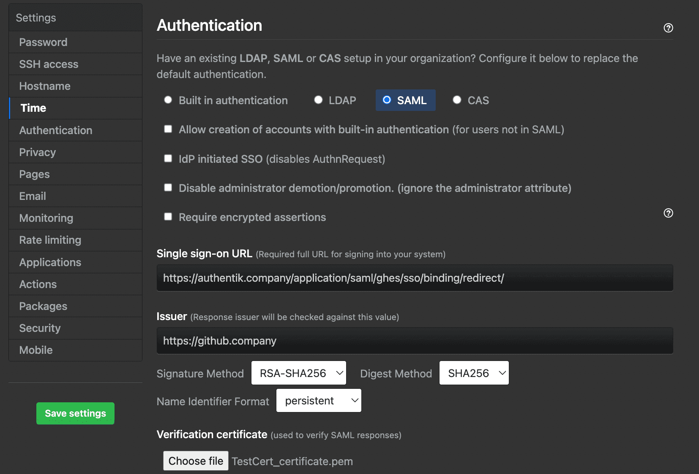

import SAMLProvider20265Warning from "../../\_saml-provider-2026-5-warning.mdx";

## What is GitHub Enterprise Server?

> GitHub Enterprise Server is the self-hosted version of the GitHub platform.
>
> -- https://github.com/enterprise

## Preparation

The following placeholders are used in this guide:

- `github.company` is the FQDN of the GitHub Enterprise Server installation.
- `authentik.company` is the FQDN of the authentik installation.

:::info
This documentation lists only the settings that you need to change from their default values. Be aware that any changes other than those explicitly mentioned in this guide could cause issues accessing your application.
:::

GitHub Enterprise Server requires SAML authentication before you can enable SCIM provisioning. If you configure SCIM, the authentik worker must be able to reach `https://github.company` on TCP port 443, and every user in the provisioning scope must have a valid email address in authentik.

Use authentik as the only system that writes to the GitHub Enterprise Server SCIM API. Writes from another identity provider or an administrative script can make authentik's record of the remote users and groups incorrect.

:::danger SCIM deprovisioning
Removing a provisioned user from the application's access scope causes authentik to send a `DELETE` request during the next full sync. GitHub Enterprise Server treats this as hard deprovisioning, which permanently suspends the account and cannot be reversed.
:::

## authentik configuration

Create a SAML application/provider pair. To add SCIM provisioning, also create a GitHub-specific SCIM user mapping and define which users can access the application.

### Create an application and provider

<SAMLProvider20265Warning />

1. Log in to authentik as an administrator and open the authentik Admin interface.
2. Navigate to **Applications** > **Applications** and click **New Application** to create an application and provider pair. (Alternatively you can first create a provider separately, then create the application and connect it with the provider.)
    - **Application**: provide a descriptive name, an optional group for the type of application, the policy engine mode, and optional UI settings. Note the application **Slug**, because it is required later.
    - **Choose a Provider type**: select **SAML Provider**.
    - **Configure the Provider**: provide a name, select an authorization flow, and configure the following settings:
        - **ACS URL**: `https://github.company/saml/consume`
        - **Audience**: `https://github.company`
        - Under **Advanced protocol settings**:
            - Select a **Signing certificate** and download the certificate for use in GitHub Enterprise Server.
            - Set **NameID Property Mapping** to `authentik default SAML Mapping: Username`.
    - **Configure Bindings**:
        - For SAML without SCIM, bindings are optional and control who can access the application.
        - For SCIM, add at least one user, group, or policy binding that selects every user who should be provisioned. If the application has no bindings, authentik includes all users in the provisioning scope.
3. Click **Submit**.

### Create an administrator entitlement _(optional)_

Create this entitlement if you want SCIM to assign the GitHub Enterprise Server enterprise owner role. Users in the application's access scope who do not receive this entitlement are provisioned with the standard user role.

1. Open the GitHub Enterprise Server application in the authentik Admin interface.
2. Click the **Application entitlements** tab.
3. Create an entitlement named `GitHub Admins`.
4. Open the entitlement and bind the users or groups that should become enterprise owners.

### Create a SCIM user property mapping _(optional)_

Complete this section if you want to use SCIM provisioning. This mapping sends the fields that GitHub Enterprise Server requires and reads the administrator entitlement from the application that owns the backchannel provider.

1. Navigate to **Customization** > **Property Mappings** and click **Create**.
2. Select **SCIM Provider Mapping** and click **Next**.
3. Configure the following settings:
    - **Name**: `GitHub Enterprise Server user`
    - **Expression**:

        ```python
        if not request.user.email:
            raise ValueError("GitHub Enterprise Server requires a user email address")

        formatted = request.user.name or request.user.username
        given_name, separator, family_name = formatted.partition(" ")
        if not separator:
            family_name = " "

        entitlement_names = {
            entitlement.name
            for entitlement in request.user.app_entitlements(
                provider.backchannel_application
            )
        }
        role = "enterprise_owner" if "GitHub Admins" in entitlement_names else "user"

        return {
            "userName": request.user.username,
            "externalId": str(request.user.uid),
            "name": {
                "formatted": formatted,
                "givenName": given_name,
                "familyName": family_name,
            },
            "displayName": formatted,
            "active": request.user.is_active,
            "emails": [
                {
                    "value": request.user.email,
                    "type": "work",
                    "primary": True,
                }
            ],
            "roles": [
                {
                    "value": role,
                    "primary": True,
                }
            ],
        }
        ```

4. Click **Finish**.

## GitHub Enterprise Server configuration

### Configure SAML

1. Open the GitHub Enterprise Server Management Console at `https://github.company:8443` and sign in as an administrator.
2. Navigate to **Authentication** and select **SAML**.
3. Configure the following settings:
    - **Single sign-on URL**: enter the **SAML Endpoint** from the authentik SAML provider.
    - **Issuer**: `https://authentik.company/application/saml/<application_slug>/metadata/`
    - **Signature method** and **Digest method**: select the methods that match the authentik SAML provider.
    - **Verification certificate**: upload the signing certificate that you downloaded from authentik.
    - If you plan to use SCIM, select **Allow creation of accounts with built-in authentication** and **Disable administrator demotion/promotion**. These settings let you create the required setup user before SCIM manages accounts.
    - In **User attributes**, leave the username attribute empty so that GitHub Enterprise Server matches the SAML `NameID` to the SCIM `userName`. If you set a custom username attribute, it must return the same value as `request.user.username` in the SCIM mapping.
4. Click **Save settings** and wait for the changes to apply.



:::info Local account authentication
After configuring SAML, you may continue to allow local authentication by checking the **Allow creation of accounts with built-in authentication (for users not in SAML)** box.
This may carry security implications if self-registration is enabled.

### Create a SCIM setup user and token _(optional)_

Complete this section if you want to use SCIM provisioning.

1. Create a built-in user named `scim-admin`. Use a username and email address that are not assigned to an account that authentik will provision.
2. Set a password for the user and promote the user to enterprise owner. Store the credentials as a break-glass account.
3. Sign in to GitHub Enterprise Server as `scim-admin` and open `https://github.company/settings/tokens`.
4. Create a personal access token (classic) with only the `scim:enterprise` scope and no expiration.
5. Store the token securely. You will add it to the authentik SCIM provider.

### Enable SCIM _(optional)_

1. Sign in to GitHub Enterprise Server as `scim-admin`.
2. In the upper-right corner, click your profile picture, then click **Enterprise settings**.
3. Click **Settings** > **Authentication security**.
4. Under **SCIM Configuration**, select **Enable SCIM configuration**.
5. Confirm that the enterprise audit log contains a `business.enable_open_scim` event.

### Create a SCIM provider in authentik _(optional)_

1. In the authentik Admin interface, navigate to **Applications** > **Providers** and click **Create**.
2. Select **SCIM Provider** and click **Next**.
3. Configure the following settings:
    - **Name**: provide a descriptive name.
    - **URL**: `https://github.company/api/v3/scim/v2`
    - **Token**: paste the personal access token that you created as `scim-admin`.
    - **User Property Mappings**: remove `authentik default SCIM Mapping: User`, then add `GitHub Enterprise Server user`.
    - **Group Property Mappings**: remove all selected mappings. Configure group provisioning separately if you use GitHub Enterprise Server identity provider groups to manage organization and team membership.
4. Click **Finish**.
5. Navigate to **Applications** > **Applications** and open the GitHub Enterprise Server application.
6. Add the SCIM provider to **Backchannel Providers**.
7. Click **Update**.

### Update GitHub Enterprise Server settings _(optional)_

Complete this section after the first SCIM sync succeeds.

1. Open the GitHub Enterprise Server Management Console at `https://github.company:8443` and sign in as an administrator.
2. Navigate to **Authentication**.
3. Clear **Disable administrator demotion/promotion** so that SCIM can assign and remove the enterprise owner role.
4. To require authentik to provision every non-setup account, clear **Allow creation of accounts with built-in authentication**.
5. Click **Save settings** and wait for the changes to apply.

## Configuration verification

To verify SAML authentication, sign out of GitHub Enterprise Server and open it again. GitHub Enterprise Server should redirect you to authentik.

To verify SCIM provisioning:

1. Create or choose a test user in authentik with a username, name, and email address.
2. Ensure that the test user matches an application binding for the GitHub Enterprise Server application. To test the enterprise owner role, also assign the `GitHub Admins` entitlement.
3. Open the SCIM provider and click **Run sync again**.
4. Confirm that the sync task succeeds and that GitHub Enterprise Server contains the provisioned user.
5. In the GitHub Enterprise Server audit log, search for `action:external_identity.provision user:<username>`.
6. Sign in as the test user and confirm that GitHub Enterprise Server links the SAML login to the provisioned SCIM identity.

### Diagnose SCIM synchronization failures

Some SCIM HTTP errors can appear in an authentik task as the following generic message:

```text
Failed to sync <username> due to transient error: Network error communicating with remote system
```

This message does not prove that the connection failed. Check both systems at the same timestamp:

1. In the authentik worker logs, find the `Failed to send SCIM request` entry. It contains the response body returned by GitHub Enterprise Server.
2. In the GitHub Enterprise Server audit log, search for `action:external_identity.scim_api_failure`. The event contains the request status, payload, and error message.
3. For a `400` response, confirm that the user has an email address and that the SCIM provider uses only the `GitHub Enterprise Server user` mapping. For a `401` or `403` response, confirm that the token belongs to the built-in setup user, has the `scim:enterprise` scope, and that the audit log contains `business.enable_open_scim`.

## Resources

- [GitHub Enterprise Server: configuring SAML single sign-on for your enterprise](https://docs.github.com/en/enterprise-server@latest/admin/managing-iam/using-saml-for-enterprise-iam/configuring-saml-single-sign-on-for-your-enterprise)
- [GitHub Enterprise Server: configuring SCIM provisioning to manage users](https://docs.github.com/en/enterprise-server@latest/admin/managing-iam/provisioning-user-accounts-with-scim/configuring-scim-provisioning-for-users)
- [GitHub Enterprise Server: provisioning users and groups with SCIM using the REST API](https://docs.github.com/en/enterprise-server@latest/admin/managing-iam/provisioning-user-accounts-with-scim/provisioning-users-and-groups-with-scim-using-the-rest-api)
- [GitHub Enterprise Server: REST API endpoints for SCIM](https://docs.github.com/en/enterprise-server@latest/rest/enterprise-admin/scim)
