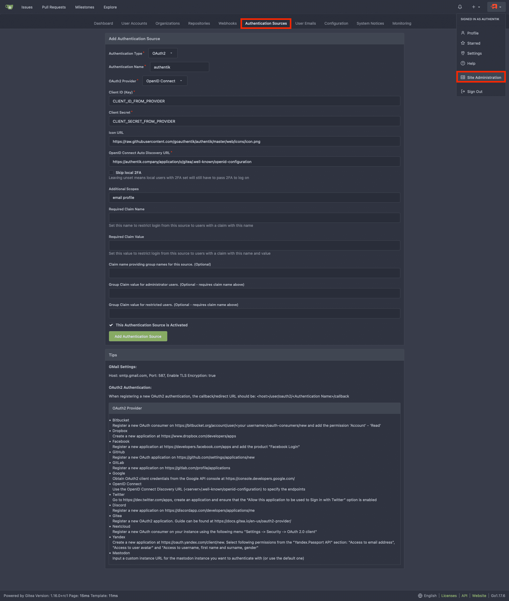

## What is Gitea?

> Gitea is a community managed lightweight code hosting solution written in Go. It is published under the MIT license.
>
> -- https://gitea.io/

## Preparation

The following placeholders are used in this guide:

- `authentik.company` is the FQDN of the authentik installation.
- `gitea.company` is the FQDN of the Gitea installation.

:::info
This documentation lists only the settings that you need to change from their default values. Be aware that any changes other than those explicitly mentioned in this guide could cause issues accessing your application.
:::

## authentik configuration

To support the integration of Gitea with authentik, you need to create an application/provider pair in authentik.

### Create an application and provider in authentik

1. Log in to authentik as an administrator and open the authentik Admin interface.
2. Navigate to **Applications** > **Applications** and click **New Application** to open the application wizard.

- **Application**: provide a descriptive name, an optional group for the type of application, the policy engine mode, and optional UI settings.
- **Choose a Provider type**: select **OAuth2/OpenID Connect** as the provider type.
- **Configure the Provider**: provide a name (or accept the auto-provided name), the authorization flow to use for this provider, and the following required configurations.
    - Note the **Client ID**, **Client Secret**, and **slug** values because they will be required later.
    - Set a `Strict` redirect URI to `https://<gitea.company>/user/oauth2/authentik/callback`.
    - Select any available signing key.
    - Under **Advanced protocol settings** > **Selected Scopes**, add `authentik default OAuth Mapping: OpenID 'entitlements'`.
- **Configure Bindings** _(optional)_: you can create a [binding](/docs/add-secure-apps/bindings-overview/) (policy, group, or user) to manage the listing and access to applications on a user's **My applications** page.

3. Click **Submit** to save the new application and provider.

## Gitea configuration

1. Log in to Gitea as an administrator, then click your profile icon in the top-right corner and select **Site Administration**.
2. Select the **Authentication Sources** tab and then click on **Add Authentication Source**.
3. Set the following required configurations:
    - **Authentication Name**: `authentik` (This must match the name used in the **Redirect URI** in the previous section)
    - **OAuth2 Provider**: `OpenID Connect`
    - **Client ID (Key)**: Enter the Client ID from authentik.
    - **Client Secret**: Enter the Client Secret from authentik.
    - **Icon URL**: `https://authentik.company/static/dist/assets/icons/icon.png`
    - **OpenID Connect Auto Discovery URL**: `https://authentik.company/application/o/<application_slug>/.well-known/openid-configuration`
    - **Additional Scopes**: `email profile`



4. Click **Add Authentication Source**.

### Claims for authorization management (optional)

This optional section shows how to set claims to control the permissions of users in Gitea by assigning them application entitlements.

#### Create application entitlements

The following application entitlements will be created:

- `gituser`: normal Gitea users.
- `gitadmin`: Gitea users with administrative permissions.
- `gitrestricted`: restricted Gitea users.

Users who are assigned none of these entitlements will not be able to log in to Gitea.

1. Log in to authentik as an administrator and open the authentik Admin interface.
2. Navigate to **Applications** > **Applications** and open the Gitea application.
3. Click the **Application entitlements** tab.
4. Click **New Entitlement**, set the name to `gituser`, and then click **Create**.
5. Repeat step 4 to create two additional entitlements named `gitadmin` and `gitrestricted`.
6. Open an entitlement and bind the users or groups that need Gitea access to it.
7. Repeat step 6 for the two additional entitlements.

#### Create custom property mapping

1. Log in to authentik as an administrator and open the authentik Admin interface.
2. Navigate to **Customization** > **Property Mappings** and click **Create**. Create a **Scope Mapping** with the following configurations:
    - **Name**: Choose a descriptive name (e.g. `authentik gitea OAuth Mapping: OpenID 'gitea'`)
    - **Scope name**: `gitea`
    - **Expression**:

    ```python showLineNumbers
    entitlement_names = {
        entitlement.name
        for entitlement in request.user.app_entitlements(provider.application)
    }
    gitea_claims = {}

    if "gituser" in entitlement_names:
        gitea_claims["gitea"] = "user"
    if "gitadmin" in entitlement_names:
        gitea_claims["gitea"] = "admin"
    if "gitrestricted" in entitlement_names:
        gitea_claims["gitea"] = "restricted"

    return gitea_claims
    ```

3. Click **Finish**.

#### Add the custom property mapping to the Gitea provider

1. Log in to authentik as an administrator and open the authentik Admin interface.
2. Navigate to **Applications** > **Providers** and click on the **Edit** icon of the Gitea provider.
3. Under **Advanced protocol settings** > **Scopes** add the following scopes to **Selected Scopes**:
    - `authentik default OAuth Mapping: OpenID 'email'`
    - `authentik default OAuth Mapping: OpenID 'profile'`
    - `authentik default OAuth Mapping: OpenID 'openid'`
    - `authentik gitea OAuth Mapping: OpenID 'gitea'`

4. Click **Update**.

#### Configure Gitea to use the new claims

:::info
For this to function, the Gitea `ENABLE_AUTO_REGISTRATION: true` variable must be set. More information on configuration variables is available in the [Gitea Configuration Cheat Sheet](https://docs.gitea.com/administration/config-cheat-sheet).
:::

1. Log in to Gitea as an admin. Click your profile icon in the top-right corner, and then click **Site Administration**.
2. Select the **Authentication Sources** tab and edit the **authentik** Authentication Source.
3. Set the following configurations:
    - **Additional Scopes**: `email profile gitea`
    - **Required Claim Name**: `gitea`
    - **Claim name providing group names for this source.** (Optional): `gitea`
    - **Group Claim value for administrator users.** (Optional - requires claim name to be set): `admin`
    - **Group Claim value for restricted users.** (Optional - requires claim name to be set): `restricted`
4. Click **Update Authentication Source**.

:::info
Users who are assigned none of the defined entitlements will be denied login access.
In contrast, users assigned the `gitadmin` entitlement will have full administrative privileges, while users assigned the `gitrestricted` entitlement will have limited access.
:::

### Helm chart configuration

authentik authentication can be configured automatically in Kubernetes deployments using its [Helm chart](https://gitea.com/gitea/helm-chart/).

Add the following to your Gitea Helm chart `values.yaml` file:

```yaml showLineNumbers title="values.yaml"
gitea:
    oauth:
        - name: "authentik"
        provider: "openidConnect"
        key: "<Client ID from authentik>"
        secret: "<Client secret from authentik>"
        autoDiscoverUrl: "https://authentik.company/application/o/<application_slug>/.well-known/openid-configuration"
        iconUrl: "https://authentik.company/static/dist/assets/icons/icon.png"
        scopes: "email profile"
```

### Kubernetes Secret

You can also utilize a Kubernetes Secret object to store and manage the sensitive `key` and `secret` values.

1. Create a Kubernetes secret with the following variables:

```yaml showLineNumbers
apiVersion: v1
kind: Secret
metadata:
    name: gitea-authentik-secret
type: Opaque
stringData:
    key: "<Client ID from authentik>"
    secret: "<Client secret from authentik>"
```

2. Add the following configurations to your Gitea Helm Chart `values.yaml` file:

```yaml showLineNumbers title="values.yaml"
gitea:
    oauth:
        - name: "authentik"
        provider: "openidConnect"
        existingSecret: gitea-authentik-secret
        autoDiscoverUrl: "https://authentik.company/application/o/<application_slug>/.well-known/openid-configuration"
        iconUrl: "https://authentik.company/static/dist/assets/icons/icon.png"
        scopes: "email profile"
```

## Configuration verification

To verify that authentik is correctly set up with Gitea, log out and then log back in using the **Sign in with authentik** button.

## Resources

- [Official Gitea Documentation](https://docs.gitea.com/)
