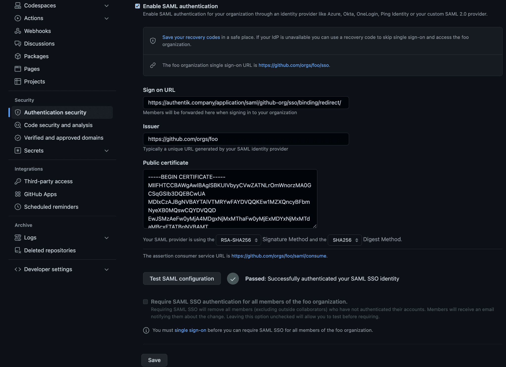

## What is GitHub Organizations

> Organizations are shared accounts where businesses and open-source projects can collaborate across many projects at once, with sophisticated security and administrative features.
>
> -- https://docs.github.com/en/organizations/collaborating-with-groups-in-organizations/about-organizations

## Preparation

The following placeholders are used in this guide:

- `github.com/orgs/foo` is your GitHub organization, where `foo` is the name of your GitHub organization.
- `authentik.company` is the FQDN of the authentik installation.

:::note
This documentation lists only the settings that you need to change from their default values. Be aware that any changes other than those explicitly mentioned in this guide could cause issues accessing your application.
:::

## authentik configuration

To support the integration of AWX Tower with authentik, you need to create an application/provider pair in authentik.

### Create an application and provider in authentik

1. Log in to authentik as an administrator and open the authentik Admin interface.
2. Navigate to **Applications** > **Applications** and click **Create with Provider** to create an application and provider pair. (Alternatively you can first create a provider separately, then create the application and connect it with the provider.)

- **Application**: provide a descriptive name, an optional group for the type of application, the policy engine mode, and optional UI settings. Take note of the **slug** as it will be required later.
- **Choose a Provider type**: select **SAML Provider** as the provider type.
- **Configure the Provider**: provide a name (or accept the auto-provided name), the authorization flow to use for this provider, and the following required configurations.
    - Set the **ACS URL** to `https://github.com/orgs/foo/saml/consume`.
    - Set the **Audience** to `https://github.com/orgs/foo`.
    - Set the **Issuer** to `https://github.com/orgs/foo`.
    - Set the **Service Provider Binding** to `Post`.
    - Under **Advanced protocol settings**, select an available signing certificate. It is advised to download this certificate as it will be required later. It can be found under **System** > **Certificates** in the Admin Interface.
- **Configure Bindings** _(optional)_: you can create a [binding](/docs/add-secure-apps/flows-stages/bindings/) (policy, group, or user) to manage the listing and access to applications on a user's **My applications** page.

3. Click **Submit** to save the new application and provider.

## GitHub Configuration

Navigate to your organization settings by going to your organization page at https://github.com/foo, then click Settings.

In the left-hand navigation, scroll down to the Security section and click `Authentication security`

On this page:

- Select the `Enable SAML authentication` checkbox.
- In `sign-on URL`, type `https://authentik.company/application/saml/<application_slug>/sso/binding/redirect/`
- For `Issuer`, type `https://github.com/orgs/foo` or the `Audience` you set in authentik
- For `Public certificate`, paste the _full_ signing certificate into this field.
- Verify that the `Signature method` and `Digest method` match your SAML provider settings in authentik.

Once these fields are populated, you can use the `Test SAML configuration` button to test the authentication flow. If the flow completes successfully, you will see a green tick next to the Test button.

Scroll down to hit the `Save` button below.

This enables SAML as an authentication _option_. If you want to _require_ SAML for your organization, visit your SSO url at `https://github.com/orgs/foo/sso` and sign in. Once signed in, you can navigate back to the `Authentication security` page and check `Require SAML SSO authentication for all members of the foo organization.`
