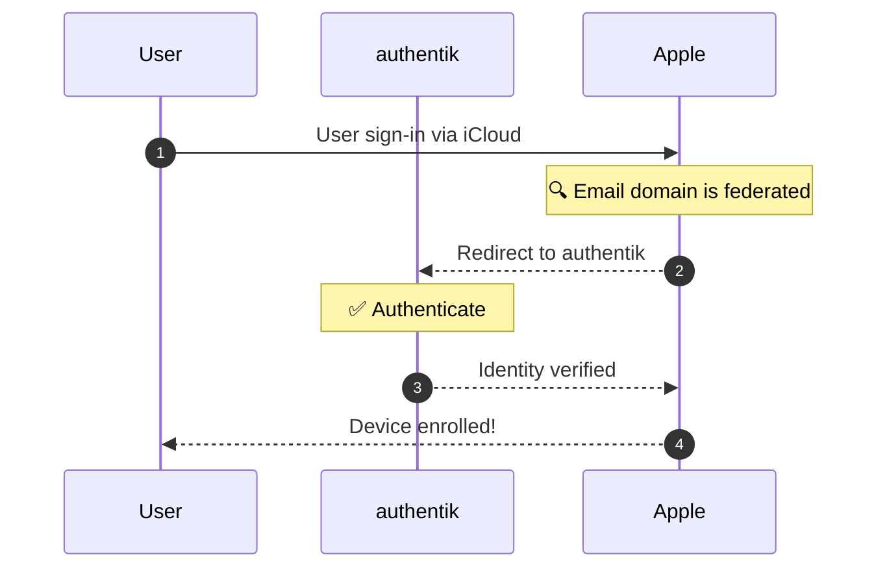

import RedirectURI20265Note from "../../\_redirect-uri-2026-5-note.mdx";

## What is Apple Business Manager?

> Apple Business Manager is a web-based portal for IT administrators, managers, and procurement professionals to manage devices and automate device enrollment.
>
> Organizations using Apple Business Essentials can allow their users to authenticate into their Apple devices using their IdP credentials, typically their company email addresses.
>
> -- [Apple Business Manager](https://www.apple.com/business/)

:::info Apple Device Management Platforms

Apple packages their device management platform into three brands to cater to different audiences:

- Apple Business Manager: Large organizations
- Apple Business Essentials: Small businesses
- Apple School Manager: Educational institutions

While this integration guide focuses on Business Manager, the instructions are applicable to all three platforms with minor changes to the terminology.

:::

## Authentication flow

This sequence diagram shows a high-level flow between Apple device, authentik, and Apple Business Manager.



In short, Apple Business Manager recognizes the email domain as a federated identity provider controlled by authentik. When a user signs in with their email address, Apple redirects them to authentik for authentication. Once authenticated, Apple enrolls the user's device and grants access to Apple services.

## Preparation

By the end of this integration, your users will be able to enroll their Apple devices using their authentik credentials.

You'll need to have an authentik instance running and accessible on an HTTPS domain, and an Apple Business Manager user with the role of Administrator or People Manager.

:::warning Apple Business Manager restrictions
Be aware that Apple Business Manager imposes the following restrictions on federated authentication:

- Federated authentication should use the user’s email address as their username. Aliases aren’t supported.
- Existing users with an email address in the federated domain will automatically be converted to federated authentication, effectively _taking ownership_ of the account.
- User accounts with the role of Administrator, Site Manager, or People Manager can’t sign in using federated authentication; they can only manage the federation process.
  :::

## authentik configuration

<RedirectURI20265Note />

The workflow to configure authentik as an identity provider for Apple Business Manager involves creating scope mappings, signing keys, a Shared Signals Framework provider, and an OIDC provider/application pair.

Together, these components will handle the authentication flow and backchannel communication between authentik and Apple Business Manager.

### 1. Create scope mappings

Apple Business Manager requires that we create three scope mappings for our OIDC provider:

- User profile information
- Read access
- Management access

#### User profile information

Apple Business Manager requires both a given name and family name in the OIDC claim. The example expression below assumes that the user's name is formatted with the given name first, followed by the family name, delimited by a space.

Consider adjusting the expression to match the name format used in your organization.

1. Log in to authentik as an administrator and open the authentik Admin interface.
2. Navigate to **Customization** > **Property Mappings** and click **Create**.
3. Select **Scope Mapping** and set the following values:
    - **Name**: `Apple Business Manager profile`
    - **Scope Name**: `profile`
    - **Expression**:

        ```python
        given_name, _, family_name = request.user.name.partition(" ")

        return {
            "given_name": given_name,
            "family_name": family_name,
        }
        ```

4. Click **Finish**.

#### Read access

1. Log in to authentik as an administrator and open the authentik Admin interface.
2. Navigate to **Customization** > **Property Mappings** and click **Create**.
3. Select **Scope Mapping** and set the following values:
    - **Name**: `Apple Business Manager ssf.read`
    - **Scope Name**: `ssf.read`
    - **Expression**: `return {}`

4. Click **Finish**.

#### Management access

1. Log in to authentik as an administrator and open the authentik Admin interface.
2. Navigate to **Customization** > **Property Mappings** and click **Create**.
3. Select **Scope Mapping** and set the following values:
    - **Name**: `Apple Business Manager ssf.manage`
    - **Scope Name**: `ssf.manage`
    - **Expression**: `return {}`

4. Click **Finish**.

### 2. Create signing key

You will need to create a **Signing Key** to sign Security Event Tokens (SET).
This key is used to both sign and verify the SETs that are sent between authentik and Apple Business Manager.

You can either generate a new key or import an existing one. It is recommended to use the same key for both the OIDC and SSF providers.

#### Generate a new key

1. Log in to authentik as an administrator and open the authentik Admin interface.
2. Navigate to **System** > **Certificates** and click **Generate Certificate-Key Pair**.
3. Provide a **Certificate Name** and click **Generate Certificate-Key Pair**.

#### Import an existing key

Alternatively, you can import an existing key.

1. Log in to authentik as an administrator and open the authentik Admin interface.
2. Navigate to **System** > **Certificates** and click **Import Existing Certificate-Key Pair**.
3. Provide a **Certificate Name**, paste the contents of your **Certificate**.
4. Click **Import Certificate-Key Pair**.

### 3. Create OIDC provider

You will need to create an [OAuth2/OpenID Provider](/docs/add-secure-apps/providers/oauth2/) to handle the authentication flow between authentik and Apple Business Manager.

1. Log in to authentik as an administrator and open the authentik Admin interface.
2. Navigate to **Applications** > **Providers** and click **New Provider** to open the provider wizard.
    - **Choose a Provider type**: select **OAuth2/OpenID Provider** as the provider type.
    - **Configure the Provider**: provide a name (or accept the auto-provided name), the authorization flow to use for this provider, and the following required configurations.
        - Note the **Client ID** and **Client Secret** values because they will be required later.
        - Add a **Redirect URI** of type `Strict` `Authorization` as `https://gsa-ws.apple.com/grandslam/GsService2/acs`.
        - Select any available signing key.
        - Under **Advanced protocol settings**, in addition to the default scopes, add the four following **Selected Scopes** to the provider.
            - `Apple Business Manager ssf.manage`
            - `Apple Business Manager ssf.read`
            - `Apple Business Manager profile`
            - `authentik default OAuth Mapping: OpenID 'offline_access'`

3. Click **Create**.

### 4. Create Shared Signals Framework provider

While the OIDC provider handles the authentication flow, you'll need to create a [Shared Signals Framework provider](/docs/add-secure-apps/providers/ssf/) to handle the backchannel communication between authentik and Apple Business Manager.

1. Log in to authentik as an administrator and open the authentik Admin interface.
2. Navigate to **Applications** > **Providers** and click **New Provider** to open the provider wizard.
    - **Choose a Provider type**: select **Shared Signals Framework Provider** and the provider type.
    - **Configure the Provider**: provide a name (or accept the auto-provided name), and the following required configurations.
        - Select the same signing key that you selected for the OIDC provider.

3. Click **Create**.

:::note A Blank SSF Config URL is expected
The **SSF Config URL** will be blank until the SSF provider is assigned to an application as a backchannel provider.
:::

### 5. Assign SSF permissions

The authentik user you will use to test the stream connection to Apple Business Manager must either be a member of the authentik Admins group (such as the default `akadmin` account) or have permission to **Add stream to SSF provider**.

If not using a superuser account, you can assign the correct permission by following these steps:

1. Log in to authentik as an administrator and open the authentik Admin interface.
2. Navigate to **Directory** > **Roles** and click **New Role**.
3. Provide a name for the new role and click **Create Role**.
4. Click on the name of the newly created role and open the **Users** tab.
5. Add whichever user you want to have the permission.
6. Navigate to **Applications** > **Providers** and click on the name of the SSF provider.
7. Open the **Permissions** tab and click **Assign Role Object Permission**.
8. Select the newly created role, toggle on **Add stream to SSF provider**, and click **Assign Role Object Permission**.

### 6. Create application

1. Log in to authentik as an administrator and open the authentik Admin interface.
2. Navigate to **Applications** > **Application**, click the **New Application** dropdown, click **with Existing Provider**, and set the following required values:
    - **Application Name**: `Apple Business Manager`
    - **Slug**: `abm`
    - **Provider**: Select the OIDC provider that you created
    - **Backchannel Provider:** Select the SSF provider that you created

3. Click **Create application**.
4. Navigate to **Application** > **Providers** and click on the name of the SSF provider.
5. On the **Overview** tab, take note of the **SSF Config URL** value.
6. Navigate to **Application** > **Providers** and click on the name of the OIDC provider.
7. On the **Overview** tab, take note of the **OpenID Configuration URL** value.

### 7. Confirm and modify copied authentik values

Before proceeding to Apple Business Manager, ensure that you have noted the following values from authentik:

    - From the OIDC provider:
        - Client ID
        - Client Secret
        - OpenID Configuration URL

    - From the SSF provider:
        - SSF Config URL

## Apple Business Manager configuration

With these prerequisites in place, authentik is ready to act as an identity provider for Managed Apple Accounts.

Similar to a personal Apple account, a _Managed Apple Account_ uses an email address to access Apple services and devices. What makes an Apple account _managed_ is that the domain associated with the email address is owned and verified by an organization through an Apple Business Manager account.

### 1. Add and verify your domain

By verifying the domain, Apple Business Manager will delegate ownership of any accounts with a matching email address to the organization, allowing for centralized management of devices, apps, and services.

1. Log in to the [Apple Business Manager dashboard](https://business.apple.com/) as an administrator.
2. Click your account name in the sidebar, then select **Preferences**.
3. From the Preferences page, select **Managed Apple Accounts** tab, click **Add Domain**, and then provide your domain name.
   Apple will generate a DNS TXT record that you'll need to add to your domain's DNS settings.
4. Wait for DNS propagation and click **Verify** to complete the domain verification process.

    A confirmation dialog will prompt you to lock your domain before you can proceed with the next steps.

    :::warning Locking your domain affects all enrolled users
    Locking your domain ensures that only your organization can use your domain for federated authentication.

    **Once locked, your enrolled users will not be able to access Apple services until you complete the next steps to configure federated authentication.**

    **Only lock your domain when you're ready to proceed with the next steps.**
    :::

5. In the confirmation dialog, set the **Lock Domain** toggle to **On** and confirm that the domain displays as locked in the **Managed Apple Accounts** tab.

### 2. Capture all accounts _(optional)_

Optionally, you may choose to [capture all accounts](https://support.apple.com/guide/apple-business-manager/capture-a-domain-axm512ce43c3/1/web/1), which will convert all existing accounts with an email address in the federated domain to _Managed Apple Accounts_. You can also choose to capture all accounts at a later time when you're ready to manage all users in the domain.

:::danger Account capture is one-way migration
Choosing to capture all accounts will affect all users with an email address in the federated domain, regardless of their enrollment status or device ownership.
**Once captured, the accounts can't be reverted to personal Apple accounts – even if the domain is unlocked.**

**Only capture accounts if you're sure that every user in the domain should be managed by Apple Business Manager.**
:::

1. Log in to the [Apple Business Manager dashboard](https://business.apple.com/) as an administrator.
2. Click **your account name** in the sidebar, then select **Preferences**.
3. From the Preferences page, select **Managed Apple Accounts** tab, and click **Manage** next to the domain you've verified.
4. In your domain's management dialog, ensure you understand the implications of capturing all accounts and then click **Capture All Accounts**.
5. Wait for Apple to complete the account capture process, and confirm that all accounts are now managed by Apple Business Manager.

### 3. Enable federated authentication

You're now ready to configure federated authentication with authentik.

1. Log in to the [Apple Business Manager dashboard](https://business.apple.com/) as an administrator.
2. Click **your account name** in the sidebar, then select **Preferences**.
3. From the Preferences page, select **Managed Apple Accounts** tab, and click **Get Started** under the **User sign in and directory sync** section.
4. To define how you want users to sign in, choose **Custom Identity Provider** and click **Continue**.
5. On the **Set up your Custom Identity Provider** page, use the following values:
    - **Name**: `authentik`
    - **Client ID**: Client ID from authentik
    - **Client Secret**: Client Secret from authentik
    - **SSF Config URL**: SSF Config URL from authentik
    - **OpenID Config URL**: OpenID Configuration URL from authentik

6. Click **Continue** to begin Apple's verification of your configuration.
7. When prompted to authenticate through your authentik instance, provide your credentials and click **Log In**.

    When the test finishes, click **Done** to complete the configuration.

#### Troubleshooting connection issues during the test

If the connection test fails, your configuration may be incorrect. Here are some common issues to check:

- [x] Ensure that your authentik instance is accessible from the internet from an HTTPS domain.
- [x] Verify that the Client ID and Client Secret values are correct.
- [x] Verify that scope mappings are created and all assigned to the OIDC provider.
- [x] Verify that the SSF provider is assigned to the application.
- [x] Ensure that the SSF Config URL and OpenID Configuration URL are accurate.
- [x] Ensure that the OAuth and SSF providers both have signing keys set. Ideally the same certificate should be used for both.

If you're still having issues, check your authentik instance's log for any errors that might have occurred during the authentication process. If Apple can reach your authentik instance, you should see logs indicating Apple's attempts to test the authentication flow.

## Configuration verification

:::warning Administrators cannot use federated authentication
Apple Business Manager does not allow users with the role of Administrator, Site Manager, or People Manager to log in using federated authentication.

When creating test users, ensure that their role is set to Standard (or Student) to test federated authentication with authentik.
:::

### 1. Create a test user

1. From the [Apple Business Manager dashboard](https://business.apple.com/), click **Users** on the sidebar, then click **Add**.
2. In the **Add New User** dialog, use the following values:
    - **First Name**: `Jessie`
    - **Last Name**: `Lorem`
    - **Email**: `jessie@authentik.company`
    - **Role**: `Standard`

3. Click **Save** to create the user account, and then click **Create Sign-In** in the user's profile.
4. When prompted to choose a delivery method, select **Create a downloadable PDF and CSV** and click **Continue**. Note the temporary password provided on the next page, optionally downloading the PDF and CSV files for future reference.
5. Confirm the user is created from the authentik Admin interface by navigating to the **Users** page and searching for the account by their email address. Note that this may take a few minutes to synchronize.

### 2. Test the authentication flow

1. Confirm that the test user is synchronized in authentik.
2. Open a private browsing window and navigate to the [Apple Business Manager](https://business.apple.com/).
3. In the email field, provide the email address assigned to the test user.
4. Submit the form to trigger the authentication flow.

    You should be redirected to authentik for authentication and then back to Apple Business Manager to manage the test user's account.

    If the test is successful, you'll be able to enroll the test user's device and access Apple services.
