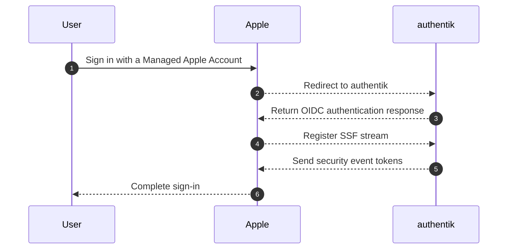

import RedirectURI20265Note from "../../\_redirect-uri-2026-5-note.mdx";

## What is Apple Business Manager?

> Apple Business Manager, now Apple Business, helps organizations deploy, manage, and secure Apple devices, apps, services, and Managed Apple Accounts.
>
> -- https://www.apple.com/business/

Apple Business federated authentication lets users sign in to assigned iPhone, iPad, Mac, Apple Vision Pro, Shared iPad, and iCloud on the web with their identity provider credentials. In this integration, authentik is the OpenID Connect (OIDC) identity provider and the Shared Signals Framework (SSF) transmitter that Apple Business uses for backchannel security events.



## Preparation

By the end of this integration, your users will be able to use their authentik credentials to sign in to Apple services and enroll Apple devices with Managed Apple Accounts.

Your authentik instance must be reachable from the internet on an HTTPS domain. In Apple Business, you need a verified domain and a user whose role has permission to configure domains, federation, and identity provider connections.

The following placeholders are used in this guide:

- `authentik.company` is the FQDN of the authentik installation.
- `example.com` is the verified domain that you want to federate in Apple Business.

:::info
This documentation lists only the settings that you need to change from their default values. Be aware that any changes other than those explicitly mentioned in this guide could cause issues accessing your application.
:::

:::warning Domain federation restrictions
Before you configure federated authentication, review these Apple Business requirements and ownership effects:

- Users should sign in with the email address that matches their Managed Apple Account.
- Devices that use federated authentication require iOS 15.5, iPadOS 15.5, macOS 12.4, visionOS 1.1, or later.
- Apple requires the domain to be locked and the Domain Capture process to be turned on.
- Users with roles that can configure federation and identity provider connections cannot sign in using federated authentication.
- After Apple Business validates the identity provider connection, users cannot create new unmanaged Apple Accounts on the federated domain.

Domain verification, domain locking, and Domain Capture affect Apple Account ownership for your whole domain. Review Apple's domain documentation before you turn them on.
:::

## authentik configuration

<RedirectURI20265Note />

To support the integration of Apple Business Manager with authentik, you need to create scope mappings, a signing key, an OAuth2/OpenID provider, an SSF provider, and an application that uses both providers.

### Create scope mappings

Apple Business needs the `ssf.manage` and `ssf.read` scopes for SSF access. The profile scope mapping below sends the user's given and family name in the OIDC profile claim. Adjust the expression if your authentik deployment stores name components in dedicated attributes.

1. Log in to authentik as an administrator and open the authentik Admin interface.
2. Navigate to **Customization** > **Property Mappings** and click **Create**.
3. Select **Scope Mapping** and set the following values:
    - **Name**: `Apple Business Manager profile`
    - **Scope Name**: `profile`
    - **Expression**:

        ```python
        given_name, _, family_name = request.user.name.partition(" ")

        return {
            "given_name": given_name,
            "family_name": family_name,
        }
        ```

4. Click **Finish**.
5. Click **Create**, select **Scope Mapping**, and set the following values:
    - **Name**: `Apple Business Manager ssf.read`
    - **Scope Name**: `ssf.read`
    - **Expression**: `return {}`
6. Click **Finish**.
7. Click **Create**, select **Scope Mapping**, and set the following values:
    - **Name**: `Apple Business Manager ssf.manage`
    - **Scope Name**: `ssf.manage`
    - **Expression**: `return {}`
8. Click **Finish**.

### Create a signing key

Create or import a certificate-key pair that authentik can use to sign OIDC tokens and SSF security event tokens.

1. In the authentik Admin interface, navigate to **System** > **Certificates**.
2. Choose one of the following options:
    - To create a new key, click **Generate Certificate-Key Pair**, provide a **Certificate Name**, and click **Generate Certificate-Key Pair**.
    - To import an existing key, click **Import Existing Certificate-Key Pair**, provide a **Certificate Name**, paste the certificate and private key, and click **Import Certificate-Key Pair**.
3. Note the certificate name because you will select it for both providers.

### Create an OAuth2/OpenID provider

1. In the authentik Admin interface, navigate to **Applications** > **Providers** and click **New Provider**.
2. Select **OAuth2/OpenID Provider** as the provider type.
3. Provide a name, select an authorization flow, and set the following values:
    - Note the **Client ID** and **Client Secret** values because you need them when configuring Apple Business.
    - Under **Protocol settings**, add the following **Redirect URIs/Origins (RegEx)** value:
        - `Strict` `Authorization`: `https://gsa-ws.apple.com/grandslam/GsService2/acs`
    - Under **Protocol settings**, set **Signing Key** to the certificate-key pair you created.
    - Under **Advanced protocol settings** > **Scopes**, add the following mappings to **Selected Scopes**:
        - `Apple Business Manager profile`
        - `Apple Business Manager ssf.read`
        - `Apple Business Manager ssf.manage`
        - `authentik default OAuth Mapping: OpenID 'offline_access'`
4. Click **Create**.

### Create an SSF provider

1. In the authentik Admin interface, navigate to **Applications** > **Providers** and click **New Provider**.
2. Select **Shared Signals Framework Provider** as the provider type.
3. Provide a name and set the following values:
    - **Signing Key**: select the same certificate-key pair that you selected for the OAuth2/OpenID provider.
    - **Federated OAuth2/OpenID Providers**: select the OAuth2/OpenID provider that you created for Apple Business.
4. Click **Create**.

:::info SSF URL availability
The SSF provider **URL** value is available only after the SSF provider is assigned to an application as a backchannel provider.
:::

### Assign stream creation permission

Apple Business tests the SSF stream connection during federation setup. The authentik user that Apple redirects to during that test must either be a superuser or have the **Add stream to SSF provider** permission on the SSF provider.

If you are not using a superuser account for the test, assign the permission to the test account:

1. In the authentik Admin interface, navigate to **Directory** > **Roles** and click **New Role**.
2. Provide a name for the new role and click **Create Role**.
3. Open the role, select the **Users** tab, and add the authentik user that you will use for the Apple Business connection test.
4. Navigate to **Applications** > **Providers** and open the SSF provider that you created.
5. Select the **Permissions** tab and click **Assign Role Object Permission**.
6. Select the role, toggle on **Add stream to SSF provider**, and click **Assign Role Object Permission**.

### Create an application

1. In the authentik Admin interface, navigate to **Applications** > **Applications**.
2. Click **New Application** > **with Existing Provider...** and set the following values:
    - **Application Name**: `Apple Business Manager`
    - **Provider**: select the OAuth2/OpenID provider that you created.
    - **Backchannel Providers**: select the SSF provider that you created.
3. Click **Create application**.
4. Navigate to **Applications** > **Providers** and open the SSF provider.
5. On the **Overview** tab, note the **URL** value because Apple Business uses it as the **SSF Config URL**.
6. Navigate to **Applications** > **Providers** and open the OAuth2/OpenID provider.
7. On the **Overview** tab, note the **OpenID Configuration URL** value.

## Apple Business Manager configuration

With the authentik values ready, configure Apple Business to trust authentik as a custom identity provider.

### Add and verify the domain

Domain verification proves that your organization controls the domain that you want to use for Managed Apple Accounts. The DNS and ownership work happens in Apple Business and your DNS provider, so only the high-level workflow is included here.

1. Log in to Apple Business as a user whose role can view, edit, and delete organization domains.
2. Navigate to **Settings** > **Domains**.
3. Click **Add**, select **Add Domain**, enter `example.com`, and click **Add Domain**.
4. Click **Verify** next to the domain.
5. Copy the TXT record that Apple Business displays and add it to your DNS provider.
6. After the DNS record is published, return to **Settings** > **Domains** and click **Check Now** for the domain.

### Lock the domain

Locking a domain permanently prevents new unmanaged Apple Accounts from being created with that domain unless the domain is removed from Apple Business.

1. In Apple Business, navigate to **Settings** > **Domains**.
2. Select the domain, click **Manage**, and lock the domain.
3. Review the ownership impact, then click **Lock Domain**.

### Configure and test the identity provider connection

1. In Apple Business, navigate to **Settings** > **Domains**.
2. Click **Get Started** next to **User sign-in and directory sync**.
3. Select **Custom Identity Provider** and click **Continue**.
4. Provide a name for the connection, for example `authentik`.
5. Set the following values:
    - **Client ID**: the Client ID from the authentik OAuth2/OpenID provider.
    - **Client Secret**: the Client Secret from the authentik OAuth2/OpenID provider.
    - **SSF Config URL**: the URL from the authentik SSF provider.
    - **OpenID Config URL**: the OpenID Configuration URL from the authentik OAuth2/OpenID provider.
6. Click **Continue**.
7. When Apple Business redirects you to authentik, sign in as the authentik user that has permission to create streams for the SSF provider.
8. After the test succeeds, click **Done**.

If the connection test fails, verify the following settings:

- The authentik instance is reachable from the internet over HTTPS.
- The Client ID and Client Secret values match the authentik OAuth2/OpenID provider.
- The OAuth2/OpenID provider has the Apple redirect URI, the Apple scope mappings, the `offline_access` scope, and a signing key.
- The SSF provider has a signing key and includes the OAuth2/OpenID provider under **Federated OAuth2/OpenID Providers**.
- The application uses the OAuth2/OpenID provider as its main provider and the SSF provider as a backchannel provider.
- The authentik user used for the Apple Business connection test can create streams for the SSF provider.

### Turn on Domain Capture

Domain Capture affects every unmanaged Apple Account that uses the domain. Apple notifies affected users and starts a 30-day transfer window.

1. In Apple Business, navigate to **Settings** > **Domains**.
2. Click **Get Started with Domain Capture**.
3. Review the affected accounts, confirm that the domain is locked, and click **Start Domain Capture**.

### Turn on federated authentication

1. In Apple Business, navigate to **Settings** > **Domains**.
2. In the **Domains** section, click **Manage** next to the domain.
3. Click **Turn on Sign in with your Identity Provider**.
4. Turn on **Sign in with your Identity Provider**.

## Configuration verification

To confirm that authentik is properly configured with Apple Business Manager, open Apple Business in a private browsing window and sign in with an account in the federated domain that is allowed to use federated authentication. You should be redirected to authentik to authenticate, then redirected back to Apple Business.

You can also sign in to an assigned Apple device with the user's Managed Apple Account to confirm the device sign-in flow.

## Resources

- [Apple Business User Guide - Intro to federated authentication with Apple Business](https://support.apple.com/guide/business/intro-to-federated-authentication-axmb19317543/web)
- [Apple Business User Guide - Use federated authentication with your identity provider in Apple Business](https://support.apple.com/guide/business/federated-authentication-identity-provider-axmfcab66783/web)
- [Apple Business User Guide - Verify a domain in Apple Business](https://support.apple.com/guide/business/verify-a-domain-axm48c3280c0/web)
- [Apple Business User Guide - Lock a domain in Apple Business](https://support.apple.com/guide/business/lock-a-domain-axmce04f4299/web)
- [Apple Business User Guide - Capture a domain in Apple Business](https://support.apple.com/guide/business/capture-a-domain-axm512ce43c3/web)
