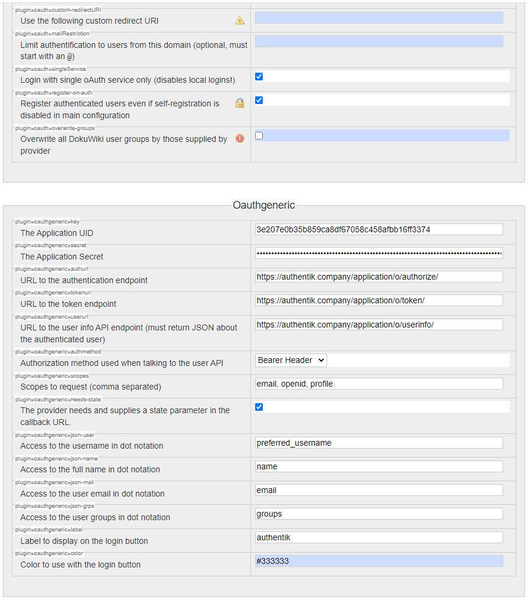

## What is DokuWiki

> DokuWiki is an open source wiki application licensed under GPLv2 and written in the PHP programming language. It works on plain text files and thus does not need a database. Its syntax is similar to the one used by MediaWiki and it is often recommended as a more lightweight, easier to customize alternative to MediaWiki.
>
> -- https://en.wikipedia.org/wiki/DokuWiki

## Preparation

The following placeholders are used in this guide:

- `dokuwiki.company` is the FQDN of the DokiWiki installation.
- `authentik.company` is the FQDN of the authentik installation.

:::info
This documentation lists only the settings that you need to change from their default values. Be aware that any changes other than those explicitly mentioned in this guide could cause issues accessing your application.
:::

## authentik configuration

To support the integration of DokuWiki with authentik, you need to create an application/provider pair in authentik.

### Create an application and provider in authentik

1. Log in to authentik as an administrator and open the authentik Admin interface.
2. Navigate to **Applications** > **Applications** and click **Create with Provider** to create an application and provider pair. (Alternatively you can first create a provider separately, then create the application and connect it with the provider.)

- **Application**: provide a descriptive name, an optional group for the type of application, the policy engine mode, and optional UI settings.
    - _(Optional)_ Under **UI Settings**, set the **Launch URL** to `https://dokuwiki.company/doku.php?id=start&oauthlogin=generic`. This will allow you to login directly to DokuWiki from the authentik applications dashboard and skip the DokuWiki OAuth Login button.
- **Choose a Provider type**: select **OAuth2/OpenID Connect** as the provider type.
- **Configure the Provider**: provide a name (or accept the auto-provided name), the authorization flow to use for this provider, and the following required configurations.
    - Note the **Client ID** and **Client Secret** values because they will be required later.
    - Set a `Strict` redirect URI to `https://dokuwiki.company/doku.php`.
    - Select any available signing key.
    - Under **Advanced protocol settings**, add the following OAuth mapping under **Scopes**: `authentik default OAuth Mapping: OpenID 'offline_access'`
- **Configure Bindings** _(optional)_: you can create a [binding](/docs/add-secure-apps/flows-stages/bindings/) (policy, group, or user) to manage the listing and access to applications on a user's **My applications** page.

3. Click **Submit** to save the new application and provider.

## DokuWiki configuration

From the **Administration** interface of your DokuWiki installation, navigate to **Extension Manager** and install the following extensions:

- [OAuth](https://www.dokuwiki.org/plugin:oauth)
- [OAuth Generic](https://www.dokuwiki.org/plugin:oauthgeneric)

Then, under the **Configuration Settings** section, update the **oauth** and **oauthgeneric** options:

For **oauth**: Select `plugin»oauth»register-on-auth`

:::warning
When using `preferred_username` as the user identifier, ensure that the [Allow users to change username setting](https://docs.goauthentik.io/docs/sys-mgmt/settings#allow-users-to-change-username) is disabled to prevent authentication issues. You can configure DokuWiki to use either the `sub` or `preferred_username` as the UID field under `plugin»oauthgeneric»json-user`. The `sub` option uses a unique, stable identifier for the user, while `preferred_username` uses the username configured in authentik.

DokuWiki supports switching between `sub` and `preferred_username` as the user identifier at any time, but this change only applies to users logging in for the first time after the switch. For all existing users, their contributions remain linked to the initial identifier type. Past contributions won't be re-associated with the new identifier when switching.

It is strongly recommended to decide on the identifier during initial setup and avoid switching it later.
:::

For **oauthgeneric**:

- Set `plugin»oauthgeneric»key` to the Client ID from authentik
- Set `plugin»oauthgeneric»secret` to the Client Secret from authentik
- Set `plugin»oauthgeneric»authurl` to `https://authentik.company/application/o/authorize/`
- Set `plugin»oauthgeneric»tokenurl` to `https://authentik.company/application/o/token/`
- Set `plugin»oauthgeneric»userurl` to `https://authentik.company/application/o/userinfo/`
- Set `plugin»oauthgeneric»authmethod` to `Bearer Header`
- Set `plugin»oauthgeneric»scopes` to `email, openid, profile, offline_access`
- Select `plugin»oauthgeneric»needs-state`
- Set `plugin»oauthgeneric»json-user` to `preferred_username`
- Set `plugin»oauthgeneric»json-name` to `name`
- Set `plugin»oauthgeneric»json-mail` to `email`
- Set `plugin»oauthgeneric»json-grps` to`groups`

Once that is done, navigate to **Administration** > **Configuration Settings** > **Authentication** and under **Authentication backend**, enable **oauth**.

## Configuration verification

To verify that authentik is correctly configured with DokuWiki, log out and log back in through authentik. You should notice a new button on the login page.

## Resources

- [DokuWiki OAuth plugin](https://www.dokuwiki.org/plugin:oauth)
- [DokuWiki Generic OAuth plugin](https://www.dokuwiki.org/plugin:oauthgeneric)
