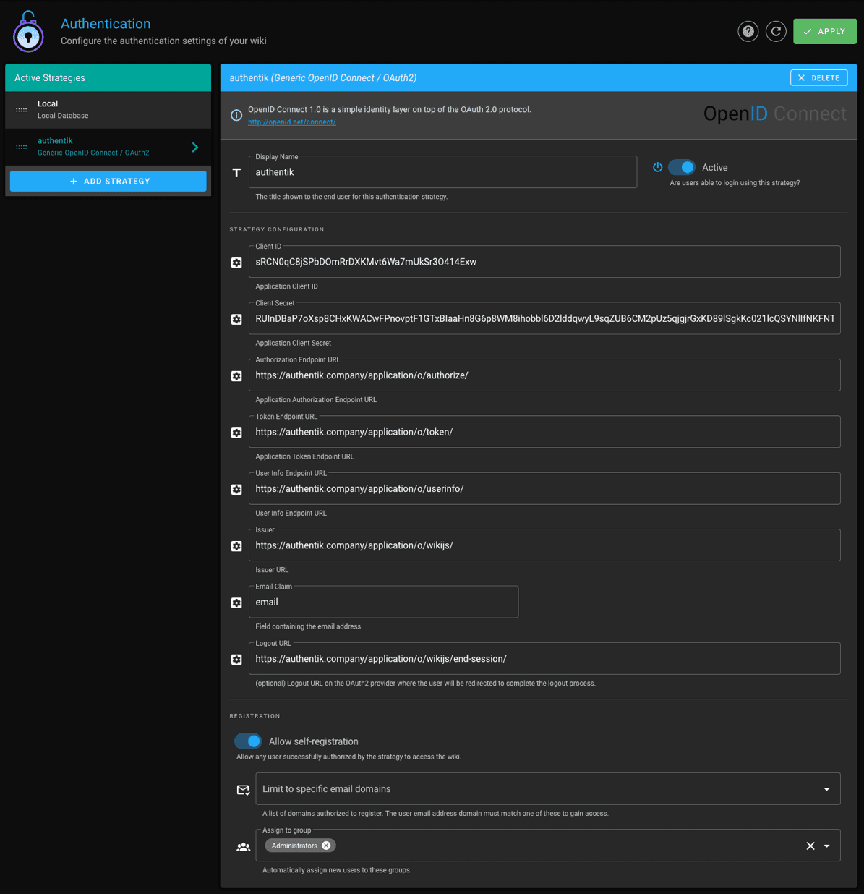

import RedirectURI20265Note from "../../\_redirect-uri-2026-5-note.mdx";

## What is Wiki.js?

> Wiki.js is a wiki engine running on Node.js and written in JavaScript. It is free software released under the Affero GNU General Public License. It is available as a self-hosted solution or using "single-click" install on the DigitalOcean and AWS marketplace.
>
> -- https://en.wikipedia.org/wiki/Wiki.js

:::info
This is based on authentik 2022.11 and Wiki.js 2.5. Instructions may differ between versions.
:::

## Preparation

The following placeholders are used in this guide:

- `wiki.company` is the FQDN of the Wiki.js installation.
- `authentik.company` is the FQDN of the authentik installation.

:::info
This documentation lists only the settings that you need to change from their default values. Be aware that any changes other than those explicitly mentioned in this guide could cause issues accessing your application.
:::

## Wiki.js pre-configuration

In Wiki.js, navigate to the _Authentication_ section in the _Administration_ interface.

Add a _Generic OpenID Connect / OAuth2_ strategy and take note of the _Callback URL / Redirect URI_ in the _Configuration Reference_ section at the bottom.

## authentik configuration

<RedirectURI20265Note />

To support the integration of Wiki.js with authentik, you need to create an application/provider pair in authentik.

### Create an application and provider in authentik

1. Log in to authentik as an administrator and open the authentik Admin interface.
2. Navigate to **Applications** > **Applications** and click **New Application** to open the application wizard.

- **Application**: provide a descriptive name, an optional group for the type of application, the policy engine mode, and optional UI settings.
- **Choose a Provider type**: select **OAuth2/OpenID Connect** as the provider type.
- **Configure the Provider**: provide a name (or accept the auto-provided name), the authorization flow to use for this provider, and the following required configurations.
    - Note the **Client ID**, **Client Secret**, and **slug** values because they will be required later.
    - Add a **Redirect URI** of type `Strict` `Authorization` as `https://wiki.company/login/id-from-wiki/callback`.
    - Select any available signing key.
- **Configure Bindings** _(optional)_: you can create a [binding](/docs/add-secure-apps/bindings-overview/) (policy, group, or user) to manage the listing and access to applications on a user's **Application Dashboard** page.

3. Click **Submit** to save the new application and provider.

## Wiki.js configuration

In Wiki.js, configure the authentication strategy with these settings:

- **Client ID**: Client ID from the authentik provider.
- **Client Secret**: Client Secret from the authentik provider.
- **Authorization Endpoint URL**: `https://authentik.company/application/o/authorize/`
- **Token Endpoint URL**: `https://authentik.company/application/o/token/`
- **User Info Endpoint URL**: `https://authentik.company/application/o/userinfo/`
- **Issuer**: `https://authentik.company/application/o/<application_slug>/`
- **Logout URL**: `https://authentik.company/application/o/<application_slug>/end-session/`
- **Allow self-registration**: Enabled
- **Assign to group**: The group to which new users logging in from authentik should be assigned. (Please note that this takes prescendence over **Map Groups** in recent versions of Wiki.js.)



:::info
You do not have to enable "Allow self-registration" and select a group to which new users should be assigned, but if you don't, you will have to manually provision users in Wiki.js and ensure that their email addresses match the ones they have in authentik.
:::

Wiki.js has a **Map Groups** feature, which will assign users to Wiki.js groups seen in the token received from authentik. To use this feature, the value of **Groups Claim** (e.g. `wiki-groups`) must be included in the `profile` claim from authentik. To set this up:
- In authentik, naviate to **Customization** > **Property Mappings** and click **New Property Mapping**.
- Choose **Scope Mapping**.
- Give the mapping an appropriate name.
- Set **Scope name** to `profile`, which causes this mapping to be included inside the existing `profile` claim.
- Set **Expression** to:
```
return {"wiki-groups":["Administrators"]} if ak_is_group_member(request.user, name="WikiAdmins") else {}
```
- Click **Create** to save the mapping.
- In authentik, navigate to **Applications** > **Providers** and edit your Wiki provider.
- Under **Advanced protocol settings**, scroll down to **Scopes**. Select your new mapping in **Available Scopes** and move it to **Selected Scopes**.
- Click **Save Changes**.
The above causes a new value `wiki-groups` to be included inside the `profile` claim if the user is part of the authentik group `WikiAdmins`. Wiki.js will then iterate over all `wiki-groups` values and assign the user to each group if the group exists in Wiki.js. Wiki.js removes the user from all existing groups of which they were a member.

:::info
If you're using self-signed certificates for authentik, you need to set the root certificate of your CA as trusted in Wiki.js by setting the NODE_EXTRA_CA_CERTS variable as explained here: https://github.com/Requarks/wiki/discussions/3387.
:::
