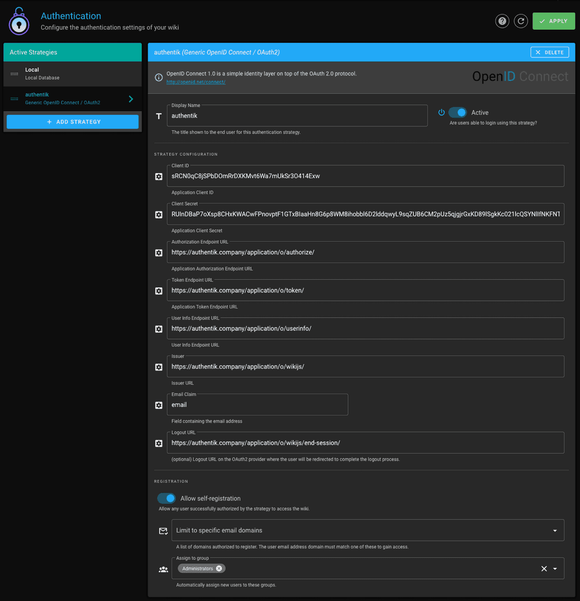

## What is Wiki.js

> Wiki.js is a wiki engine running on Node.js and written in JavaScript. It is free software released under the Affero GNU General Public License. It is available as a self-hosted solution or using "single-click" install on the DigitalOcean and AWS marketplace.
>
> -- https://en.wikipedia.org/wiki/Wiki.js

:::note
This is based on authentik 2022.11 and Wiki.js 2.5. Instructions may differ between versions.
:::

## Preparation

The following placeholders are used in this guide:

- `wiki.company` is the FQDN of Wiki.js installation.
- `authentik.company` is the FQDN of authentik installation.

:::note
This documentation lists only the settings that you need to change from their default values. Be aware that any changes other than those explicitly mentioned in this guide could cause issues accessing your application.
:::

## Wiki.js pre-configuration

In Wiki.js, navigate to the _Authentication_ section in the _Administration_ interface.

Add a _Generic OpenID Connect / OAuth2_ strategy and take note of the _Callback URL / Redirect URI_ in the _Configuration Reference_ section at the bottom.

## authentik configuration

To support the integration of Wiki.js with authentik, you need to create an application/provider pair in authentik.

### Create an application and provider in authentik

1. Log in to authentik as an administrator and open the authentik Admin interface.
2. Navigate to **Applications** > **Applications** and click **Create with Provider** to create an application and provider pair. (Alternatively you can first create a provider separately, then create the application and connect it with the provider.)

- **Application**: provide a descriptive name, an optional group for the type of application, the policy engine mode, and optional UI settings.
- **Choose a Provider type**: select **OAuth2/OpenID Connect** as the provider type.
- **Configure the Provider**: provide a name (or accept the auto-provided name), the authorization flow to use for this provider, and the following required configurations.
    - Note the **Client ID**, **Client Secret**, and **slug** values because they will be required later.
    - Set a `Strict` redirect URI to `https://wiki.company/login/id-from-wiki/callback`.
    - Select any available signing key.
- **Configure Bindings** _(optional)_: you can create a [binding](/docs/add-secure-apps/flows-stages/bindings/) (policy, group, or user) to manage the listing and access to applications on a user's **My applications** page.

3. Click **Submit** to save the new application and provider.

## Wiki.js configuration

In Wiki.js, configure the authentication strategy with these settings:

- Client ID: Client ID from the authentik provider.
- Client Secret: Client Secret from the authentik provider.
- Authorization Endpoint URL: https://authentik.company/application/o/authorize/
- Token Endpoint URL: https://authentik.company/application/o/token/
- User Info Endpoint URL: https://authentik.company/application/o/userinfo/
- Issuer: https://authentik.company/application/o/wikijs/
- Logout URL: https://authentik.company/application/o/wikijs/end-session/
- Allow self-registration: Enabled
- Assign to group: The group to which new users logging in from authentik should be assigned.

:::note
You do not have to enable "Allow self-registration" and select a group to which new users should be assigned, but if you don't you will have to manually provision users in Wiki.js and ensure that their emails match the email they have in authentik.
:::

:::note
If you're using self-signed certificates for authentik, you need to set the root certificate of your CA as trusted in WikiJS by setting the NODE_EXTRA_CA_CERTS variable as explained here: https://github.com/Requarks/wiki/discussions/3387.
:::
