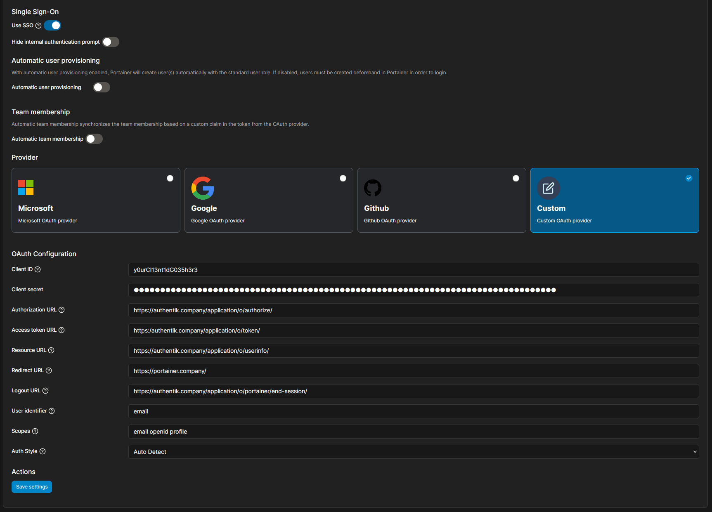
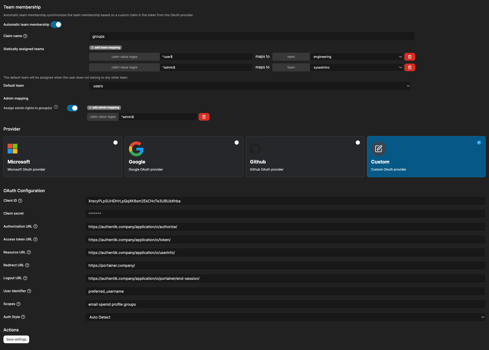

## What is Portainer

> Portainer is a powerful, GUI-based Container-as-a-Service solution that helps organizations manage and deploy cloud-native applications easily and securely.
>
> -- https://www.portainer.io/

:::info
This documentation has been validated to work for authentik 2025.10.3 and Portainer 2.33.6 LTS.
:::

## Preparation

The following placeholders are used in this guide:

- `portainer.company` is the FQDN of Portainer installation.
- `authentik.company` is the FQDN of authentik installation.

:::info
This documentation lists only the settings that you need to change from their default values. Be aware that any changes other than those explicitly mentioned in this guide could cause issues accessing your application.
:::

## authentik configuration

To support the integration of Portainer with authentik, you need to create an application/provider pair in authentik.

### Create an application and provider in authentik

1. Log in to authentik as an administrator and open the authentik Admin interface.
2. Navigate to **Applications** > **Applications** and click **Create with Provider** to create an application and provider pair. (Alternatively you can first create a provider separately, then create the application and connect it with the provider.)

- **Application**: provide a descriptive name, an optional group for the type of application, the policy engine mode, and optional UI settings.
- **Choose a Provider type**: select **OAuth2/OpenID Connect** as the provider type.
- **Configure the Provider**: provide a name (or accept the auto-provided name), the authorization flow to use for this provider, and the following required configurations.
    - Note the **Client ID**, **Client Secret**, and **slug** values because they will be required later.
    - Set a `Strict` redirect URI to `https://portainer.company/`.
    - Select any available signing key.
- **Configure Bindings** _(optional)_: you can create a [binding](/docs/add-secure-apps/flows-stages/bindings/) (policy, group, or user) to manage the listing and access to applications on a user's **My applications** page.

3. Click **Submit** to save the new application and provider.

## Portainer configuration

In Portainer, under _Settings_, _Authentication_, Select _OAuth_ and _Custom_

- Client ID: The 'Client ID' from the authentik provider
- Client Secret: The 'Client secret' from the authentik provider
- Authorization URL: `https://authentik.company/application/o/authorize/`
- Access Token URL: `https://authentik.company/application/o/token/`
- Resource URL: `https://authentik.company/application/o/userinfo/`
- Redirect URL: `https://portainer.company/`
- Logout URL: `https://authentik.company/application/o/portainer/end-session/`
- User Identifier: `preferred_username` (Or `email` if you want to use email addresses as identifiers)
- Scopes: `email openid profile`

:::info
Portainer by default shows commas between each item in the Scopes field. Do **NOT** use commas. Use a _space_
:::



## Configuration verification

To confirm that authentik is properly configured with Portainer, open a private browsing window and go to the `https://portainer.company`.

Click **Login with OAuth**. You should be redirected to authentik to login, once successful you should be redirected to the Portainer dashboard.

## Configure automatic team membership in Portainer BE

If you are using [Portainer Business Edition (BE)](https://www.portainer.io/take-3), it is possible to configure automatic team membership. This allows you to grant access to teams & environments and automatically grant admin access to certain users based on authentik group membership. It is only possible to configure automatic group membership in Portainer BE - this cannot be configured in the Community Edition.

For this section, we will presume that you already have two teams configured in Portainer: `engineering` and `sysadmins`. Please reference [Portainer's documentation](https://docs.portainer.io/admin/user/teams) for information on managing teams and access to environments based on team membership.

### Create a property mapping

1. Log in to authentik as an administrator and open the authentik Admin interface.
2. Navigate to **Customization** > **Property Mappings** and click **Create**.
    - **Select type**: select **Scope Mapping**.
    - **Configure the Scope Mapping**: Provide a descriptive name (e.g. `authentik portainer OpenID Mapping: OAuth 'groups'`), and an optional description.
        - **Scope name**: `groups`
        - **Expression**:

        ```python showLineNumbers
        groups = []

        if request.user.ak_groups.filter(name="Portainer Admins").exists():
            groups.append("admin")

        if request.user.ak_groups.filter(name="Portainer Users").exists():
            groups.append("user")

        return {
            "groups": groups
        }
        ```

3. Click **Finish** to save the property mapping.
4. Navigate to **Applications** > **Providers**.
5. Select your provider for Portainer, and click **Edit**.
6. Under **Advanced protocol settings**, add the property mapping that you created to your **Selected Scopes**.
7. Click **Update** to save your changes to the provider.
8. Navigate to **Directory** > **Groups**.
9. Add two new groups with names matching the filters in your property mapping **exactly** - in this case, `Portainer Admins` and `Portainer User`.
10. Navigate to **Directory** > **Users**.
11. Select your user, and add them to the `Portainer Admins` group. Repeat for any other users that require access, granting access to either group as desired.

:::info
Since we are configuring access to Portainer based on group membership, It is recommended that you configure a [binding](/docs/add-secure-apps/flows-stages/bindings/) (policy, group, or user) for the application in authentik such that access is restricted to these groups.
:::

### Update your configuration in Portainer

1. Login to Portainer as a user with administrative privileges.
2. Navigate to **Settings** > **Authentication**.
3. Under **Team Membership**, toggle **Automatic team membership** to **ON**, and complete configuration as follows:
    - **Claim name**: `groups`
    - **Statically assigned teams**: Add two team mappings with the following values:
       - **client value regex** `^user$` **maps to team** `engineering`.
       - **client value regex** `^admin$` **maps to team** `sysadmins`.
    - **Default team**: `engineering`
    - **Admin mapping**:
       - Toggle **Assign admin rights to group(s)** to **ON**.
       - Add one admin mapping, and set **client value regex** to `^admin$`.
4. Under **Provider** > ** OAuth Configuration**, append `groups` to **Scopes** - the full value for **Scopes** should then be `email openid profile groups`.
5. Click **Save Settings** to apply your changes.




## Resources

- [Portainer Documentation - Authenticate via OAuth](https://docs.portainer.io/admin/settings/authentication/oauth)
- [Portainer Documentation - Add a new team](https://docs.portainer.io/admin/user/teams/add)
- [Portainer Documentation - Manage access to environments](https://docs.portainer.io/admin/environments/access)
