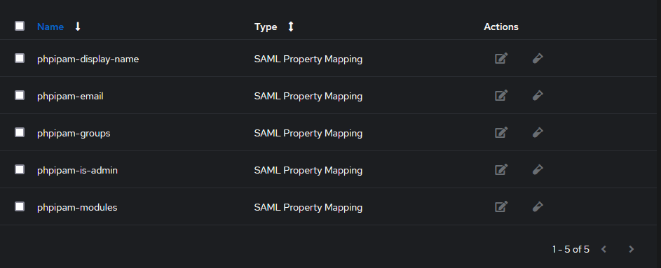
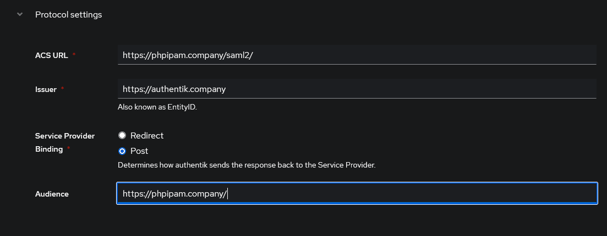
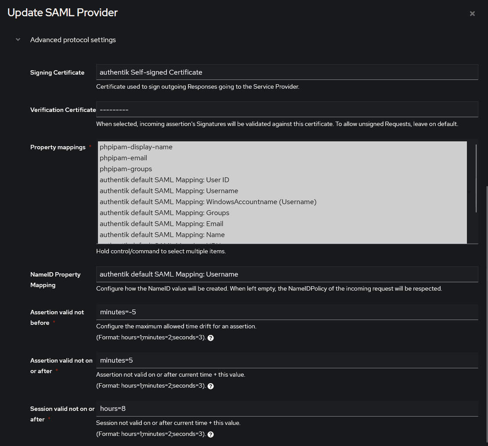
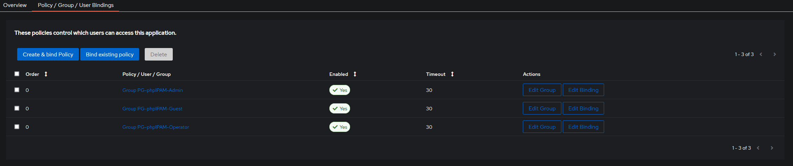
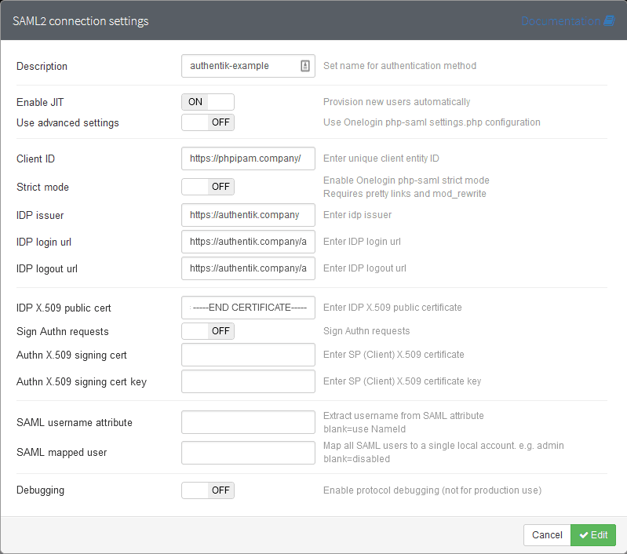
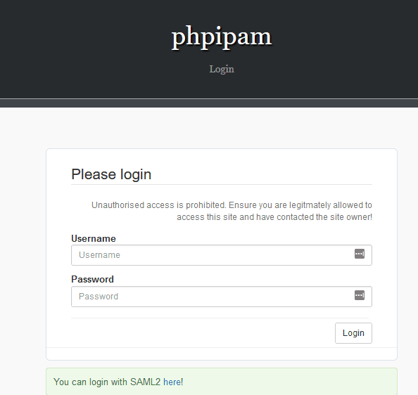
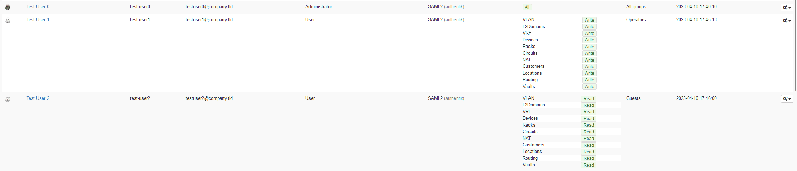

import SAMLProvider20265Warning from "../../\_saml-provider-2026-5-warning.mdx";

## What is phpIPAM?

> phpIPAM is an open-source web IP address management application. It helps you manage IP addresses, subnets, VLANs, locations, and related network inventory from a web interface.
>
> -- https://phpipam.net/

## Preparation

The following placeholders are used in this guide:

- `phpipam.company` is the FQDN of the phpIPAM installation.
- `authentik.company` is the FQDN of the authentik installation.
- `admin-permission-group` is the authentik group for phpIPAM administrators.
- `operator-permission-group` is the authentik group for phpIPAM users with read/write module access.
- `guest-permission-group` is the authentik group for phpIPAM users with read-only module access.

:::info
This documentation lists only the settings that you need to change from their default values. Be aware that any changes other than those explicitly mentioned in this guide could cause issues accessing your application.
:::

## authentik configuration

To support the integration of phpIPAM with authentik, you need to create an application/provider pair in authentik. This guide also configures SAML property mappings for phpIPAM just-in-time (JIT) user provisioning.

### Create groups

Create or identify the authentik groups that control phpIPAM access. This guide uses the following example groups:

- `admin-permission-group`
- `operator-permission-group`
- `guest-permission-group`

Assign users to the group that matches the phpIPAM access level that they should receive. These groups are used in the SAML property mappings and in the application bindings.

### Create property mappings

phpIPAM requires the `display_name` and `email` SAML attributes when JIT provisioning is enabled. You can also send `is_admin`, `groups`, and `modules` attributes to control phpIPAM roles, group memberships, and module permissions.

1. Log in to authentik as an administrator and open the authentik Admin interface.
2. Navigate to **Customization** > **Property Mappings**.
3. Click **Create** and select **SAML Provider Property Mapping**.
4. Create the following property mappings:
    - **Name**: `phpipam-display-name`
        - **SAML Attribute Name**: `display_name`
        - **Expression**:

            ```python
            return user.name
            ```

    - **Name**: `phpipam-email`
        - **SAML Attribute Name**: `email`
        - **Expression**:

            ```python
            return user.email
            ```

    - **Name**: `phpipam-is-admin`
        - **SAML Attribute Name**: `is_admin`
        - **Expression**:

            ```python
            return ak_is_group_member(request.user, name="admin-permission-group")
            ```

    - **Name**: `phpipam-groups`
        - **SAML Attribute Name**: `groups`
        - **Expression**:

            ```python
            if ak_is_group_member(request.user, name="operator-permission-group"):
                return "Operators"
            if ak_is_group_member(request.user, name="guest-permission-group"):
                return "Guests"
            return ""
            ```

    - **Name**: `phpipam-modules`
        - **SAML Attribute Name**: `modules`
        - **Expression**:

            ```python
            if ak_is_group_member(request.user, name="operator-permission-group"):
                return "*:2"
            if ak_is_group_member(request.user, name="guest-permission-group"):
                return "*:1"
            return ""
            ```



The example `groups` mapping sends phpIPAM group names. Adjust `Operators` and `Guests` to match the groups that exist in your phpIPAM installation. The example `modules` mapping grants read/write access to all modules for operators and read-only access to all modules for guests.

### Create an application and provider

<SAMLProvider20265Warning />

1. Log in to authentik as an administrator and open the authentik Admin interface.
2. Navigate to **Applications** > **Applications** and click **New Application** to open the application wizard.
    - **Application**: provide a descriptive name, an optional group for the type of application, the policy engine mode, and optional UI settings. Take note of the **Slug** because it will be required later.
    - **Choose a Provider type**: select **SAML Provider** as the provider type.
    - **Configure the Provider**: provide a name (or accept the auto-provided name), the authorization flow to use for this provider, and the following required configurations:
        - Set the **ACS URL** to `https://phpipam.company/index.php?page=saml2`.
        - Set the **Audience** to `https://phpipam.company/`.
        - Under **Advanced protocol settings**:
            - Select an available **Signing Certificate**.
            - Add the property mappings that you created in the previous section.
            - Set **NameID Property Mapping** to `authentik default SAML Mapping: Username`.
    - **Configure Bindings** _(optional)_: create [bindings](/docs/add-secure-apps/bindings-overview/) for `admin-permission-group`, `operator-permission-group`, and `guest-permission-group` so that only members of those groups can access phpIPAM from authentik.

3. Click **Submit** to save the new application and provider.





### Download the signing certificate

1. Navigate to **Applications** > **Providers** and click the phpIPAM provider that you created in the previous section.
2. Under **Related objects** > **Download signing certificate**, click **Download**.
3. Open the downloaded certificate file and copy its contents. This value is required when you configure phpIPAM.

## phpIPAM configuration

1. Log in to phpIPAM as a local administrator.
2. Navigate to **Administration** > **Authentication Methods**.
3. Click **Create New** > **SAML2 Authentication**.
4. Configure the following fields:
    - **Description**: `authentik`
    - **Enable JIT**: enable this option.
    - **Client ID**: `https://phpipam.company/`
    - **IDP Issuer**: `https://authentik.company/application/saml/<application_slug>/metadata/`
    - **IDP Login url**: `https://authentik.company/application/saml/<application_slug>/`
    - **IDP Logout url**: `https://authentik.company/application/saml/<application_slug>/`
    - **IDP X.509 public cert**: paste the contents of the signing certificate that you downloaded from authentik.
5. Click **Save**.



## Configuration verification

To verify that authentik is correctly integrated with phpIPAM, log out of phpIPAM and open the phpIPAM login page. Click the SAML2 login link to sign in with authentik.



After you sign in, phpIPAM creates or updates the local user with the SAML attributes from authentik. Test users from each permission group to confirm that the expected phpIPAM role, group membership, and module permissions are applied.



## Resources

- [phpIPAM documentation - SAML2 authentication](https://github.com/phpipam/phpipam/blob/master/doc/Authentication/SAML2.md)
- [phpIPAM documentation - SAML2 with Keycloak](https://github.com/phpipam/phpipam/blob/master/doc/Authentication/SAML2-with-Keycloak.md)
