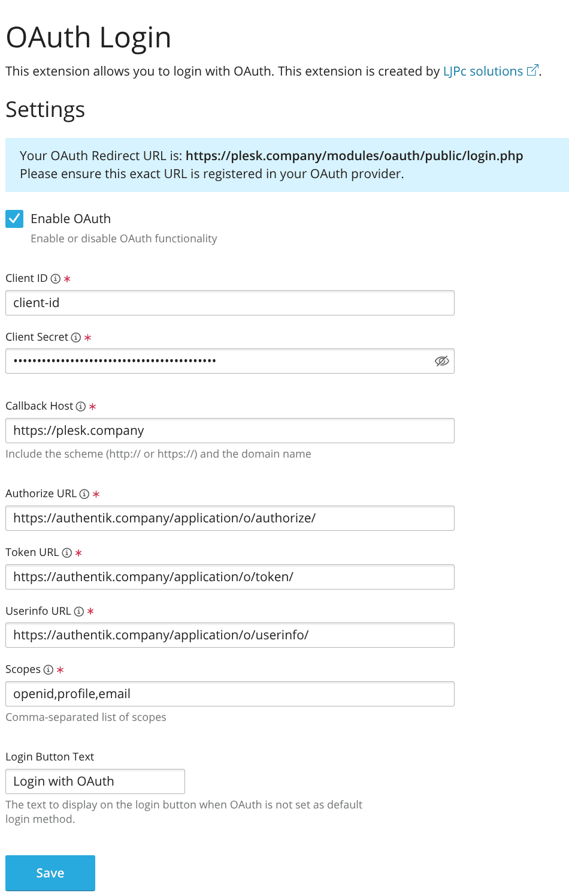
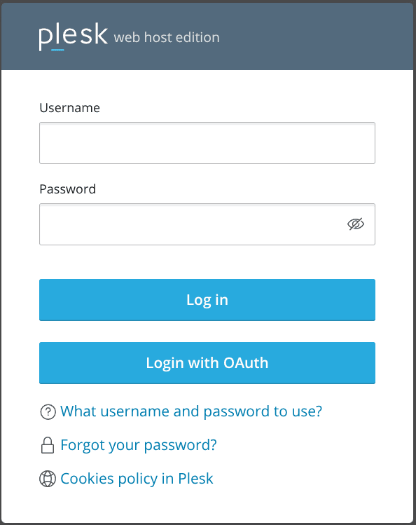

import RedirectURI20265Note from "../../\_redirect-uri-2026-5-note.mdx";

## What is Plesk?

> Plesk is a web hosting platform with a control panel that helps manage servers, applications, and websites through a comprehensive graphical user interface. It provides tools for web professionals, IT administrators, and hosting companies to simplify the process of hosting and managing websites.
>
> -- https://www.plesk.com

## Preparation

The following placeholders are used in this guide:

- `plesk.company` is the FQDN of the Plesk installation.
- `authentik.company` is the FQDN of the authentik installation.

:::info
This documentation lists only the settings that you need to change from their default values. Be aware that any changes other than those explicitly mentioned in this guide could cause issues accessing your application.
:::

:::caution Account eligibility
The Plesk OAuth Login extension applies only to existing additional administrator accounts. It maps OAuth logins to existing additional administrator accounts by email and does not apply to the main administrator, customer, or reseller accounts.
:::

## authentik configuration

<RedirectURI20265Note />

To support the integration of Plesk with authentik, you need to create an application/provider pair in authentik.

### Create an application and provider

1. Log in to authentik as an administrator and open the authentik Admin interface.
2. Navigate to **Applications** > **Applications** and click **New Application** to open the application wizard.

- **Application**: provide a descriptive name, an optional group for the type of application, the policy engine mode, and optional UI settings.
- **Choose a Provider type**: select **OAuth2/OpenID Connect** as the provider type.
- **Configure the Provider**: provide a name (or accept the auto-provided name), the authorization flow to use for this provider, and the following required configurations.
    - Note the **Client ID** and **Client Secret** values because they will be required later.
    - Add a **Redirect URI** of type `Strict` `Authorization` as `https://plesk.company/modules/oauth/public/login.php`.
    - Select any available signing key.
- **Configure Bindings** _(optional)_: you can create a [binding](/docs/add-secure-apps/bindings-overview/) (policy, group, or user) to manage the listing and access to applications on a user's **Application Dashboard** page.

3. Click **Submit** to save the new application and provider.

## Plesk configuration

1. Install the OAuth login extension:
    - Log in to your Plesk installation.
    - Navigate to **Extensions** in the left sidebar.
    - Select **Extensions Catalog**.
    - Search for "OAuth login".
    - Click **Install** next to the OAuth login extension.

2. Enable and configure OAuth authentication:
    - After installation, select **Extensions** > **OAuth Login** in the left sidebar.
    - Enable OAuth authentication using the toggle switch in the main configuration panel.

3. In the same panel, configure these OAuth settings:
    - **Type**: `OpenID Connect`
    - **Client ID**: enter the Client ID from your authentik provider
    - **Client Secret**: enter the Client Secret from your authentik provider
    - **Callback Host**: `https://plesk.company`
    - **Authorize URL**: `https://authentik.company/application/o/authorize/`
    - **Token URL**: `https://authentik.company/application/o/token/`
    - **Userinfo URL**: `https://authentik.company/application/o/userinfo/`
    - **Scopes**: `openid,email,profile`
    - **Login Button Text**: enter the text to display on the Plesk login page, for example `Log in with authentik`

    

4. Click **Save** to apply the settings.

## Configuration verification

To confirm that authentik is properly configured with Plesk, open Plesk and complete the following steps:

1. Log out of Plesk.
2. Look for the OAuth login button on the login page.
3. Click the OAuth login button.
4. Verify that you are redirected to authentik for authentication.
5. After successful authentication, confirm that you can log in to your Plesk administrator account.

## Resources

- [Plesk OAuth Login extension](https://www.plesk.com/extensions/oauth/)
- [Authelia Plesk OpenID Connect integration](https://www.authelia.com/integration/openid-connect/clients/plesk/)
