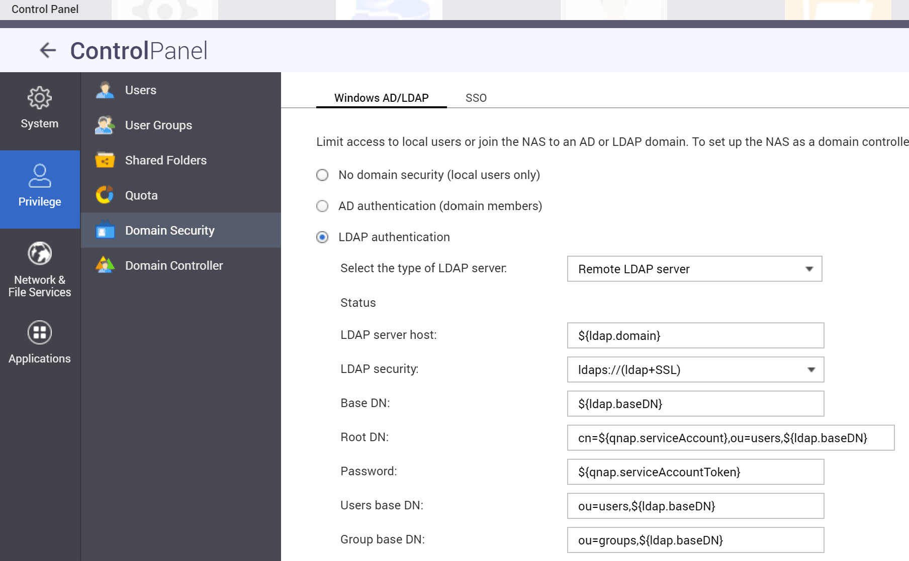

## What is QNAP NAS?

> QNAP Systems, Inc. is a Taiwanese corporation that specializes in network-attached storage appliances used for file sharing, virtualization, storage management and surveillance applications.
>
> -- https://en.wikipedia.org/wiki/QNAP_Systems

Connecting a QNAP NAS to an LDAP directory is a little unusual because it is **not** well documented what QNAP does behind the scenes.

## Preparation

The following placeholders are used in this guide:

- `ldap.baseDN` is the Base DN you configure in the LDAP provider.
- `ldap.domain` is (typically) a FQDN for your domain. Usually
  it is just the components of your base DN. For example, if
  `ldap.baseDN` is `dc=ldap,dc=goauthentik,dc=io` then the domain
  might be `ldap.goauthentik.io`.
- `ldap.searchGroup` is the "Search Group" that can see all
  users and groups in authentik.
- `qnap.serviceAccount` is a service account created in authentik.
- `qnap.serviceAccountToken` is the service account token generated
  by authentik.

:::info
This documentation lists only the settings that you need to change from their default values. Be aware that any changes other than those explicitly mentioned in this guide could cause issues accessing your application.
:::

Create an LDAP Provider if you don't already have one set up.
This guide assumes you will be running with TLS. See the [LDAP provider docs](https://docs.goauthentik.io/docs/add-secure-apps/providers/ldap) for setting up SSL on the authentik side.

Remember the `ldap.baseDN` you configured for the provider, as you'll
need it in the SSSD configuration.

Create a new service account for all of your hosts to use to connect
to LDAP and perform searches. Make sure this service account is added
to `ldap.searchGroup`.

:::caution
The QNAP LDAP client configuration has issues with passwords that are too long.
Maximum password length: \<= 66 characters.
:::

## Deployment

Create an outpost deployment for the provider you've created above, as described [here](https://docs.goauthentik.io/docs/add-secure-apps/outposts/). Deploy this Outpost either on the same host or a different host that your QNAP NAS can access.

The outpost will connect to authentik and configure itself.

## NAS configuration

The procedure is a two-step setup:

1. QNAP Web UI: used to set up and store initial data, especially the encrypted bind password.
2. SSH config edit: used to adapt settings so the NAS can communicate with the authentik LDAP outpost.

:::info
The config edit is essential, as QNAP relies on certain non-configurable settings.
The search for users and groups relies on a fixed filter for
`objectClass` in `posixAccount` or `posixGroup` classes.

Also by default the search scope is set to `one` (`singleLevel`), which can be
adapted in the config to `sub` (`wholeSubtree`).

### Sample LDAP request from QNAP

Default search for users

```text
Scope: 1 (singleLevel)
Deref Aliases: 0 (neverDerefAliases)
Size Limit: 0
Time Limit: 0
Types Only: false
Filter: (objectClass=posixAccount)
Attributes:
    uid
    userPassword
    uidNumber
    gidNumber
    cn
    homeDirectory
    loginShell
    gecos
    description
    objectClass
```

Default search for groups

```text
Scope: 1 (singleLevel)
Deref Aliases: 0 (neverDerefAliases)
Size Limit: 0
Time Limit: 0
Types Only: false
Filter: (objectClass=posixGroup)
Attributes:
    cn
    userPassword
    memberUid
    gidNumber
```

:::

### QNAP Web UI

Configure the following values and "Apply"


:::caution
With each save (Apply) in the UI the `/etc/config/nss_ldap.conf` will be overwritten with default values.
:::

:::info
The UI configuration is necessary because it saves the encrypted password
in `/etc/config/nss_ldap.ensecret`.
:::

### SSH

Connect your QNAP NAS via SSH.
First stop the LDAP Service:

```bash
/sbin/setcfg LDAP Enable FALSE
/etc/init.d/ldap.sh stop
```

Edit the file at `/etc/config/nss_ldap.conf`:

```conf
host                        ${ldap.domain}
base                        ${ldap.baseDN}
uri                         ldaps://${ldap.domain}/
ssl                         on
rootbinddn                  cn=${qnap.serviceAccount},ou=users,${ldap.baseDN}
# authentik has no memberUid therefore switch to
nss_schema                  rfc2307bis

# remap object classes to authentik ones
nss_map_objectclass         posixAccount    user
nss_map_objectclass         shadowAccount   user
nss_map_objectclass         posixGroup      group

# remap attributes
# uid to cn is essential otherwise only id usernames will occur
nss_map_attribute           uid             cn
# map displayName information into comments field
nss_map_attribute           gecos           displayName
# see https://ldapwiki.com/wiki/Wiki.jsp?page=GroupOfUniqueNames%20vs%20groupOfNames
nss_map_attribute           uniqueMember    member

# configure scope per search filter
nss_base_passwd             ou=users,${ldap.baseDN}?one
nss_base_shadow             ou=users,${ldap.baseDN}?one
nss_base_group              ou=groups,${ldap.baseDN}?one

tls_checkpeer               no
referrals                   no
bind_policy                 soft
timelimit                   120
tls_ciphers                 EECDH+CHACHA20:EECDH+CHACHA20-draft:EECDH+AES128:RSA+AES128:EECDH+AES256:RSA+AES256:!MD5
nss_initgroups_ignoreusers  admin,akadmin
```

Now start the LDAP service:

```bash
/sbin/setcfg LDAP Enable TRUE
/etc/init.d/ldap.sh start
```

To see if the connection is working, type

```bash
# list users
$ getent passwd
```

The output should list local users and authentik accounts.

```bash
# list groups
$ getent group
```

The output should list local and authentik groups.
