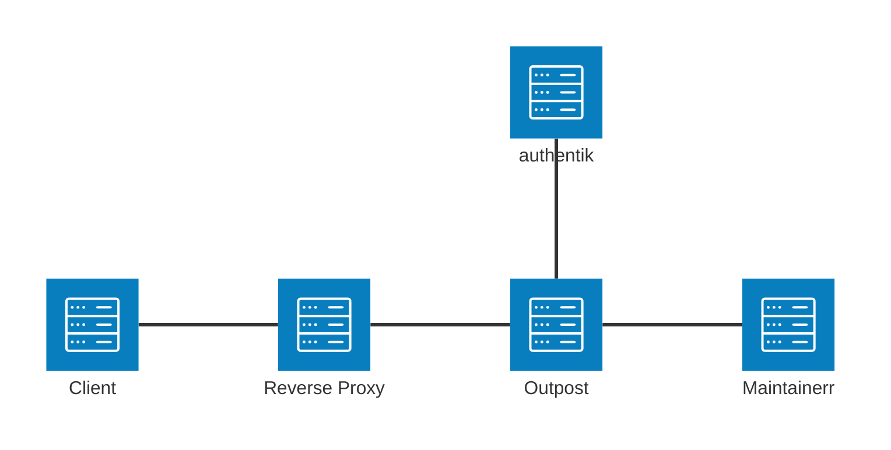

## What is Maintainerr?

> Maintainerr applies rules you define to a Plex, Jellyfin, or Emby library, gathers the media that matches into collections, leaves it visible for a configurable period, and then removes it along with the matching files and requests in Radarr, Sonarr, and Seerr.
>
> -- https://docs.maintainerr.info/

Maintainerr has no login of its own. This guide uses the authentik Proxy Provider to authenticate requests before they reach Maintainerr.

## Preparation

The following placeholders are used in this guide:

- `maintainerr.company` is the FQDN of the Maintainerr installation.
- `authentik.company` is the FQDN of the authentik installation.

:::info
This documentation lists only the settings that you need to change from their default values. Be aware that any changes other than those explicitly mentioned in this guide could cause issues accessing your application.
:::

:::danger Protect the Maintainerr backend
Maintainerr does not authenticate requests, so anything that reaches it is trusted. `GET /api/settings/database/download` returns its entire database, which stores the credentials for every connected service in plain text. Make sure that Maintainerr is reachable only through authentik, and do not add unauthenticated path exceptions for anything under `/api/`.
:::

## authentik configuration

To support the integration of Maintainerr with authentik, you need to create an application/provider pair in authentik and assign it to a proxy outpost.

### Create an application and provider

1. Log in to authentik as an administrator and open the authentik Admin interface.
2. Navigate to **Applications** > **Applications** and click **New Application** to open the application wizard.
    - **Application**: provide a descriptive name, an optional group for the type of application, the policy engine mode, and optional UI settings.
    - **Choose a Provider type**: select **Proxy Provider** as the provider type.
    - **Configure the Provider**: provide a name (or accept the auto-provided name), the authorization flow to use for this provider, and the following required configurations.
        - Set **Mode** to **Proxy**.
        - Set **External host** to `https://maintainerr.company`.
        - Set **Internal host** to the URL that the authentik proxy outpost uses to reach Maintainerr.
            - If Maintainerr and the authentik proxy outpost are both running in the same Docker deployment, set the value to `http://<maintainerr_container_name>:6246`.
            - If Maintainerr runs on a different server than the authentik proxy outpost, set the value to `http://<maintainerr_host>:6246`, using an address that resolves to Maintainerr itself rather than to the authentik proxy outpost.
    - **Configure Bindings** _(optional)_: you can create a [binding](/docs/add-secure-apps/bindings-overview/) (policy, group, or user) to manage the listing and access to applications on a user's **Application Dashboard** page.

3. Click **Submit** to save the new application and provider.

### Configure proxy outpost

The proxy provider requires an authentik proxy outpost. If you do not already have a proxy outpost, follow the [outpost documentation](/docs/add-secure-apps/outposts/) to create and deploy one.

Add the Maintainerr application to a proxy outpost that will serve it:

1. Log in to authentik as an administrator and open the authentik Admin interface.
2. Navigate to **Applications** > **Outposts**.
3. Click the edit icon for the proxy outpost. This can be the built-in **authentik Embedded Outpost** or another proxy outpost.
4. Under **Available Applications**, select the Maintainerr application and move it to **Selected Applications**.
5. Click **Update** to save your changes.

## Maintainerr configuration

Maintainerr has no authentication settings and reads no authentication headers, so nothing inside the application needs to change. What matters is that the only route to it runs through the outpost.

1. Stop publishing the Maintainerr container port, so that only containers on the same Docker network can reach it.

    ```yaml title="docker-compose.yml"
    services:
        maintainerr:
            image: ghcr.io/maintainerr/maintainerr:latest
            # No `ports:` mapping: only the authentik proxy outpost can reach this container.
            volumes:
                - ./data:/opt/data
            networks:
                - proxy

    networks:
        proxy:
            external: true
    ```

    If the outpost runs outside Docker, bind the port to loopback instead with `ports: ["127.0.0.1:6246:6246"]`.

2. Configure DNS or your reverse proxy so that requests for `https://maintainerr.company` are routed to the authentik proxy outpost. The authentik proxy outpost then forwards authenticated requests to Maintainerr through the **Internal host** configured on the proxy provider.

The Maintainerr web interface and its API share port `6246`, so a single provider covers both. Maintainerr receives no inbound webhooks, so no path needs to be exempted from authentication. Its Logs page and live task progress are streamed as Server-Sent Events, which the proxy outpost forwards without buffering.



## Configuration verification

To verify the login flow, open Maintainerr. You should be redirected to authentik before the Maintainerr web interface is shown. After you sign in, open the **Logs** page and confirm that new entries keep appearing, which shows that streamed responses are passing through the outpost.

## Resources

- [Maintainerr documentation - Security & Authentication](https://docs.maintainerr.info/security)
- [Maintainerr documentation - Reverse Proxy](https://docs.maintainerr.info/reverseproxy)
