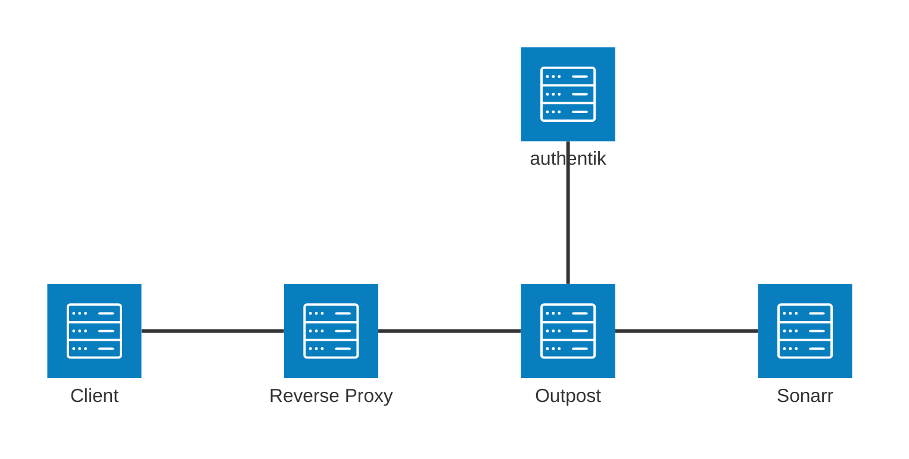

## What is Sonarr?

> Sonarr is an internet PVR for Usenet and Torrents.
>
> -- https://sonarr.tv/

Sonarr does not provide native SSO. This guide uses the authentik Proxy Provider to authenticate requests before they reach Sonarr.

## Preparation

The following placeholders are used in this guide:

- `sonarr.company` is the FQDN of the Sonarr installation.
- `authentik.company` is the FQDN of the authentik installation.

:::info
This documentation lists only the settings that you need to change from their default values. Be aware that any changes other than those explicitly mentioned in this guide could cause issues accessing your application.
:::

:::warning Protect the Sonarr backend
When Sonarr is configured for external authentication, Sonarr trusts the authentication layer in front of it. Make sure users can access Sonarr only through authentik, and do not expose the Sonarr backend directly to the internet.
:::

## authentik configuration

To support the integration of Sonarr with authentik, you need to create an application/provider pair in authentik and assign it to a proxy outpost.

### Create an application and provider

1. Log in to authentik as an administrator and open the authentik Admin interface.
2. Navigate to **Applications** > **Applications** and click **New Application** to open the application wizard.
    - **Application**: provide a descriptive name, an optional group for the type of application, the policy engine mode, and optional UI settings.
    - **Choose a Provider type**: select **Proxy Provider** as the provider type.
    - **Configure the Provider**: provide a name (or accept the auto-provided name), the authorization flow to use for this provider, and the following required configurations.
        - Set **Mode** to **Proxy**.
        - Set **External host** to `https://sonarr.company`.
        - Set **Internal host** to the URL that the authentik proxy outpost uses to reach Sonarr.
            - If Sonarr and the authentik proxy outpost are both running in the same Docker deployment, set the value to `http://<sonarr_container_name>:8989`.
            - If Sonarr runs on a different server than the authentik proxy outpost, set the value to `http://sonarr.company:8989`.
    - **Configure Bindings** _(optional)_: you can create a [binding](/docs/add-secure-apps/bindings-overview/) (policy, group, or user) to manage the listing and access to applications on a user's **Application Dashboard** page.

3. Click **Submit** to save the new application and provider.

### Configure proxy outpost

The proxy provider requires an authentik proxy outpost. If you do not already have a proxy outpost, follow the [outpost documentation](/docs/add-secure-apps/outposts/) to create and deploy one.

Add the Sonarr application to a proxy outpost that will serve it:

1. Log in to authentik as an administrator and open the authentik Admin interface.
2. Navigate to **Applications** > **Outposts**.
3. Click the edit icon for the proxy outpost. This can be the built-in **authentik Embedded Outpost** or another proxy outpost.
4. Under **Available Applications**, select the Sonarr application and move it to **Selected Applications**.
5. Click **Update** to save your changes.

## Sonarr configuration

Configure Sonarr to trust the external authentication layer provided by authentik.

1. In Sonarr, navigate to **System** > **Status** and note the **AppData directory** value. The `config.xml` file is stored in this directory.
2. Stop Sonarr.
3. Open `config.xml` and replace any existing `AuthenticationMethod` value with `External`. Make sure that the file contains only one `AuthenticationMethod` entry.

    ```xml title="config.xml"
    <AuthenticationMethod>External</AuthenticationMethod>
    ```

4. Start Sonarr.

Configure DNS or your reverse proxy so that requests for `https://sonarr.company` are routed to the authentik proxy outpost. The authentik proxy outpost then forwards authenticated requests to Sonarr through the **Internal host** configured on the proxy provider.



## Configuration verification

To verify the login flow, open Sonarr. You should be redirected to authentik before the Sonarr web interface is shown.

## Resources

- [Servarr Wiki - Sonarr v4 FAQ: Forced Authentication](https://wiki.servarr.com/sonarr/faq-v4#forced-authentication)
