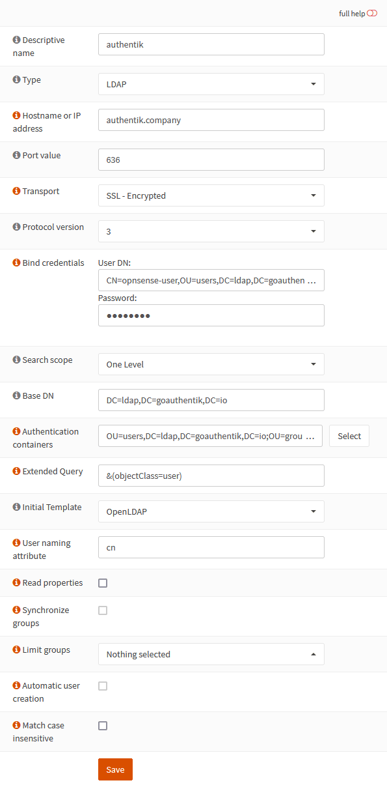
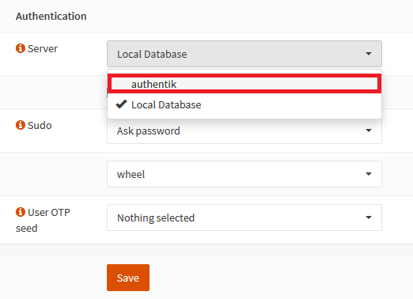

## What is OPNsense?

> OPNsense is an open source, easy-to-use and easy-to-build FreeBSD based firewall and routing platform.
>
> -- https://opnsense.org/

## Preparation

The following placeholders are used in this guide:

- `opnsense.company` is the FQDN of the OPNsense installation.
- `authentik.company` is the FQDN of the authentik installation.
- `ldap.company` is the FQDN of the authentik LDAP outpost.

:::info
This documentation lists only the settings that you need to change from their default values. Be aware that any changes other than those explicitly mentioned in this guide could cause issues accessing your application.
:::

:::warning LDAPS certificate
This guide uses LDAPS. The LDAP outpost must use a certificate that is trusted by OPNsense and valid for `ldap.company`. If you use a private certificate authority, import that authority into OPNsense under **System** > **Trust** > **Authorities** before configuring the LDAP server.
:::

## authentik configuration

To support the integration of OPNsense with authentik, you need an LDAP application/provider pair, a service account for LDAP binding, LDAP search permissions for that service account, and an LDAP outpost. Follow the [LDAP provider documentation](/docs/add-secure-apps/providers/ldap/create-ldap-provider) to create these resources.

While following the LDAP provider documentation, use the following OPNsense-specific settings:

- On the LDAP provider, set **Certificate** to the certificate OPNsense will trust for `ldap.company`.
- On the LDAP provider, set **TLS Server Name** to `ldap.company`.
- For the LDAP bind service account name, use a descriptive name such as `opnsense-user`.
- If you configure application bindings, ensure that the LDAP bind service account and users who should authenticate to OPNsense have access to the application.

## OPNsense configuration

### Add the LDAP authentication server

1. Log in to the OPNsense web UI at `opnsense.company`.
2. Navigate to **System** > **Access** > **Servers** and click **Add**.
3. Configure the LDAP server with the following settings:
    - **Descriptive name**: `authentik`
    - **Type**: `LDAP`
    - **Hostname or IP address**: `ldap.company`
    - **Port value**: `636`
    - **Transport**: `SSL - Encrypted`
    - **Bind credentials**:
        - **User DN**: `CN=opnsense-user,OU=users,DC=ldap,DC=goauthentik,DC=io`
        - **Password**: enter the password for the LDAP bind service account.
    - **Base DN**: `DC=ldap,DC=goauthentik,DC=io`
    - **Authentication containers**: `OU=users,DC=ldap,DC=goauthentik,DC=io;OU=groups,DC=ldap,DC=goauthentik,DC=io`
    - **Extended Query**: `objectClass=user`
    - **Initial Template**: `OpenLDAP`

4. Click **Save**.

### Enable authentik authentication

OPNsense can use LDAP for authentication, but GUI privileges still need to be assigned in OPNsense. Before enabling the LDAP server for GUI login, ensure that the LDAP users or groups that should access the OPNsense web UI exist in OPNsense and have the required privileges.

1. Navigate to **System** > **Settings** > **Administration**.
2. Under **Authentication**, add `authentik` to the **Server** list.
3. Keep **Local Database** selected as a fallback while testing the new LDAP server.
4. Click **Save**.

You can import users or synchronize users and groups from authentik LDAP. For more information, refer to the OPNsense LDAP documentation in the Resources section.

## Configuration verification

To confirm that authentik is properly configured with OPNsense, navigate to **System** > **Access** > **Tester** in OPNsense, select the `authentik` authentication server, and test with an authentik user's username and password.

After the test succeeds, log out of OPNsense and log back in with an authentik account that has the required OPNsense privileges.

## Resources

- [OPNsense documentation - Access / Servers / LDAP](https://docs.opnsense.org/manual/how-tos/user-ldap.html)
- [OPNsense documentation - Access / User Management](https://docs.opnsense.org/manual/users.html)
- [OPNsense source - LDAP connector](https://github.com/opnsense/core/blob/master/src/opnsense/mvc/app/library/OPNsense/Auth/LDAP.php)
