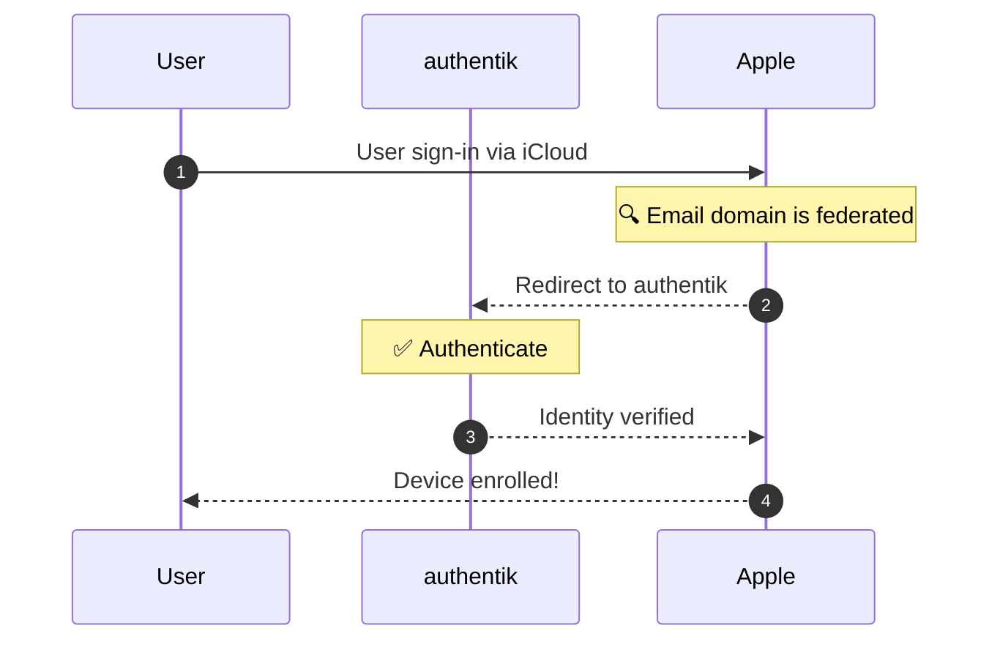

## What is Apple Business Manager?

> Apple Business Manager is a web-based portal for IT administrators, managers, and procurement professionals to manage devices, and automate device enrollment.
>
> Organizations using Apple Business Essentials can allow their users to authenticate into their Apple devices >using their IdP credentials, typically their company email addresses.
>
> -- [Apple Business Manager](https://www.apple.com/business/)

:::info Apple Device Management Platforms

Apple repackages their device management platform into three brands to cater to different audiences:

- Apple Business Manager: Large organizations
- Apple Business Essentials: Small businesses
- Apple School Manager: Educational institutions

While this integration guide focuses on Business Manager, the instructions are applicable to all three platforms with minor changes to the terminology.

:::

## Authentication Flow

This sequence diagram shows a high-level flow between the user's MacBook, authentik, and Apple.


```mermaid
sequenceDiagram
    autonumber
    participant User
    participant authentik
    participant Apple

    User->>Apple: User sign-in via iCloud
    Note over Apple: 🔍 Email domain is federated
    Apple-->>authentik: Redirect to authentik
    Note over authentik: ✅ Authenticate
    authentik-->>Apple: Identity verified
    Apple-->>User: Device enrolled!

```

In short, Apple Business Manager recognizes the email domain
as a federated identity provider controlled by authentik. When a user signs in with their email address, Apple redirects them to authentik for authentication. Once authenticated, Apple enrolls the user's device and grants access to Apple services.

---

## Preparation

By the end of this integration, your users will be able to enroll their Apple devices using their authentik credentials.

You'll need to have authentik instance running and accessible on an HTTPS domain, and an Apple Business Manager user with the role of Administrator or People Manager.

:::warning Caveats

Be aware that Apple Business Manager imposes the following restrictions on federated authentication:

- Federated authentication should use the user’s email address as their username. Aliases aren’t supported.
- Existing users with an email address in the federated domain will automatically be converted to federated authentication, effectively _taking ownership_ of the account.
- User accounts with the role of Administrator, Site Manager, or People Manager can’t sign in using federated authentication; they can only manage the federation process.

:::

### Placeholders

The following placeholders are used:

- `authentik.company`: The FQDN of the authentik installation.

## authentik configuration

Before proceeding with the Apple Business Manager configuration, you will to need to configure authentik to act as an identity provider for Apple. Start by logging into your authentik instance and navigating to the Admin interface.

### 1. Scope mapping

In the Admin interface, navigate to **Customization** -> **Property Mappings**.

Click **Create** and when prompted for a choice of mapping, select **Scope Mapping**.

#### Mapping the user's profile information

Create a new scope mapping to handle the user's profile information:

| Field      | Value                          |
| ---------- | ------------------------------ |
| Name       | Apple Business Manager profile |
| Scope name | `profile`                      |

This scope mapping will also require an expression to map the user's profile information to Apple Business Manager's expected format:

```py title="Expression Field"
first_name, _, last_name = request.user.name.partition(" ")

return {
  "given_name": first_name,
  "family_name": last_name,
}
```

Save the scope mapping and click **Create** to continue to the next scope mapping.

#### Provide read access for the scope mapping

Create a new scope mapping to handle read access to the user's profile information:

| Field      | Value                           |
| ---------- | ------------------------------- |
| Name       | Apple Business Manager ssf.read |
| Scope name | ssf.read                        |
| Expression | `return {}`                     |

Save the scope mapping and click **Create** to continue to create the final scope mapping.

#### Provide management access for the scope mapping

Create a new scope mapping to handle management access to the user's profile information:

| Field      | Value                             |
| ---------- | --------------------------------- |
| Name       | Apple Business Manager ssf.manage |
| Scope name | ssf.manage                        |
| Expression | `return {}`                       |

Save the scope mapping and click **Create** to confirm the creation of all three scope mappings.

### 2. Signing keys

You will need to create **Signing Key** to sign Security Event Tokens (SET). This key is used to both sign and verify the SETs that are sent between authentik and Apple Business Manager.

From the Admin interface, navigate to **System** -> **Certificates** and clicking **Generate** or **Create**.
When choosing a **Common Name**, consider using a name that reflects the purpose of the key, such as `apple-business-manager`.

### 3. OAuth2/OpenID provider

:::tip Keep your text editor ready

authentik will automatically generate the **Client ID** and **Client Secret** values for the new provider. You'll need these values when configuring Apple Business Manager.

You can always find your provider's generated values by navigating to **Providers**, selecting the provider by name, and clicking the **Edit** button.

:::

From the authentik Admin interface, navigate to **Applications** -> **Providers** and click **Create**.
In the creation wizard, select **OAuth2/OpenID Provider** and continue with the following form values:

| Field                 | Value                                               |
| --------------------- | --------------------------------------------------- |
| Name                  | Apple Business Manager                              |
| Redirect URIs/Origins | `https://gsa-ws.apple.com/grandslam/GsService2/acs` |
| Signing Key           | `[Your Signing Key]`                                |

Under **Advanced protocol settings**, make sure to add the newly created scope mappings to the provider, as well as the following additional scopes:

- `Apple Business Manager ssf.manage`
- `Apple Business Manager ssf.read`
- `Apple Business Manager profile`
- `authentik default OAuth Mapping: OpenID 'profile'`

Make sure that you've copied the generated values from the **Client ID** and **Client Secret** fields to your text editor. Click **Finish** and confirm that _Apple Business Manager_ is listed in the provider overview.

:::tip OpenID Configuration URL

Before leaving the provider overview page, copy the URL in the **OpenID Configuration URL** field to your text editor. You'll need this when configuring Apple Business Manager.

You can always find your provider's generated URLs by navigating to **Providers** and selecting the provider by name. The URLs are listed under the **Overview** tab.

:::

### 4. Shared Signals Framework provider

While the OAuth2/OpenID provider handles the authentication flow, you'll need to create a [Shared Signals Framework provider](https://docs.goauthentik.io/docs/add-secure-apps/providers/ssf/) to handle the backchannel communication between authentik and Apple Business Manager.

From the authentik Admin interface, navigate to **Applications** -> **Providers** and click **Create**. Select **Shared Signals Framework Provider** and continue with the following form values:

| Field           | Value                      |
| --------------- | -------------------------- |
| Name            | Apple Business Manager SSF |
| Signing Key     | `[Your Signing Key]`       |
| Event Retention | `days=30`                  |

Click **Finish** to create the Shared Signals Framework Provider. Keep in mind the **SSF Config URL** will be blank until you assigned backchannel provider to an application. We'll return to collect this URL after creating the application.

### 5. Create application

From the authentik Admin interface, navigate to **Applications** -> **Applications** and click **Create**. Continue with the following form values:

| Field                | Value                      |
| -------------------- | -------------------------- |
| Name                 | Apple Business Manager     |
| Slug                 | `abm`                      |
| Provider             | Apple Business Manager     |
| Backchannel Provider | Apple Business Manager SSF |

Click **Create** and confirm that the application is listed in the overview page.

:::tip SSF Config URL

Assigning an SSF provider to a application will generate **SSF Config URL**. You'll need this when configuring Apple Business Manager, so make sure navigate to **Providers** -> **Apple Business Manager SSF** and copy the `SSF Config URL` value to your text editor.

:::

---

## Apple Business Manager configuration

Let's recap what steps you've completed in authentik to act as an identity provider for Apple Business Manager.

1. You've created three new scope mappings to handle the user's profile information, read access, and management access.
2. Created a OAuth2/OpenID Provider to handle the authentication flow.
    - [x] Added the scope mappings to the provider.
    - [x] Specified the `Redirect URIs/Origins` and `Signing Key`.
    - [x] Noted the `Client ID`, `Client Secret`, and `OpenID Configuration URL` in your text editor.
3. Created a Shared Signals Framework Provider to handle the backchannel communication between authentik and Apple Business Manager.
    - [x] Specified the `Signing Key` and `Event Retention`.

With these prerequisites in place, authentik is ready to act as an identity provider for Managed Apple Accounts.

:::info Managed Apple Accounts

Similar to a personal Apple account, a _Managed Apple Account_ uses an email address to access Apple services and devices. However, Managed Apple Accounts are owned by a specific organization, allowing for centralized management of devices, apps, and services.

This distinction of personal and managed accounts is made possible through the domain ownership verification process. By verifying the domain, Apple Business Manager will delegate ownership of any accounts that use an email address with the same domain.

:::

### 2. Add and verify your domain

From the [Apple Business Manager dashboard](https://business.apple.com/), click **your account name** on the sidebar, then select **Preferences**. From the preferences page, select **Managed Apple Accounts** tab, and click **Add Domain**.

After providing your domain name, continue by clicking **Verify**. Apple will generate a DNS TXT record that you'll need to add to your domain's DNS settings. Once you've added the TXT record (and waited for DNS propagation), click **Verify** to complete the process.

#### Lock your domain

Upon successful domain verification, you are asked to confirm that you wish to lock your domain. Locking your domain ensures that only your organization can use your domain for federated authentication.

:::info Consequences of locking a domain

Locking your domain affects all _enrolled_ users who log in with an email address in the federated domain. The only way to unlock a domain is to remove it from Apple Business Manager, which until re-locking, will prevent them from accessing Apple services.

:::

#### Capture all accounts

While optional, you may choose to [capture all accounts](https://support.apple.com/guide/apple-business-manager/capture-a-domain-axm512ce43c3/1/web/1), which will convert all existing accounts with an email address in the federated domain to _Managed Apple Accounts_.

:::danger Account capture is one-way migration

Choosing to capture all accounts will affect all users with an email address in the federated domain, regardless of their enrollment status.

**Once captured, the accounts can't be reverted to personal Apple IDs.**

:::

### 2. Federated authentication

Now that your authentication domain is verified, you're ready to configure federated authentication.

From the Apple Business Manager dashboard, click **your account name** on the sidebar, then select **Preferences**. From the preferences page, select **Managed Apple Accounts** tab, and click **Get Started** under the "User sign in and directory sync" section.

To define how you want users to sign in, choose **Custom Identity Provider** and click **Continue**. On the **Set up your Custom Identity Provider** page.

:::warning Port number required

authentik will generate the **SSF Config URL** and **OpenID Configuration URL** without the default HTTPS port (443). However, Apple requires the port number to be included when providing the URLs in the configuration.

```diff title="Adding the port to the SSF Config URL"
-https://authentik.company/.well-known/ssf-configuration/abm
+https://authentik.company:443/.well-known/ssf-configuration/abm
```

```diff title="Adding the port to the OpenID Config URL"
-https://authentik.company/application/o/abm/.well-known/openid-configuration
+https://authentik.company:443/application/o/abm/.well-known/openid-configuration
```

:::

| Field             | Value                                    |
| ----------------- | ---------------------------------------- |
| Name              | authentik                                |
| Client ID         | `[Your Client ID]`                       |
| Client Secret     | `[Your Client Secret]`                   |
| SSF Config URL    | **`[Your SSF Config URL with port]`**    |
| OpenID Config URL | **`[Your OpenID Config URL with port]`** |

Click **Continue** to complete the setup. Apple will now verify the configuration and prompt you to test the authentication flow. During this test, Apple redirects you to authentik to authenticate, and then back to Apple to complete the process. When the test is successful, click **Done** to complete the setup.

:::tip Troubleshooting

If the test fails, double-check the values you've provided to Apple, and make sure that the authentik instance is accessible from the internet. Check the authentik logs for any errors that might have occurred during the authentication process.

Scope mappings are a common source of issues, so double-check that you've created the necessary mappings, and that they're all assigned to the OAuth2/OpenID provider.

:::

## Configuration verification

To confirm that authentik is properly configured with Apple Business Manager, you will need a user account in the federated domain that is not Administrator, Site Manager, or People Manager.

### 1. Create a test user

From the [Apple Business Manager dashboard](https://business.apple.com/), click **Users** on the sidebar, then click **Add**. In the **Add New User** continue with the following form values:

| Field      | Value                      |
| ---------- | -------------------------- |
| First Name | `Jessie`                   |
| Last Name  | `Lorem`                    |
| Email      | `jessie@authentik.company` |
| Role       | `Standard`                 |

Click **Save** to create the user account, and then click **Create Sign-In** in the user's profile. When prompted to choose a delivery method, select **Create a downloadable PDF and CSV** and click **Continue**. Note the temporary password provided on the next page, optionally downloading the PDF and CSV files for future reference.

You can confirm that the user account is synchronized with authentik from the Admin interface by navigating to **Users** and searching for the user by email address. Note that this may take a few minutes to synchronize.

### 2. Test the authentication flow

Once the test user is confirmed as synchronized in authentik, open a private browsing window and navigate to the [Apple Business Manager](https://business.apple.com/). Fill the email address you've provided for the test user and click the **Next** button.

You should be redirected to authentik for authentication and then back to Apple Business Manager to complete the process. If the test is successful, you'll be able to enroll the test user's device and access Apple services.
