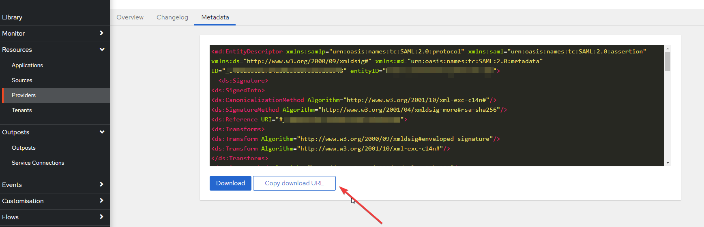

<span class="badge badge--secondary">Support level: Community</span>

## What is BookStack

> BookStack is a free and open-source wiki software aimed for a simple, self-hosted, and easy-to-use platform. Based on Laravel, a PHP framework, BookStack is released under the MIT License. It uses the ideas of books to organise pages and store information. BookStack is multilingual and available in over thirty languages. For the simplicity, BookStack is considered as suitable for smaller businesses or freelancers.
>
> -- https://en.wikipedia.org/wiki/BookStack

:::note
This is based on authentik 2021.7.2 and BookStack V21.05.3. Instructions may differ between versions.
:::

## Preparation

The following placeholders will be used:

-   `book.company` is the FQDN of BookStack.
-   `authentik.company` is the FQDN of authentik.
-   `METADATAURL` is the URL for the SAML metadata from authentik.

## authentik Configuration

### Step 1

In authentik, under **Providers**, create a **SAML Provider** with these settings:

**Protocol Settings**

-   **Name:** Bookstack
-   **ACS URL:** `https://book.company/saml2/acs`
-   **Issuer:** `https://authentik.company`
-   **Service Provider Binding:** Post
-   **Audience:** `https://book.company/saml2/metadata`

**Advanced Protocol Settings**

-   **Signing Certificate:** Choose your certificate or the default authentik Self-signed Certificate. All other options should remain as default.


### Step 2

In authentik, create an application that uses this provider. Optionally apply access restrictions to the application using policy bindings.

-   **Name:** Bookstack
-   **Slug:** bookstack
-   **Provider:** Bookstack
-   **Launch URL:** `https://book.company`

### Step 3

Obtain your Metadata URL from authentik.

1. Click on the BookStack Provider.
2. Click the **Metadata** tab.
3. Click **Copy download URL** (This URL is the `METADATAURL` required in Step 4).



## Service Configuration

### Step 4

Edit the `.env` file inside the `www` folder of BookStack.

Modify the following example SAML config and incorporate it into your `.env` file:

```bash
# Set authentication method to be saml2
AUTH_METHOD=saml2
# Control if BookStack automatically initiates login via your SAML system if it's the only authentication method.
# Prevents the need for the user to click the "Login with x" button on the login page.
# Setting this to true enables auto-initiation.
AUTH_AUTO_INITIATE=true
# Set the display name to be shown on the login button.
# (Login with <name>)
SAML2_NAME=authentik
# Name of the attribute which provides the user's email address
SAML2_EMAIL_ATTRIBUTE=email
# Name of the attribute to use as an ID for the SAML user.
SAML2_EXTERNAL_ID_ATTRIBUTE=uid
# Enable SAML group sync.
SAML2_USER_TO_GROUPS=true
# Set the attribute from which BookStack will read group names from.
# You will need to rename your roles in Bookstack to match your groups in authentik.
SAML2_GROUP_ATTRIBUTE=http://schemas.xmlsoap.org/claims/Group
# Name of the attribute(s) to use for the user's display name
# Can have multiple attributes listed, separated with a '|' in which
# case those values will be joined with a space.
# Example: SAML2_DISPLAY_NAME_ATTRIBUTES=firstName|lastName
# Defaults to the ID value if not found.
SAML2_DISPLAY_NAME_ATTRIBUTES=http://schemas.microsoft.com/ws/2008/06/identity/claims/windowsaccountname
# Identity Provider entityID URL
SAML2_IDP_ENTITYID=METADATAURL
# Auto-load metadata from the IDP
# Setting this to true negates the need to specify the next three options
SAML2_AUTOLOAD_METADATA=true
```

## Notes

BookStack will attempt to match the SAML user to an existing BookStack user based on a stored external ID attribute. If not found, BookStack will auto-register the user to provide a seamless access experience.

SAML Group Sync is supported by BookStack. Review the BookStack documentation on the required environment variables: https://www.bookstackapp.com/docs/admin/saml2-auth/

In some cases, you might need to define the full SAML property name. For example: `SAML2_GROUP_ATTRIBUTE="http://schemas.xmlsoap.org/claims/Group"`. See https://github.com/BookStackApp/BookStack/issues/3109 for more details.
